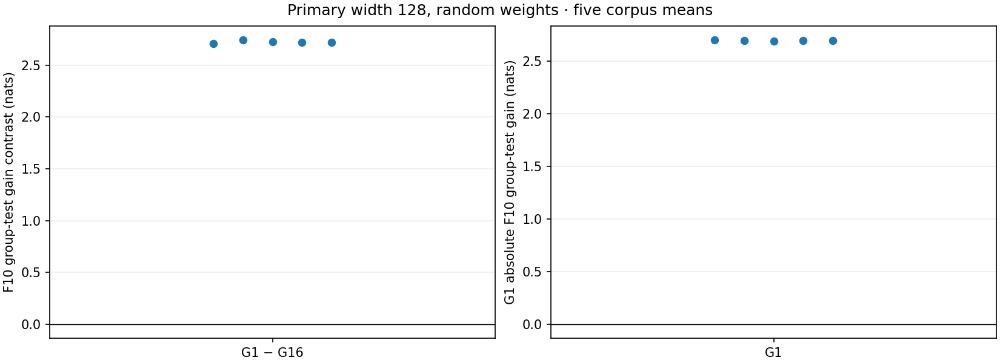
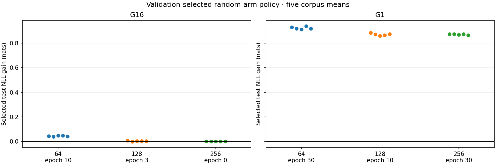
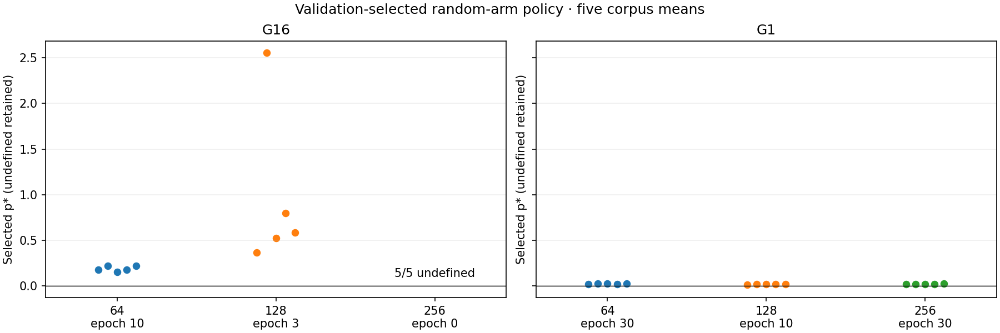
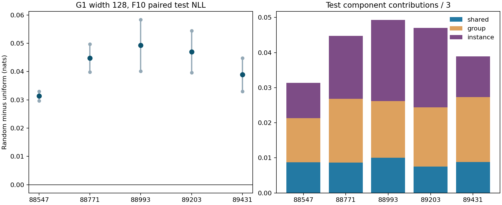

# Research figures collected so far

5 October 2026 UTC. This directory contains **45 existing figure files** (43 PNG,
2 SVG; 43 distinct charts) and **46 existing CSV/JSON data files** from completed
studies. Everything was copied byte-for-byte from saved project outputs. No new
plot, MATLAB conversion, numerical analysis, training or model computation ran.
PNG is ready to view; the two pilot SVGs provide vector versions. No native MATLAB
.fig or PDF figure was available in the selected result folders.

The collection uses the latest saved final presentation for each study. It excludes
36 fixture/testcase images and 24 superseded presentation images. Those originals,
all raw results and failed/cancelled evidence remain where they were. v0135 is source
only and has no results in this collection. SOURCE_FILES.csv lists every copied
source path, file size and SHA-256; FIGURE_MANIFEST.json also records selection and
study metadata. Copies are verified against originals, not regenerated.

Start with the recent G1/group-rule and paired weighting figures below, then follow
the chronological catalogue. Original reports give full scientific interpretation.

## Recent saved figures

The v0128 panels compare group-rule sharing and selected policies on historical
corpora; they do not establish an interior peak shift. v0131 reuses those corpora:
its paired adverse held-out contrast and preferential training allocation are not
causal mediation findings. More recent fresh-data studies below refine this record.

## Chronological catalogue

### v01-stage0 — 2026-09-28

Status: completed saved study; final figures available.

Exploratory pilot: learning curves and shared/group/instance learning. Single-seed exploratory result; no scaling-law claim.

[Original report](../outputs/sequence-weighting-pilot/results-local-wsl-20260928/RESULTS.md) — source folder: `outputs/sequence-weighting-pilot/results-local-wsl-20260928`.

Figures:

- [v01-stage0__pattern-learning.png](v01-stage0__pattern-learning.png)
- [v01-stage0__pattern-learning.svg](v01-stage0__pattern-learning.svg)
- [v01-stage0__pilot-curves.png](v01-stage0__pilot-curves.png)
- [v01-stage0__pilot-curves.svg](v01-stage0__pilot-curves.svg)

Existing data files (copied, not recomputed):

- [v01-stage0__summary.json](v01-stage0__summary.json)

### v02-stage1 — 2026-09-28

Status: completed saved study; final figures available.

Calibration, capacity curves, duration, gain fits and public-text check. Early synthetic peak depends on fixed policy and fit quality; later studies qualify it.

[Original report](../outputs/sequence-weighting-pilot/results-mechanism-v02/REPORT.md) — source folder: `outputs/sequence-weighting-pilot/results-mechanism-v02`.

Figures:

- [v02-stage1__calibration.png](v02-stage1__calibration.png)
- [v02-stage1__capacity-curves.png](v02-stage1__capacity-curves.png)
- [v02-stage1__duration-diagnostics.png](v02-stage1__duration-diagnostics.png)
- [v02-stage1__gain-fit.png](v02-stage1__gain-fit.png)
- [v02-stage1__text-check.png](v02-stage1__text-check.png)

Existing data files (copied, not recomputed):

- [v02-stage1__all-checkpoints.csv](v02-stage1__all-checkpoints.csv)
- [v02-stage1__summary.json](v02-stage1__summary.json)
- [v02-stage1__text-summary.json](v02-stage1__text-summary.json)

### v03-stage2 — 2026-09-28

Status: completed saved study; final figures available.

Capacity-specific validation selection, paired contrasts and trajectories. Frozen generalization criterion failed; selected-policy peak disappeared with different selected durations.

[Original report](../outputs/sequence-weighting-stage2/results-generalization-v03-20260928-01-r2/REPORT.md) — source folder: `outputs/sequence-weighting-stage2/results-generalization-v03-20260928-01-r2`.

Figures:

- [v03-stage2__gain-fit.png](v03-stage2__gain-fit.png)
- [v03-stage2__paired-contrasts.png](v03-stage2__paired-contrasts.png)
- [v03-stage2__selected-policy.png](v03-stage2__selected-policy.png)
- [v03-stage2__trajectories.png](v03-stage2__trajectories.png)

Existing data files (copied, not recomputed):

- [v03-stage2__all-checkpoints.csv](v03-stage2__all-checkpoints.csv)
- [v03-stage2__paired-contrasts.csv](v03-stage2__paired-contrasts.csv)
- [v03-stage2__selected-checkpoints.csv](v03-stage2__selected-checkpoints.csv)

### v04-stage3 — 2026-09-29

Status: completed saved study; final figures available.

Optimizer/duration controls, selection objective and baseline components. Controlled synthetic schedule/optimizer contrasts; no large-LM mechanism inference.

[Original report](../outputs/sequence-weighting-stage3/results-controls-v04-20260929-01/REPORT.md) — source folder: `outputs/sequence-weighting-stage3/results-controls-v04-20260929-01`.

Figures:

- [v04-stage3__baseline-components.png](v04-stage3__baseline-components.png)
- [v04-stage3__optimizer-duration.png](v04-stage3__optimizer-duration.png)
- [v04-stage3__selection-objective.png](v04-stage3__selection-objective.png)
- [v04-stage3__trajectories.png](v04-stage3__trajectories.png)

Existing data files (copied, not recomputed):

- [v04-stage3__all-checkpoints.csv](v04-stage3__all-checkpoints.csv)
- [v04-stage3__baseline-components.csv](v04-stage3__baseline-components.csv)
- [v04-stage3__diagnostics.csv](v04-stage3__diagnostics.csv)
- [v04-stage3__per-capacity-effects.csv](v04-stage3__per-capacity-effects.csv)
- [v04-stage3__policy-cells.csv](v04-stage3__policy-cells.csv)

### v05-stage4 — 2026-09-29

Status: completed saved study; final figures available.

Pretraining baselines, matched adaptation, gain reference and selected policies. Final presentation r2; numerical-verification repair documented in source report.

[Original report](../outputs/sequence-weighting-stage4/results-baseline-v05-20260929-01-r2/REPORT.md) — source folder: `outputs/sequence-weighting-stage4/results-baseline-v05-20260929-01-r2`.

Figures:

- [v05-stage4__baseline.png](v05-stage4__baseline.png)
- [v05-stage4__matched.png](v05-stage4__matched.png)
- [v05-stage4__reference.png](v05-stage4__reference.png)
- [v05-stage4__selected.png](v05-stage4__selected.png)

Existing data files (copied, not recomputed):

- [v05-stage4__all-checkpoints.csv](v05-stage4__all-checkpoints.csv)
- [v05-stage4__baseline-records.csv](v05-stage4__baseline-records.csv)
- [v05-stage4__diagnostics.csv](v05-stage4__diagnostics.csv)
- [v05-stage4__per-capacity-effects.csv](v05-stage4__per-capacity-effects.csv)
- [v05-stage4__policy-cells.csv](v05-stage4__policy-cells.csv)
- [v05-stage4__reference-capacity-effects.csv](v05-stage4__reference-capacity-effects.csv)
- [v05-stage4__reference-sensitivity.csv](v05-stage4__reference-sensitivity.csv)

### v06-stage5 — 2026-09-29

Status: completed saved study; final figures available.

Adaptation utility versus own no-adaptation baseline and selected fits. Global useful-adaptation criterion failed; undefined p* observations retained.

[Original report](../outputs/sequence-weighting-stage5/results-utility-v06-20260929-01-r1/REPORT.md) — source folder: `outputs/sequence-weighting-stage5/results-utility-v06-20260929-01-r1`.

Figures:

- [v06-stage5__baseline.png](v06-stage5__baseline.png)
- [v06-stage5__selected-fits.png](v06-stage5__selected-fits.png)
- [v06-stage5__selection.png](v06-stage5__selection.png)
- [v06-stage5__utility.png](v06-stage5__utility.png)

Existing data files (copied, not recomputed):

- [v06-stage5__all-checkpoints.csv](v06-stage5__all-checkpoints.csv)
- [v06-stage5__canonical-initial.csv](v06-stage5__canonical-initial.csv)
- [v06-stage5__diagnostics.csv](v06-stage5__diagnostics.csv)
- [v06-stage5__policy-cells.csv](v06-stage5__policy-cells.csv)

### v07-stage6 — 2026-09-29

Status: completed saved study; final figures available.

Tuning-panel selection, held-out utility, crossed gains and fits. Middle-capacity utility failed in all four panels; epoch 0 and undefined outcomes retained.

[Original report](../outputs/sequence-weighting-stage6/results-stability-v07-20260929-01/REPORT.md) — source folder: `outputs/sequence-weighting-stage6/results-stability-v07-20260929-01`.

Figures:

- [v07-stage6__crossed-gains.png](v07-stage6__crossed-gains.png)
- [v07-stage6__selected-fits.png](v07-stage6__selected-fits.png)
- [v07-stage6__selection-panels.png](v07-stage6__selection-panels.png)
- [v07-stage6__utility-panels.png](v07-stage6__utility-panels.png)

Existing data files (copied, not recomputed):

- [v07-stage6__all-checkpoints.csv](v07-stage6__all-checkpoints.csv)
- [v07-stage6__canonical-initial.csv](v07-stage6__canonical-initial.csv)
- [v07-stage6__crossed-matrix.csv](v07-stage6__crossed-matrix.csv)
- [v07-stage6__diagnostics.csv](v07-stage6__diagnostics.csv)
- [v07-stage6__policy-cells.csv](v07-stage6__policy-cells.csv)

### v08-stage7 — 2026-09-30

Status: completed saved study; final figures available.

Signed-gain estimator recovery, cancellation and scale invariance. Simulation rather than training; guard/undefined outcomes and recovery errors retained.

[Original report](../outputs/sequence-weighting-stage7/results-estimator-v08-20260930-01-r1/REPORT.md) — source folder: `outputs/sequence-weighting-stage7/results-estimator-v08-20260930-01-r1`.

Figures:

- [v08-stage7__cancellation.png](v08-stage7__cancellation.png)
- [v08-stage7__recovery.png](v08-stage7__recovery.png)
- [v08-stage7__scale-invariance.png](v08-stage7__scale-invariance.png)

Existing data files (copied, not recomputed):

- [v08-stage7__scale-pairs.csv](v08-stage7__scale-pairs.csv)
- [v08-stage7__summaries.csv](v08-stage7__summaries.csv)

### v09-stage8 — 2026-09-30

Status: completed saved study; final figures available.

Objective ranking, contrast errors and reference regret. Reused synthetic gain profiles; precision agreement is not true-exponent recovery.

[Original report](../outputs/sequence-weighting-stage8/results-precision-v09-20260930-01-r2/REPORT.md) — source folder: `outputs/sequence-weighting-stage8/results-precision-v09-20260930-01-r2`.

Figures:

- [v09-stage8__contrast-errors.png](v09-stage8__contrast-errors.png)
- [v09-stage8__grid-ranking.png](v09-stage8__grid-ranking.png)
- [v09-stage8__reference-regret.png](v09-stage8__reference-regret.png)

Existing data files (copied, not recomputed):

- [v09-stage8__summaries.csv](v09-stage8__summaries.csv)

### v010-stage9 — 2026-09-30

Status: completed saved study; final figures available.

Numerical precision on preserved model gains, grid agreement and model context. 179 comparable inputs; seven guards retained; no new training or peak validation.

[Original report](../outputs/sequence-weighting-stage9/results-model-precision-v010-20260930-01-r2/REPORT.md) — source folder: `outputs/sequence-weighting-stage9/results-model-precision-v010-20260930-01-r2`.

Figures:

- [v010-stage9__contrast-errors.png](v010-stage9__contrast-errors.png)
- [v010-stage9__grid-agreement.png](v010-stage9__grid-agreement.png)
- [v010-stage9__model-context.png](v010-stage9__model-context.png)

Existing data files (copied, not recomputed):

- [v010-stage9__policy-reference-metrics.csv](v010-stage9__policy-reference-metrics.csv)
- [v010-stage9__profile-metrics.csv](v010-stage9__profile-metrics.csv)
- [v010-stage9__summaries.csv](v010-stage9__summaries.csv)

### v011-stage10 — 2026-09-30

Status: completed saved study; final figures available.

Continuous-search coverage, objective gaps and parameter differences. 179 comparable inputs and seven guards; four original parameter disagreements retained.

[Original report](../outputs/sequence-weighting-stage10/results-search-v011-20260930-01/REPORT.md) — source folder: `outputs/sequence-weighting-stage10/results-search-v011-20260930-01`.

Figures:

- [v011-stage10__cohort-coverage.png](v011-stage10__cohort-coverage.png)
- [v011-stage10__objective-gaps.png](v011-stage10__objective-gaps.png)
- [v011-stage10__parameter-differences.png](v011-stage10__parameter-differences.png)

Existing data files (copied, not recomputed):

- [v011-stage10__input-metrics.csv](v011-stage10__input-metrics.csv)
- [v011-stage10__policy-reference-metrics.csv](v011-stage10__policy-reference-metrics.csv)
- [v011-stage10__summaries.csv](v011-stage10__summaries.csv)

### v0128-stage11 — 2026-10-02

Status: completed saved study; final figures available.

G1/G16 group learning, validation-selected utility and selected p*. Five corpora/two nested seeds; rule change also changes teacher-forced context; own baselines required.

[Original report](../outputs/sequence-weighting-stage11-v0128/results-analysis-20261002-01/REPORT.md) — source folder: `outputs/sequence-weighting-stage11-v0128/results-analysis-20261002-01`.

Figures:

- [v0128-stage11__group-learning.png](v0128-stage11__group-learning.png)
- [v0128-stage11__selected-p.png](v0128-stage11__selected-p.png)
- [v0128-stage11__selected-utility.png](v0128-stage11__selected-utility.png)

Existing data files (copied, not recomputed):

- Original v0128 summaries.json (unavailable in this distribution; `../outputs/sequence-weighting-stage11-v0128/results-analysis-20261002-01/summaries.json`) (83 MB; linked instead of duplicated).

### v0130 — 2026-10-03

Status: completed saved study; no saved figure available.

Completed no-clip diagnostic: no saved figure. Frozen width 128 validation criterion failed; retain canonical clip 1 control.

[Original report](../outputs/g1-clipping-diagnostic-v0130/results/DECISION_RECORD.md) — source folder: `outputs/g1-clipping-diagnostic-v0130/results`.

Existing data files (copied, not recomputed):

- [v0130__AUDIT_AND_ANALYSIS.json](v0130__AUDIT_AND_ANALYSIS.json)

### v0131 — 2026-10-03

Status: completed saved study; final figures available.

Paired random-minus-uniform held-out loss and training allocation. Historical-corpus reanalysis; adverse held-out tradeoff and preferential allocation do not prove mediation.

[Original report](../outputs/sequence-weighting-weighting-contrast-v0131/results-fixed-policy-v0131-20261003-01/SYNTHESIS_AND_DECISION.md) — source folder: `outputs/sequence-weighting-weighting-contrast-v0131/results-fixed-policy-v0131-20261003-01`.

Figures:

- [v0131__PAIRED_FIGURE.png](v0131__PAIRED_FIGURE.png)

Existing data files (copied, not recomputed):

- [v0131__COMPONENT_TABLE.csv](v0131__COMPONENT_TABLE.csv)
- [v0131__SUMMARY.json](v0131__SUMMARY.json)

### v0132 — 2026-10-04

Status: completed saved study; no saved figure available.

Completed fresh four-arm loss-weighting experiment: no saved figure. Instance-weighting group-test penalty +0.035304929 nats; positive in all five corpus means; fixed-policy effect.

[Original report](../outputs/sequence-weighting-factorial-v0132/results-fresh-factorial-v0132-20261004-01/RESULT_AND_DECISION_20261004.md) — source folder: `outputs/sequence-weighting-factorial-v0132/results-fresh-factorial-v0132-20261004-01`.

Existing data files (copied, not recomputed):

- [v0132__CORPUS_CONTRASTS.csv](v0132__CORPUS_CONTRASTS.csv)
- [v0132__CORPUS_SUMMARY.json](v0132__CORPUS_SUMMARY.json)

### v0133-r1 — 2026-10-04

Status: completed saved study; no saved figure available.

Completed fresh clipping interaction: no saved figure. Primary interaction +0.000743708 nats, 3/5 positive; frozen practical criterion failed; penalties persisted with and without clip.

[Original report](../outputs/sequence-weighting-clipping-interaction-v0133-r1/results-fresh-clipping-interaction-v0133-20261004-02/RESULT_AND_DECISION_20261004.md) — source folder: `outputs/sequence-weighting-clipping-interaction-v0133-r1/results-fresh-clipping-interaction-v0133-20261004-02`.

Existing data files (copied, not recomputed):

- [v0133-r1__CORPUS_CONTRASTS.csv](v0133-r1__CORPUS_CONTRASTS.csv)
- [v0133-r1__CORPUS_SUMMARY.json](v0133-r1__CORPUS_SUMMARY.json)

### v0134 — 2026-10-05

Status: completed saved study; no saved figure available.

Completed fixed existing-checkpoint gradient panel: no saved figure. Initial cosine -0.07425 is mixed: 4/5 negative corpus means, 6/10 seeds; component dispersion is not total weighted-gradient variance.

[Original report](../outputs/sequence-weighting-gradient-alignment-v0134/results-existing-gradient-panel-v0134-20261004-01/PANEL_REPORT.md) — source folder: `outputs/sequence-weighting-gradient-alignment-v0134/results-existing-gradient-panel-v0134-20261004-01`.

Existing data files (copied, not recomputed):

- [v0134__COHORT_SUMMARY.json](v0134__COHORT_SUMMARY.json)
- [v0134__CORPUS_SUMMARY.json](v0134__CORPUS_SUMMARY.json)

## Latest findings without saved plots

- **v0130:** the frozen width 128 no-clip validation criterion failed; the canonical
  clip 1 control remained. Its existing audit/analysis JSON is included.
- **v0132:** fresh factorial group-test instance-weighting penalty was +0.035304929
  nats, positive in all five corpus means. The fixed-policy causal effect leaves
  the pathway unresolved. Existing corpus contrasts and summary are included.
- **v0133-r1:** clipping interaction was +0.000743708 nats with 3/5 positive corpus
  means; it failed the frozen practical criterion. Instance penalties persisted
  with and without clipping. This weakens a clipping-only account, not an
  equivalence conclusion. Existing corpus contrasts and summary are included.
- **v0134:** initial alignment averaged -0.07425 cosine, with 4/5 negative corpus
  means but only 6/10 negative seeds. Extra-component dispersion exceeded uniform
  dispersion at all 30 states, but total weighted-gradient variance needs covariance.
  These existing-state associations are not AdamW updates or mediation. Both saved
  corpus and cohort summaries are included; no figure has yet been generated.

v0129 has source/protocol files but no saved completed result bundle or figure was
located; it is not presented as a completed measured study. The original failed
v0133 attempt is also not a completed study; the completed revision is v0133-r1.

## Interpretation limits

Early synthetic capacity/peak plots are historical exploratory or selected-policy
results, not a cumulative proof of a universal mechanism. Stage 2's frozen
criterion failed; Stage 5/6 useful-adaptation gates failed, with zero-adaptation and
undefined cases retained. Estimator/precision/search studies measure numerical
properties on simulations or preserved gains, not independent training replications.
Do not count nested model/weight seeds as independent corpora. No significance,
universal mechanism, large-LM replication, peak shift or mediation follows from
this figure collection. Negative, null, mixed and guarded outcomes are preserved
in the selected reports and accompanying tables. No v0135 result is claimed.
