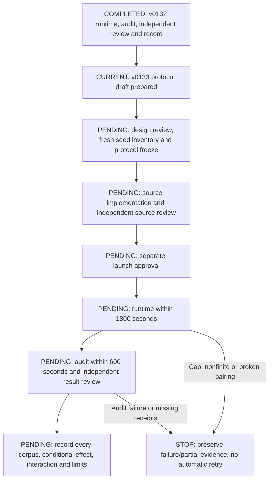

# Proposed v0133 clipping-interaction protocol

4 October 2026 UTC. **Protocol preparation only.** This document is the current
planning deliverable. Numeric seed selection, implementation, source review and
execution are pending. Preparing this protocol does not authorize a launch.
No source, data or results in the completed v0132 study are changed or reused as
fresh experimental outcomes.

## Question and fixed design

Does adaptation gradient clipping change the effect of random instance-loss
weighting on held-out group-rule NLL under the specified synthetic training
algorithm? v0132 found an instance-weighting penalty under clip 1, but did not
identify whether clipping/update dynamics explain it. The next experiment tests
that interaction directly; it does not establish mediation by itself.

Use G1, width 128, depth 3, 621,696 parameters, fp32, batch 32 and fixed F10.
Retain AdamW LR 1e-4 and WD .1 for adaptation. There is no capacity sweep,
checkpoint selection, LR tuning, p* fitting or adaptive seed expansion.
Use five fresh adaptation corpora, two nested model/weight seeds per corpus,
ten fresh U-pretrained checkpoints and forty adaptation trajectories.
Each checkpoint initializes all four matched arms below.

| Arm | Shared/group/instance loss weights | Adaptation clipping |
|---|---|---|
| Uclip | (1,1,1) | Global gradient norm, clip 1 |
| Iclip | (1,1,w) | Global gradient norm, clip 1 |
| Unoclip | (1,1,1) | No gradient rescaling |
| Inoclip | (1,1,w) | No gradient rescaling |

As in v0132, each sequence has four answer tokens per component; the objective
is the batch mean of the three weighted component mean NLLs, each with coefficient
1/3. Random weights use the inherited log-uniform raw distribution on [.01,10],
cast to float32 and normalized once to corpus mean one. Iclip and Inoclip use
the same saved vector; shared/group weights stay exactly one in every arm.
Do not divide by batch weight sums or renormalize objectives by arm.

Within each matched seed, hold every token, label, teacher-forced context,
pretrained checkpoint, assignment and batch order fixed. Reset the optimizer
for each adaptation. No-clip means only removing adaptation gradient rescaling;
finite-loss, gradient, parameter, input-integrity and resource checks stay active.
Predetermine execution order Uclip, Iclip, Unoclip, Inoclip for each pair.
Keep the v0132 hardware/precision policy, including disabled TF32 and no claim
of strict bitwise GPU determinism.

Pretraining policy is unchanged: five fresh pretraining corpus seeds, each paired
with its adaptation corpus and two model seeds; 2048 train / 256 validation
examples, four epochs, AdamW LR 3e-4 / WD .1 / clip 5. Preserve the inherited U
objective: hard shared-rule NLL plus soft uniform sixteen-answer auxiliary NLL
at group/instance positions, with uniform sequence weighting. Adaptation sizes
remain 512 train / 256 validation / 512 test. Pretraining and adaptation key
namespaces remain disjoint. Reusing trusted generator/model source later does
not mean reusing historical datasets or checkpoints.

**Seed selection is pending.** Before freezing executable source, inventory all
recorded tuning, confirmation and diagnostic corpus identities, including v0132
and failed attempts. Select and bind five new adaptation seeds, five new
pretraining seeds and ten model/weight identities with their derived RNG streams.
Separate nested order-seed ranges, document intentional within-pair PRNG pairing,
and require independent semantic freshness review. No numeric seeds are selected
by this document; no data generation is authorized now.

## Primary outcome and prospective practical criterion

Let Y be unweighted F10 group-answer test NLL, in nats per group-answer token.
Within matched corpus c and nested seed s:

    Cclip_cs   = Y(Iclip)   - Y(Uclip)
    Cnoclip_cs = Y(Inoclip) - Y(Unoclip)
    D_cs       = Cclip_cs - Cnoclip_cs

Average the two seeds to obtain each corpus's Cclip_c, Cnoclip_c and D_c; then
average the five corpus values equally. Positive D means the instance-weighting
effect is more adverse, or less beneficial, under clip 1 than under no clipping.
The independent corpus replication count is five, not ten.

Freeze the proposed practical criterion before any v0133 outcome:
**mean D >= .01 nats/group-answer token AND all five D_c > 0**.
This is a prospective practical/consistency criterion, **not a statistical
significance threshold**. Always report continuous D, both conditional
contrasts, corpus SD/range, all five corpus contributions and all ten matched
seed contributions, whether or not the criterion is met. Nonpositive corpus
results count against consistency; no replacement, exclusion or expansion.
No p-value or universal effect is claimed from this small corpus panel.

Positive D alone does not mean that no clipping removes an instance penalty,
nor that clipping creates one. If the conditional contrasts have different signs,
describe those signs directly. Even a passed practical criterion establishes a
policy interaction in this setup, not a mediating pathway or intrinsic capacity
competition. No universal weighting disadvantage, greater overall memorization,
p* peak or scaling curve follows.

## Frozen no-clip uniform learning-adequacy diagnostic

Evaluate the shared pretrained checkpoint's unweighted group test NLL once per
matched pair before adaptation; this evaluation is inside the runtime budget.
Define the own-baseline gain for Unoclip:

    A_cs = Y(initial shared U checkpoint) - Y(Unoclip at F10)
    A_c  = mean of the two A_cs values

The no-clip uniform arm is adequate for this diagnostic only if **all five
A_c > 0** (which also implies a positive equal-corpus mean). Report all A_cs,
A_c and the mean/SD/range. This gate asks whether no-clip U actually learns the
group rule relative to its own matched initialization; it is not a tuned utility
threshold or a checkpoint-selection rule.

If adequacy fails, retain the complete numerical contrasts when finite and
paired, but classify the proposed mechanistic interpretation as **inconclusive**.
A nonfinite value, broken pairing, missing input or cap stop fails closed:
preserve partial evidence and report the incomplete experiment; no favorable
subset becomes the primary result. Never exclude a failed corpus, replace a
seed, tune a policy or automatically regenerate/retry. A small/nonpositive D
is reported as evidence against the proposed practical interaction, rather than
as a reason to extend the experiment.

## Minimal update instrumentation and audit

For each adaptation update, record the actual parameter-step L2 norm
||theta_after - theta_before||_2 and its relative norm
||theta_after - theta_before||_2 / ||theta_before||_2. Include AdamW's adaptive
update and weight decay by measuring immediately around optimizer.step(), after
any gradient clipping. Record the denominator and pre-clipping gradient norm;
retain clipping fractions for clip-1 arms. These are descriptive diagnostics,
not selection criteria or a causal mediation test.

Use one reusable float32 parameter snapshot of about **2.37 MiB** for this
architecture, in a fixed named-parameter order. Copy before the step and reuse
the buffer for parameter differences after it; no second persistent snapshot,
activation logging, optimizer-state archives or per-component gradient probes.
Use scalar float64 sum-of-squares accumulation for reported norms. Buffer
placement and safe implementation must be reviewed later; copy/reduction cost,
synchronization, transient memory and log I/O all count toward the caps.
**Instrumentation overhead is unmeasured.**

Guard all norms for finiteness. If the finite pre-step parameter norm is <=1e-12,
save the relative norm as undefined with a guard reason; never invent a tiny
denominator to report a misleading ratio. Retain the absolute step norm and
endpoint if otherwise valid. Nonfinite parameters, differences or gradients stop
the experiment; guarded relative diagnostics cannot support a relative-update
interpretation. Instrumentation must not modify model parameters or gradients.

The later independent audit should regenerate full inputs, verify every paired
label/token/weight/order/checkpoint binding and all four objective masks, and
reevaluate ten initial plus forty F10 checkpoints. It should independently
recompute D, the conditional effects and adequacy without an outcome-direction
acceptance gate, retain signed allocation/component results, and inspect finite
step logs and receipt accounting. Log checks are not a replay of every optimizer
update. Log maximum observed numerical discrepancies as well as frozen tolerances;
v0132 passed its tolerances but did not save those maxima. Exact-source and
scientific audit review remain pending. No audit code or fixtures are created now.

## Proposed caps, estimates and obstacles

These caps are proposed for a later separately approved launch:

| Phase/resource | Proposed bound or estimate |
|---|---|
| Total runtime | 1800 seconds, including preparation, census/hash checks, imports, pretraining, initial evaluation, adaptation, instrumentation, final evaluation, receipts and termination grace |
| Separate numerical audit | 600 seconds, including imports, regeneration, reevaluation, receipts and termination |
| Additional storage | 512 MiB, including planning/source, inputs, checkpoints, logs, reviews, receipts and reserves; retain 64 MiB archive and 16 MiB terminal reserves inside this cap |
| Free space | At least 2 GiB; check again at any later launch and throughout it |
| Expected runtime | 10–20 minutes; uncertain, based on v0132's measured 601.933168 seconds (~602 seconds) |
| Implementation and source review | Approximately 45–90 minutes of active work, after this protocol is accepted |
| Independent result review and recording | Approximately 15–30 minutes, after runtime/audit completion |
| Overall active work | Approximately 1.5–3 hours, including runtime, bounded audit, coordination and normal contingencies; not a guarantee |

Completed v0132's audit took 43.409159 seconds, but that is context, not v0133
audit readiness. No-clip stability, new snapshot overhead, source changes,
historical census growth/I/O, GPU/guest availability and independent-review
findings can change timing or stop the attempt. The outer watchdog must contain
the worker even if its supervisor dies; termination grace remains inside the
same cap. No benchmark or unbudgeted preparation allowance is added here.
If the exact forty-trajectory design cannot fit, report that obstruction instead
of increasing limits or shrinking/selecting the cohort silently.

**Resolving the mechanism has no guaranteed timetable.** One bounded interaction
study can sharpen evidence while leaving clipping, AdamW dynamics and allocation
paths unresolved. A cap failure or inconclusive finding is a reportable outcome;
further work would require a new scoped proposal and authorization.

## Progress flow chart

The chart records actual status at preparation: v0132 is complete; this v0133
protocol draft is prepared; every subsequent stage is pending.

No executable source, manual launch commands, data or new scientific result is
provided by this planning document. Protocol preparation is the full current
authorization; later implementation and launch require their own scoped decisions.

Background record: `../sequence-weighting-factorial-v0132/results-fresh-factorial-v0132-20261004-01/RESULT_AND_DECISION_20261004.md`, SHA256
`0816f514797f65ad95184927be5732762d4c98303e8a95361dc47a9751927453`.
