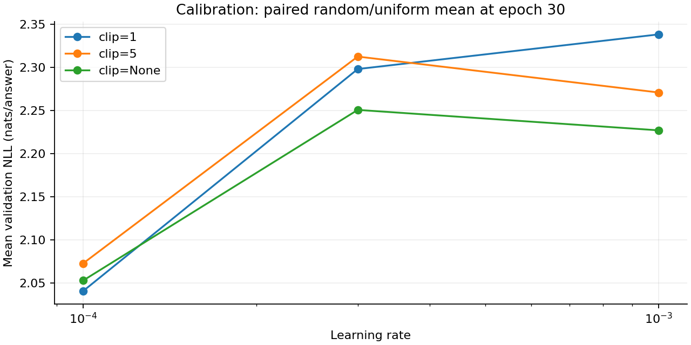
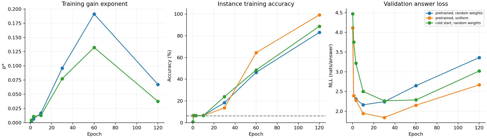
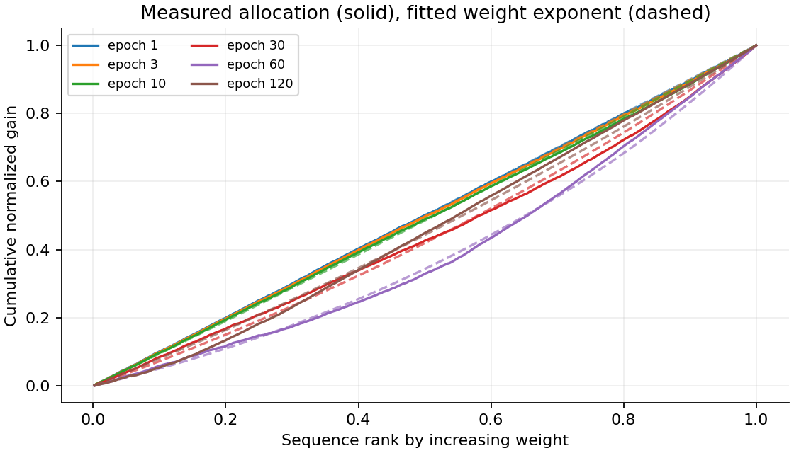
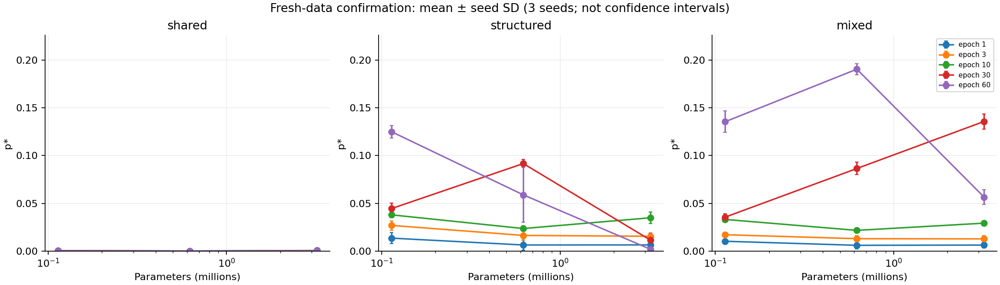
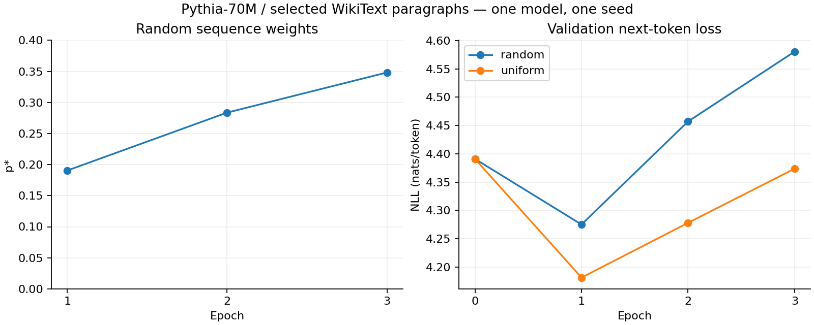

# Execution results for PILOT_NOTES.md

28 September 2026 · all training ran locally on an RTX 3050 Laptop with 4 GB VRAM through Ubuntu WSL 2.

## Completion status

All stages in the notes were completed: 10 synthetic pretrained checkpoints,
18 calibration runs, 3 duration/initialization diagnostic runs, 30 confirmation runs, and
2 public-text runs. The total was **53 adaptation runs**, excluding pretraining.

**Main finding:** the middle-capacity p* peak appeared in all three seeds for
the mixed-data regime at epoch 60. This supports a possible mechanism in this
controlled task. The results do not establish Jane Street's explanation for
large language models under optimally tuned regularization.

## 1. Pretraining and configuration selection

Pretraining used 2,048 shared-rule examples, uniform weights, and four epochs.
Example-key namespaces were separate for pretraining, adaptation, validation, and test.
Paired arms reused the same pretrained checkpoint; AdamW state was reset
when adaptation began. All pretrained models reached
100% shared-rule validation accuracy.

Calibration used 512 adaptation examples and 256 validation examples. A grid of three learning rates
× three clipping settings × two weighting arms produced 18 runs. Selection used
the mean validation NLL across both arms at epoch 30, excluding p* and test loss.
The selected settings were **learning rate 0.0001, clipping 1, weight decay 0.1**; score 2.04087.

Clipping remained frequently active. Disabling it did not automatically produce
the best result in this grid; one calibration seed was insufficient to separate
all interactions among optimizer settings, clipping, and capacity.

## 2. Measurable memorization

In the pretrained random-weight arm, p* at epochs 30/60/120 was
0.0959 / 0.1911 / 0.0672. Instance training accuracy increased from 18.4% to
46.3% and 83.1%. The uniform control reached 64.5% at epoch 60 and 99.3% at 120.
The learnability gate first passed at **60 epochs**.

Validation loss deteriorated as memorization increased. The duration of 60 epochs was chosen
to observe the mechanism, rather than to optimize early stopping for generalization.
The cold-start arm also showed p* rising and then falling with duration.
Pretraining was not established as a necessary condition for this phenomenon.

The observed gain-allocation curves and exponent fits were saved so that p* could be assessed
alongside fit quality. Negative gains were retained.

## 3. Confirmation on fresh data

The configuration was frozen before switching to data seed 2718. Three capacities and three
training/weight seeds (42, 43, 44) were run in the shared, structured, and mixed regimes.
Three additional uniform controls were run at the middle capacity in the mixed regime.
Test evaluation occurred once at the fixed final epoch; test results did not select configurations.

**Mixed regime, epoch 60; mean ± standard deviation across three seeds:**

| Parameters | p* | Instance training accuracy | Validation NLL |
|---:|---:|---:|---:|
| 113,408 | 0.1355 ± 0.0113 | 15.4% | 2.2431 |
| 621,696 | 0.1906 ± 0.0057 | 42.6% | 2.6976 |
| 3,212,800 | 0.0565 ± 0.0077 | 81.2% | 3.1508 |

The difference between middle-capacity p* and the larger endpoint value was positive
in all three seeds: **0.0669; 0.0466; 0.0518**. This is descriptive consistency,
not a significance test. Shared-only p* was nearly zero. The structured regime
had a middle-capacity peak at epoch 30, whereas at epoch 60 the largest value
occurred at the smallest measured capacity.

Three capacities provide only one possible interior peak location. An argmax moving
to an endpoint does not establish a shift between two interior peaks.
A stronger claim about peak shifts with epoch requires additional capacities.

## 4. Pretrained-model and public-text check

Pythia-70M (70,426,624 parameters) was fully fine-tuned in float32,
without LoRA. The data consisted of 512 training, 128 validation, and 128 test paragraphs from WikiText-2 raw;
each contained 129 tokens and 128 targets. Deterministic selection of long paragraphs,
truncation, and removal of cross-split token duplicates were documented. This is not
the standard WikiText benchmark protocol; overlap with pretraining is unknown.

Learning rate 0.00003 was fixed before inspecting results, with effective batch size 32,
clipping 1, weight decay 0.1, three epochs, and seed 42. No test-based tuning occurred.

| Weighting | Final p* | Train NLL | Validation NLL | Test NLL |
|---|---:|---:|---:|---:|
| random | 0.3482 | 3.6178 | 4.5806 | 4.7951 |
| uniform | undefined | 3.0459 | 4.3737 | 4.5551 |

Random-weight p* increased **0.1905 → 0.2837 → 0.3482**. Baseline validation NLL for both
arms was 4.3911. The results confirm that the measurement pipeline ran on
text and a pretrained checkpoint. One model size and one seed do not
confirm a capacity curve, a mechanism, or an advantage for the weighting method.
Clipping occurred on every update in both arms.

## 5. Measured resource use

- Synthetic study: adaptation and evaluation across 51 runs totaled 368.17 seconds; peak
  PyTorch allocated memory was 150.49 MiB and reserved memory was 184 MiB.
- Text study: the two runs totaled 154.99 seconds; peak allocated memory was 1,585.79 MiB
  (approximately 1.55 GiB), with 1,652 MiB reserved.
- Times cover instrumented program sections rather than
  all startup, downloads, installation, pretraining, baseline evaluation, and
  checkpoint serialization. Memory figures exclude desktop/driver usage.

## 6. Claim boundaries and research direction

Jane Street reports improving held-out performance with capacity and
uses validation-tuned regularization. In our mixed-data regime,
validation loss instead increased with capacity. The present results are therefore
best framed as a **mechanism demonstration in a controlled task
with memorization**, rather than a reproduction of the original study's regularization conditions.

Other limitations include only three training seeds on one confirmation corpus; fixed weight decay;
shared-only synthetic pretraining; changing pattern proportions across regimes;
frequent clipping; and a text check with only one model/seed.

At the time of this report, the next research priority was to test **whether the peak persists
when each capacity is tuned for its best generalization**. Freeze the regularization grid,
use fresh data, and add capacities that permit two
interior peak locations to be observed. Include several independent data seeds.
That extension had not yet been run and must not be described as completed in this report.

A working title consistent with the evidence at this stage was *Controlled Pattern Complexity and
Non-Monotonic Sequence Weighting*. Novelty and venue suitability
required further literature review and experiments.

## Audit and reproducibility

- `all-checkpoints.csv`: all evaluated synthetic checkpoints.
- `summary.json`, `text-summary.json`: numerical results and gate decisions.
- `AUDIT.json`: run counts, paired baseline equality, splits, and source hashes.
- `run-records.zip`: configurations, results, per-example weights/losses, dataset metadata,
  source, protocols, environment versions, and text provenance; full model checkpoints
  remained in the local workspace to avoid a large archive.
- `../PROTOCOL_STAGE1.md` and `../TEXT_PROTOCOL.md`: protocols established before the runs.

At the time of this report, no models or training results had been published to an external service.

## Sources

- [Jane Street study](https://blog.janestreet.com/a-study-of-sequence-weighting-at-scale/)
- [Estimator definition](https://blog.janestreet.com/a-study-of-sequence-weighting-at-scale/sequence-weighting-note.pdf)
- [Pythia-70M, EleutherAI](https://huggingface.co/EleutherAI/pythia-70m)
- [WikiText, Salesforce](https://huggingface.co/datasets/Salesforce/wikitext)

Model revision: `a39f36b100fe8a5377810d56c3f4789b9c53ac42`.
Dataset revision: `b08601e04326c79dfdd32d625aee71d232d685c3`.
The model is licensed under Apache-2.0; the dataset card lists CC-BY-SA-3.0 and GFDL.
