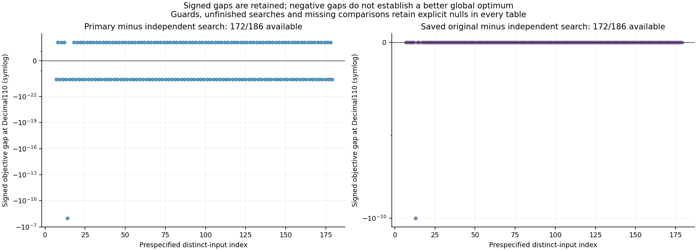
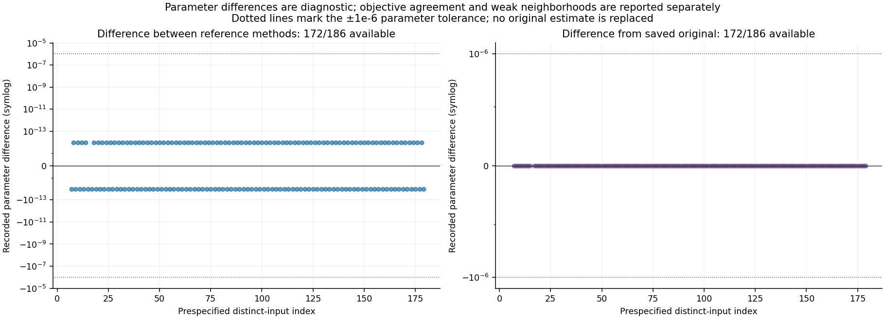
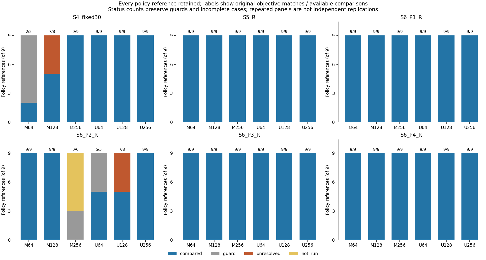

# SYNTHETIC FIXTURE — NOT MEASURED RESULTS

# Stage 10 — continuous-search agreement on retained model gains

Run `synthetic-raw` ended with status **BUDGET_EXHAUSTED**; infrastructure/provenance audit: **PARTIAL**. The complete design retains 186 distinct weight/gain inputs, 207 saved native checkpoints and 324 policy references. Original estimates, model selections and utility conclusions remain unchanged.

## Coverage and measured agreement

| Counting unit | Planned | Compared | Guard | Unresolved | Not run |
| --- | --- | --- | --- | --- | --- |
| Distinct inputs | 186 | 169 | 7 | 4 | 6 |
| Policy references (reused inputs) | 324 | 296 | 14 | 8 | 6 |

| Diagnostic (distinct inputs) | True | False | Available | Unavailable |
| --- | --- | --- | --- | --- |
| precision_converged | 171 | 1 | 172 | 14 |
| search_objective_agreement | 171 | 1 | 172 | 14 |
| parameter_agreement | 172 | 0 | 172 | 14 |
| original_objective_agreement | 171 | 1 | 172 | 14 |
| original_parameter_agreement | 172 | 0 | 172 | 14 |
| original_better_than_search | 1 | 171 | 172 | 14 |
| weak_neighborhood | 0 | 172 | 172 | 14 |
| unresolved | 10 | 176 | 186 | 0 |

All denominators include the full design. Conditional rates use only available comparisons and are explicitly labeled; an unavailable comparison is not an agreement or disagreement. Guards retain their mathematical reasons, epoch0 retains historical `no_adaptation`, and interruption leaves explicit `not_run` records. Numerical disagreement and incomplete convergence remain reported.

## Frozen search methods and limits

The primary Decimal80 search scans 513 points j/64 on [0,8], retains every mesh point (including endpoints and exact-zero derivative nodes), and bisects every strict derivative sign-change bracket to width 1e-12 with at most 40 iterations. Its candidates comprise all mesh points and final bracket midpoints. The independent Decimal110 search uses a different algorithm: 1,025 points j/128 and golden-section objective refinement of every declared mesh-local-minimum neighborhood to width 1e-12 with at most 80 iterations. Its candidates comprise all mesh points and final bracket midpoints. Candidate, mesh, bracket, derivative, refinement and failure records are retained in the raw run. The frozen protocol and config define plateau handling, deterministic ties and all convergence rules.

Both candidate points and the saved original point are compared using Decimal110 arithmetic. The search-agreement objective tolerance is 1e-18 times the frozen profile scale; original-point objective tolerance is 1e-12 times that scale; parameter tolerance is 1e-6. Per-input scale/tolerances and signed gaps remain in the tables. Different parameter values may be objective-equivalent in weakly separated profiles. Precision convergence and objective/parameter classifications remain separate.

Neither search provides a global-optimality certificate. Finite meshes and local refinements can miss stationary structure; agreement means agreement between these bounded searches. A saved original point lower than the reference beyond tolerance is unresolved reference-search evidence. The original point never participates in candidate selection. The shared numerical search/audit ceiling is one hour, checked with monotonic and UTC elapsed time, including verification and cache preparation. No adaptive retry, grid expansion or outcome-based subset is permitted.

| Quantity | Available /186 | Conditional mean | Minimum | Maximum | Negative / zero / positive |
| --- | --- | --- | --- | --- | --- |
| search_signed_gap | 172/186 | -5.81395e-11 | -1e-8 | 1e-24 | 88/0/84 |
| original_signed_gap | 172/186 | -5.81395e-13 | -1e-10 | 0 | 1/171/0 |
| search_parameter_delta | 172/186 | -1.16279e-16 | -1e-14 | 1e-14 | —/—/— |
| original_parameter_delta | 172/186 | 0 | 0 | 0 | —/—/— |
| reference_mesh_span | 172/186 | 0.3 | 0.3 | 0.3 | —/—/— |





Signed gaps and Decimal strings are preserved without clipping. Summary arithmetic uses 110 decimal digits. Nulls prevent an unconditional mean; conditional statistics retain availability counts. Boundary counts distinguish exact endpoints and proximity within 1e-6, while historical boundary flags remain unchanged in model-context records. Neighborhood points and their signed objective gaps remain fully recorded; weak neighborhoods describe numerical separation, not statistical confidence intervals.

## Policy cells and preserved model context

Each of the 36 cells contains three corpus seeds × three model/weight seeds. Model seeds within one corpus and reused Stage6 panel selections are paired observations, not additional independent datasets. These tables are descriptive and do not re-evaluate Stage6 usefulness or any p* peak.

| Cohort | Variant | Width | Distinct /9 | Compared | Guard | Unresolved | Not run | Original objective match / available |
| --- | --- | --- | --- | --- | --- | --- | --- | --- |
| S4_fixed30 | M | 64 | 9 | 2 | 7 | 0 | 0 | 2/2 |
| S4_fixed30 | M | 128 | 9 | 5 | 0 | 4 | 0 | 7/8 |
| S4_fixed30 | M | 256 | 9 | 9 | 0 | 0 | 0 | 9/9 |
| S4_fixed30 | U | 64 | 9 | 9 | 0 | 0 | 0 | 9/9 |
| S4_fixed30 | U | 128 | 9 | 9 | 0 | 0 | 0 | 9/9 |
| S4_fixed30 | U | 256 | 9 | 9 | 0 | 0 | 0 | 9/9 |
| S5_R | M | 64 | 9 | 9 | 0 | 0 | 0 | 9/9 |
| S5_R | M | 128 | 9 | 9 | 0 | 0 | 0 | 9/9 |
| S5_R | M | 256 | 9 | 9 | 0 | 0 | 0 | 9/9 |
| S5_R | U | 64 | 9 | 9 | 0 | 0 | 0 | 9/9 |
| S5_R | U | 128 | 9 | 9 | 0 | 0 | 0 | 9/9 |
| S5_R | U | 256 | 9 | 9 | 0 | 0 | 0 | 9/9 |
| S6_P1_R | M | 64 | 9 | 9 | 0 | 0 | 0 | 9/9 |
| S6_P1_R | M | 128 | 9 | 9 | 0 | 0 | 0 | 9/9 |
| S6_P1_R | M | 256 | 9 | 9 | 0 | 0 | 0 | 9/9 |
| S6_P1_R | U | 64 | 9 | 9 | 0 | 0 | 0 | 9/9 |
| S6_P1_R | U | 128 | 9 | 9 | 0 | 0 | 0 | 9/9 |
| S6_P1_R | U | 256 | 9 | 9 | 0 | 0 | 0 | 9/9 |
| S6_P2_R | M | 64 | 9 | 9 | 0 | 0 | 0 | 9/9 |
| S6_P2_R | M | 128 | 9 | 9 | 0 | 0 | 0 | 9/9 |
| S6_P2_R | M | 256 | 9 | 0 | 3 | 0 | 6 | 0/0 |
| S6_P2_R | U | 64 | 9 | 5 | 4 | 0 | 0 | 5/5 |
| S6_P2_R | U | 128 | 9 | 5 | 0 | 4 | 0 | 7/8 |
| S6_P2_R | U | 256 | 9 | 9 | 0 | 0 | 0 | 9/9 |
| S6_P3_R | M | 64 | 9 | 9 | 0 | 0 | 0 | 9/9 |
| S6_P3_R | M | 128 | 9 | 9 | 0 | 0 | 0 | 9/9 |
| S6_P3_R | M | 256 | 9 | 9 | 0 | 0 | 0 | 9/9 |
| S6_P3_R | U | 64 | 9 | 9 | 0 | 0 | 0 | 9/9 |
| S6_P3_R | U | 128 | 9 | 9 | 0 | 0 | 0 | 9/9 |
| S6_P3_R | U | 256 | 9 | 9 | 0 | 0 | 0 | 9/9 |
| S6_P4_R | M | 64 | 9 | 9 | 0 | 0 | 0 | 9/9 |
| S6_P4_R | M | 128 | 9 | 9 | 0 | 0 | 0 | 9/9 |
| S6_P4_R | M | 256 | 9 | 9 | 0 | 0 | 0 | 9/9 |
| S6_P4_R | U | 64 | 9 | 9 | 0 | 0 | 0 | 9/9 |
| S6_P4_R | U | 128 | 9 | 9 | 0 | 0 | 0 | 9/9 |
| S6_P4_R | U | 256 | 9 | 9 | 0 | 0 | 0 | 9/9 |



Historical contexts are copied exactly from the audited Stage9 report and joined by full policy-reference identity. They supply saved training memorization, validation/test losses, clipping, signed gain/cancellation and original fit context; no Stage9 grid statistic is reused as a Stage10 conclusion. All 324 selected test losses remain available. Stage4 intentionally did not measure own-initial epoch0 test metrics, so those 54 test gains remain null; 270/324 test gains are available. No imputation or premixed-baseline proxy is used.

| Cohort | Variant | Width | Train NLL gain | Validation NLL gain | Selected test NLL | Test NLL gain | Test gain available /9 | Train instance accuracy | Clipping (available) | Original p (available) | Original fit J (available) |
| --- | --- | --- | --- | --- | --- | --- | --- | --- | --- | --- | --- |
| S4_fixed30 | M | 64 | 1 | 0.25 | 2.25 | undefined | 0/9 | 0.75 | 0.5 (2/9) | 0.25 (2/9) | 0.0100000 (2/9) |
| S4_fixed30 | M | 128 | 1 | 0.25 | 2.25 | undefined | 0/9 | 0.75 | 0.5 (9/9) | 0.25 (9/9) | 0.0100000 (9/9) |
| S4_fixed30 | M | 256 | 1 | 0.25 | 2.25 | undefined | 0/9 | 0.75 | 0.5 (9/9) | 0.25 (9/9) | 0.0100000 (9/9) |
| S4_fixed30 | U | 64 | 1 | 0.25 | 2.25 | undefined | 0/9 | 0.75 | 0.5 (9/9) | 0.25 (9/9) | 0.0100000 (9/9) |
| S4_fixed30 | U | 128 | 1 | 0.25 | 2.25 | undefined | 0/9 | 0.75 | 0.5 (9/9) | 0.25 (9/9) | 0.0100000 (9/9) |
| S4_fixed30 | U | 256 | 1 | 0.25 | 2.25 | undefined | 0/9 | 0.75 | 0.5 (9/9) | 0.25 (9/9) | 0.0100000 (9/9) |
| S5_R | M | 64 | 1 | 0.25 | 2.25 | -0.25 | 9/9 | 0.75 | 0.5 (9/9) | 0.25 (9/9) | 0.0100000 (9/9) |
| S5_R | M | 128 | 1 | 0.25 | 2.25 | -0.25 | 9/9 | 0.75 | 0.5 (9/9) | 0.25 (9/9) | 0.0100000 (9/9) |
| S5_R | M | 256 | 1 | 0.25 | 2.25 | -0.25 | 9/9 | 0.75 | 0.5 (9/9) | 0.25 (9/9) | 0.0100000 (9/9) |
| S5_R | U | 64 | 1 | 0.25 | 2.25 | -0.25 | 9/9 | 0.75 | 0.5 (9/9) | 0.25 (9/9) | 0.0100000 (9/9) |
| S5_R | U | 128 | 1 | 0.25 | 2.25 | -0.25 | 9/9 | 0.75 | 0.5 (9/9) | 0.25 (9/9) | 0.0100000 (9/9) |
| S5_R | U | 256 | 1 | 0.25 | 2.25 | -0.25 | 9/9 | 0.75 | 0.5 (9/9) | 0.25 (9/9) | 0.0100000 (9/9) |
| S6_P1_R | M | 64 | 1 | 0.25 | 2.25 | -0.25 | 9/9 | 0.75 | 0.5 (9/9) | 0.25 (9/9) | 0.0100000 (9/9) |
| S6_P1_R | M | 128 | 1 | 0.25 | 2.25 | -0.25 | 9/9 | 0.75 | 0.5 (9/9) | 0.25 (9/9) | 0.0100000 (9/9) |
| S6_P1_R | M | 256 | 1 | 0.25 | 2.25 | -0.25 | 9/9 | 0.75 | 0.5 (9/9) | 0.25 (9/9) | 0.0100000 (9/9) |
| S6_P1_R | U | 64 | 1 | 0.25 | 2.25 | -0.25 | 9/9 | 0.75 | 0.5 (9/9) | 0.25 (9/9) | 0.0100000 (9/9) |
| S6_P1_R | U | 128 | 1 | 0.25 | 2.25 | -0.25 | 9/9 | 0.75 | 0.5 (9/9) | 0.25 (9/9) | 0.0100000 (9/9) |
| S6_P1_R | U | 256 | 1 | 0.25 | 2.25 | -0.25 | 9/9 | 0.75 | 0.5 (9/9) | 0.25 (9/9) | 0.0100000 (9/9) |
| S6_P2_R | M | 64 | 1 | 0.25 | 2.25 | -0.25 | 9/9 | 0.75 | 0.5 (9/9) | 0.25 (9/9) | 0.0100000 (9/9) |
| S6_P2_R | M | 128 | 1 | 0.25 | 2.25 | -0.25 | 9/9 | 0.75 | 0.5 (9/9) | 0.25 (9/9) | 0.0100000 (9/9) |
| S6_P2_R | M | 256 | 1 | 0.25 | 2.25 | -0.25 | 9/9 | 0.75 | 0.5 (6/9) | 0.25 (6/9) | 0.0100000 (6/9) |
| S6_P2_R | U | 64 | 1 | 0.25 | 2.25 | -0.25 | 9/9 | 0.75 | 0.5 (5/9) | 0.25 (5/9) | 0.0100000 (5/9) |
| S6_P2_R | U | 128 | 1 | 0.25 | 2.25 | -0.25 | 9/9 | 0.75 | 0.5 (9/9) | 0.25 (9/9) | 0.0100000 (9/9) |
| S6_P2_R | U | 256 | 1 | 0.25 | 2.25 | -0.25 | 9/9 | 0.75 | 0.5 (9/9) | 0.25 (9/9) | 0.0100000 (9/9) |
| S6_P3_R | M | 64 | 1 | 0.25 | 2.25 | -0.25 | 9/9 | 0.75 | 0.5 (9/9) | 0.25 (9/9) | 0.0100000 (9/9) |
| S6_P3_R | M | 128 | 1 | 0.25 | 2.25 | -0.25 | 9/9 | 0.75 | 0.5 (9/9) | 0.25 (9/9) | 0.0100000 (9/9) |
| S6_P3_R | M | 256 | 1 | 0.25 | 2.25 | -0.25 | 9/9 | 0.75 | 0.5 (9/9) | 0.25 (9/9) | 0.0100000 (9/9) |
| S6_P3_R | U | 64 | 1 | 0.25 | 2.25 | -0.25 | 9/9 | 0.75 | 0.5 (9/9) | 0.25 (9/9) | 0.0100000 (9/9) |
| S6_P3_R | U | 128 | 1 | 0.25 | 2.25 | -0.25 | 9/9 | 0.75 | 0.5 (9/9) | 0.25 (9/9) | 0.0100000 (9/9) |
| S6_P3_R | U | 256 | 1 | 0.25 | 2.25 | -0.25 | 9/9 | 0.75 | 0.5 (9/9) | 0.25 (9/9) | 0.0100000 (9/9) |
| S6_P4_R | M | 64 | 1 | 0.25 | 2.25 | -0.25 | 9/9 | 0.75 | 0.5 (9/9) | 0.25 (9/9) | 0.0100000 (9/9) |
| S6_P4_R | M | 128 | 1 | 0.25 | 2.25 | -0.25 | 9/9 | 0.75 | 0.5 (9/9) | 0.25 (9/9) | 0.0100000 (9/9) |
| S6_P4_R | M | 256 | 1 | 0.25 | 2.25 | -0.25 | 9/9 | 0.75 | 0.5 (9/9) | 0.25 (9/9) | 0.0100000 (9/9) |
| S6_P4_R | U | 64 | 1 | 0.25 | 2.25 | -0.25 | 9/9 | 0.75 | 0.5 (9/9) | 0.25 (9/9) | 0.0100000 (9/9) |
| S6_P4_R | U | 128 | 1 | 0.25 | 2.25 | -0.25 | 9/9 | 0.75 | 0.5 (9/9) | 0.25 (9/9) | 0.0100000 (9/9) |
| S6_P4_R | U | 256 | 1 | 0.25 | 2.25 | -0.25 | 9/9 | 0.75 | 0.5 (9/9) | 0.25 (9/9) | 0.0100000 (9/9) |

## Interpretation and provenance

This is a bounded numerical search diagnostic on saved signed gains, not fresh known-truth recovery or model generalization. No model training, inference, retuning, p* replacement, K recomputation or utility-gate revision occurs. Stage6 primary utility failures remain unchanged. Three capacities cannot establish a shift between two interior peaks; one Pythia size/seed cannot establish a scaling curve. No novelty or publication claim is made. The next research focus is a bounded Stage4–10 synthesis, with numerical validity, recovery and held-out usefulness kept distinct. No further experiment is launched automatically.

Results SHA256: `f716e43de63f23cc9284dfaefaad1e7769a5702309f35ca7e241cf3419a9b05f`. All frozen sources, copied input provenance, raw searches/comparisons, guards, incomplete records, complete histories, fixture checks and report artifacts are archived. CRC and SHA256 are checked; final visual review is recorded separately.

Execution record:

```json
{
  "status": "BUDGET_EXHAUSTED",
  "elapsed_seconds": 3600.0,
  "utc_elapsed_seconds": 3600.0
}
```
