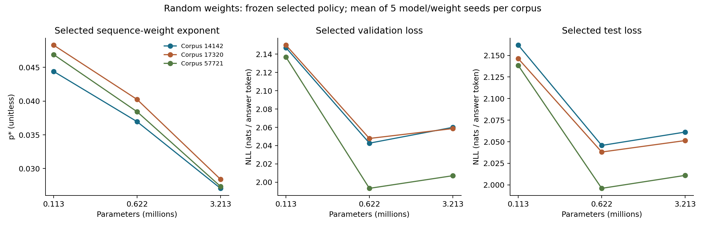
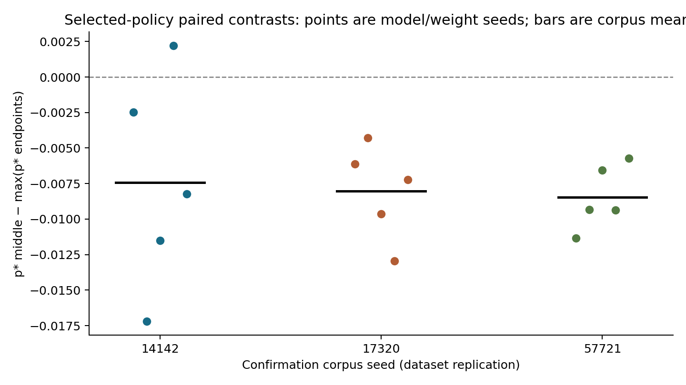
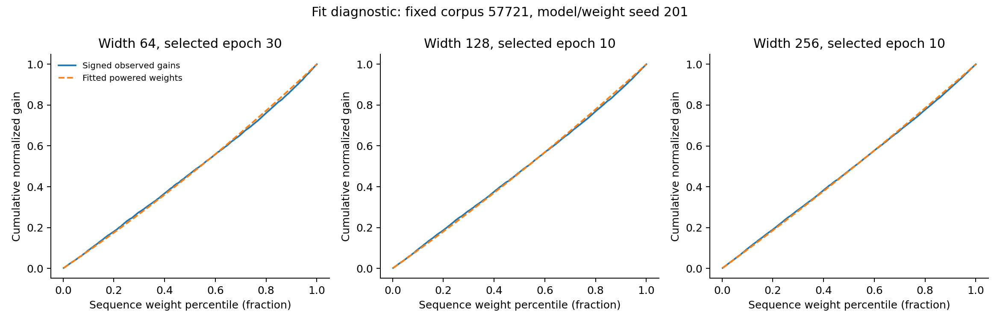
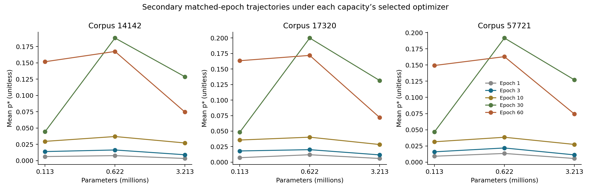

# Stage 2: capacity-specific validation tuning

Result: **the p* peak disappears** under the frozen descriptive rule.
Positive contrasts: **1/15** corpus/seed pairs.
The primary generalization criterion was **not met**.
These are results from a synthetic task with a bounded grid, not an exact large-LM replication.

## Design and execution

The study completed 216 tuning runs, 90 confirmation runs, one separate engineering benchmark,
and 52 pretrained checkpoints. All completed without failed runs. Training ran locally on
an RTX 3050 Laptop through Ubuntu WSL 2 in float32. Source/protocols were frozen before
the benchmark, and selection.json was frozen before confirmation. Test evaluation occurred once
per confirmation run, at the selected epoch. The notebook was not executed;
scripts ran the experiments.

Each of the two tuning replications used one corpus and one model seed;
these factors were not crossed. Confirmation used three independent corpora with
five model/weight seeds per corpus. Model/weight seeds do not constitute 15 dataset replications.
All arms had paired tokens/labels, initial checkpoints, and batch order;
random weights were identical across capacities. Full data were generated before toggling test evaluation.

## Validation-only selection

| Width/layers | LR | WD | Clip | Epoch | Tuning val NLL | Epoch 0 val NLL |
| --- | --- | --- | --- | --- | --- | --- |
| 64/2 | 0.0001 | 0.1 | 1.0 | 30 | 2.009139 | 3.234835 |
| 128/3 | 0.0003 | 0.1 | 1.0 | 10 | 1.895202 | 4.193495 |
| 256/4 | 0.0001 | 1.0 | 1.0 | 10 | 1.901818 | 5.450627 |

The mean across two arms × two tuning replications was the selection score. The tie rule was:
full-precision score, earlier epoch, ascending LR, ascending WD, and clipping 1 before disabled clipping.
Epoch 0 was a required comparator; adaptation candidates were epochs 1/3/10/30/60.
Capacities whose selected adaptation was worse than epoch 0:
[].
Neither p*, test loss, nor curve shape was a selection criterion.

## Results under the selected policies

| Arm | Parameters | Epoch | p* mean | Train NLL | Val NLL | Test NLL | Instance train accuracy | Clipping |
| --- | --- | --- | --- | --- | --- | --- | --- | --- |
| random | 113408 | 30 | 0.046519 | 2.05450 | 2.14454 | 2.14875 | 6.44% | 99.9% |
| random | 621696 | 10 | 0.038538 | 1.88132 | 2.02793 | 2.02661 | 9.89% | 99.7% |
| random | 3212800 | 10 | 0.027615 | 1.87971 | 2.04190 | 2.04119 | 9.80% | 99.6% |
| uniform | 113408 | 30 | undefined | 1.85120 | 1.89826 | 1.89661 | 6.17% | 100.0% |
| uniform | 621696 | 10 | undefined | 1.65830 | 1.81381 | 1.81462 | 9.69% | 95.8% |
| uniform | 3212800 | 10 | undefined | 1.63720 | 1.79727 | 1.79884 | 9.71% | 98.8% |

Table entries are means of 15 runs per arm/capacity, with equal seed counts
within each corpus. This compares policies: duration can differ across capacities.
Uniform-weight p* is unidentified. The CSV retains all components, gains, fits,
clipping, and checkpoints so that means do not obscure individual outcomes.

| Corpus | Model/weight seed | p* small | p* middle | p* large | Middle minus max endpoint |
| --- | --- | --- | --- | --- | --- |
| 57721 | 201 | 0.048086 | 0.036757 | 0.026499 | -0.011328 |
| 57721 | 202 | 0.042568 | 0.033231 | 0.025276 | -0.009337 |
| 57721 | 203 | 0.050965 | 0.044397 | 0.032146 | -0.006568 |
| 57721 | 204 | 0.040614 | 0.031262 | 0.023101 | -0.009352 |
| 57721 | 205 | 0.052189 | 0.046461 | 0.029782 | -0.005728 |
| 14142 | 201 | 0.043092 | 0.040623 | 0.026656 | -0.002469 |
| 14142 | 202 | 0.051336 | 0.034134 | 0.024526 | -0.017202 |
| 14142 | 203 | 0.042216 | 0.030720 | 0.022705 | -0.011496 |
| 14142 | 204 | 0.037892 | 0.040094 | 0.031680 | 0.002203 |
| 14142 | 205 | 0.047403 | 0.039184 | 0.029789 | -0.008219 |
| 17320 | 201 | 0.038989 | 0.032866 | 0.021807 | -0.006123 |
| 17320 | 202 | 0.049790 | 0.045515 | 0.028199 | -0.004275 |
| 17320 | 203 | 0.049909 | 0.040281 | 0.030024 | -0.009628 |
| 17320 | 204 | 0.054278 | 0.041323 | 0.030461 | -0.012955 |
| 17320 | 205 | 0.048454 | 0.041215 | 0.031582 | -0.007239 |

| Corpus | Mean contrast | Within-corpus SD | Positive / 5 |
| --- | --- | --- | --- |
| 14142 | -0.007436696014881021 | 0.007583735229707229 | 1 |
| 17320 | -0.008043978199351418 | 0.0033604921699118156 | 0 |
| 57721 | -0.008462625667742302 | 0.0022822826041384125 | 0 |

Mean contrast across corpora: -0.007981099960658248; between-corpus SD:
0.0005158470391801077; range: [-0.008462625667742302, -0.007436696014881021].
The within-corpus SD above measures model/weight variation on the same data.
Three corpora are insufficient for a significance claim; no sequence-level
bootstrap was treated as dataset replication.

## Generalization, memorization, and fit quality

| Corpus | Arm | Test decreases with capacity | Selected val no worse than epoch 0 |
| --- | --- | --- | --- |
| 14142 | random | False | True |
| 14142 | uniform | True | True |
| 17320 | random | False | True |
| 17320 | uniform | True | True |
| 57721 | random | False | True |
| 57721 | uniform | True | True |

The primary rule required random-weight test NLL to decrease strictly across all three capacities
in every corpus, and selected mean validation NLL to be no worse than
epoch 0 for every capacity/corpus. Full values are in summary.json.
Baseline test evaluation was not scheduled, so no claim of test improvement
over epoch 0 is made. Uniform controls are reported separately.

Primary random-weight p* undefined: 0/45;
lower boundary (p<=.001): 0/45;
upper boundary (p>=7.999): 0/45.
Fit-objective range: 7.517703433987704e-06 to 0.00010353193440490573.
Total signed-gain range: 562.0836169719696 to 1848.9171843528748.
Negative-gain fraction range: 0.0 to 0.001953125.
Counts of all checkpoints with undefined p*, by reason:
{"no_adaptation": 307, "constant_weights": 765}. This includes epoch 0,
uniform controls, tuning, confirmation, and the engineering benchmark; the benchmark
is excluded from primary inference. Undefined values were never replaced with zero.
Negative gains were retained. A small objective does not itself establish a correct
mechanistic model. A clipping choice within the grid is not a separate causal intervention.

## Secondary diagnostics

| Epoch | Positive contrasts / 15 | Undefined | Mean contrast by corpus |
| --- | --- | --- | --- |
| 1 | 13 | 0 | 14142: 0.0012605589564729624, 17320: 0.004535690078206001, 57721: 0.004257881857760932 |
| 3 | 15 | 0 | 14142: 0.002444034726352248, 17320: 0.0020939775908275144, 57721: 0.005920298707585646 |
| 10 | 15 | 0 | 14142: 0.007373047715695082, 17320: 0.004583245600071917, 57721: 0.006951888433079744 |
| 30 | 15 | 0 | 14142: 0.05940599427265688, 17320: 0.06843275785044688, 57721: 0.06458881829756843 |
| 60 | 10 | 0 | 14142: 0.015776224642135607, 17320: 0.008552526371074742, 57721: 0.013634599809569947 |

Trajectories use each capacity's selected optimizer at matched epochs.
Models could continue training beyond their test-evaluation epoch only for prescheduled
diagnostics; no reselection or additional test evaluation occurred. Historical v0.2
is a cross-study comparator rather than a control with identical tensors. At this stage,
no new control matched all v0.2 optimizer settings on the Stage 2 corpora.

## Runtime, audit, and reproducibility

Wall time from the grid start through confirmation completion: 3314.8 seconds (55.2 minutes),
including required pretraining, evaluation, and serialization within
that interval; excluding preparation, the benchmark, and audit. Total per-run time
(including the benchmark, and pretraining on the first invocation): 3153.0 seconds.
Peak adaptation allocated memory: 150.49 MiB;
reserved memory: 184.00 MiB. These are
PyTorch memory measurements, not total desktop/driver usage.

AUDIT.json verifies 307 runs and 52 checkpoints, full pairing, all hashes,
selection reconstruction, freeze/test ordering, all p* values from signed gains, and
absence of test evaluation during tuning. raw-manifest.json records hashes of every raw file,
including full models excluded from the compact archive. run-records.zip
retains source, protocols, environment, corpora, assignments/order, all losses,
selection decisions, reports, and figures. Full models remain at:
`work/runs/generalization-v03-20260928-01/`.

Reproduction requires environment-lock.txt and the local CUDA/WSL runtime. Use Stage 2
source with a new run-id: run the benchmark phase, then the experiment phase if
its gate passes, followed by analyze_stage2.py. Do not overwrite this directory.

## Research positioning and claim boundaries

The results support framing this study around the limits of peak robustness under validation-based selection in this synthetic task. They do not establish replication of Jane Street's curve. At this stage, the follow-up priority was optimizer/duration controls on identical corpora to separate early-stopping effects from regularization changes. Large-text extensions and inverse-exponent compensation were not justified by these results.

The [updated primary-source check](../LITERATURE_CHECK.md) limits novelty claims:
relationships among weighting, regularization, duration, and memorization were already addressed in the literature.
Jane Street selects hyperparameters for validation and reports improving
held-out performance with scale; that difference in conditions must remain explicit.

Three capacities provide only one interior point. Selection within the grid does not establish
a global optimum. No new dropout or pattern-proportion changes were introduced. Model and
weight assignments use related seeds. Three corpora provide a stronger cross-data
description than Stage 1, but remain insufficient for universal claims.
The single Pythia size/seed from Stage 1 still does not constitute a scaling curve. This stage
involved no publication, upload, cloud spending, venue claim, or publication promise.
