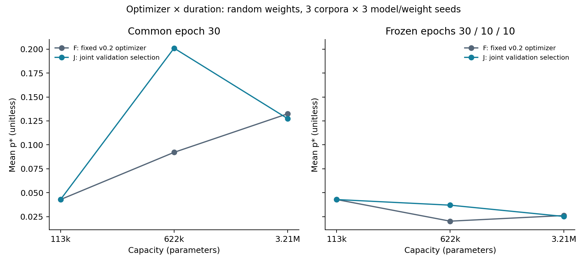
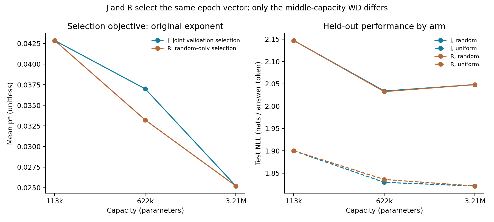
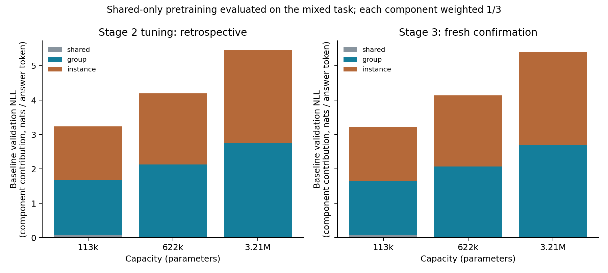
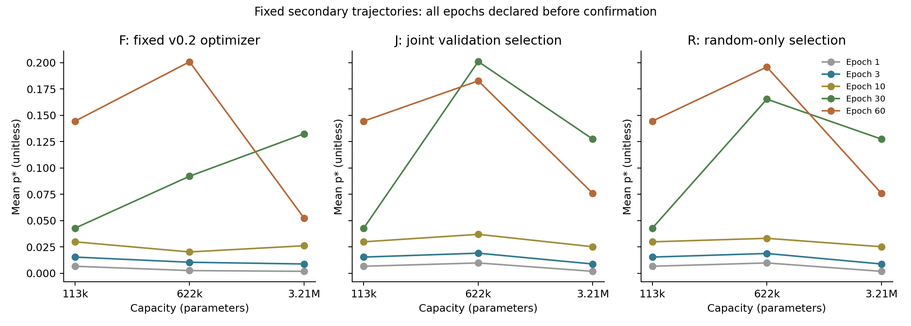

# Stage 3 v0.4: optimizer, duration, selection objective, and baseline

The study completed 108 paired confirmation runs and 27 pretrained checkpoints without
failures. Three fresh corpora × three model/weight seeds; six unique configurations
across three capacities, with random and uniform weighting. No new tuning grid was run.
The integrity audit returned **PASS**. All figures below follow the protocol
frozen before confirmation; Stage 2 diagnostics are labeled retrospective.

## 1. Optimizer and duration

On fresh data, changing the schedule from C30 → EJ produced a mean K change of 0.017682 with optimizer F and -0.079479 with J. The optimizer×duration interaction was -0.097161 (corpus-mean sign: negative). At the same epoch 30, F/J yielded disappears / survives; under the 30/10/10 schedule, the verdicts were disappears / disappears. This separates checkpoint changes along the same trajectory from optimizer-configuration changes in this controlled experiment.

F uses LR 1e-4, WD 0.1, and clipping 1 at every capacity. J is the
Stage 2 joint-validation-selected configuration. C30 denotes epochs 30/30/30; EJ denotes 30/10/10.
K = middle-capacity p* − max(small-capacity p*, large-capacity p*). Optimizers and schedules are crossed on
identical corpora, initial checkpoints, weights, and batch order. This contrast
does not equate a combined LR/WD intervention with the effect of regularization alone.

| Cell | Alias | Mean K | Between-corpus SD | Positive / 9 | Peak verdict | Random generalization |
| --- | --- | --- | --- | --- | --- | --- |
| F_C30 | - | -0.040267 | 0.006178 | 0 | disappears | False |
| F_EJ | - | -0.022584 | 0.002914 | 0 | disappears | False |
| J_C30 | - | 0.073606 | 0.005694 | 9 | survives | False |
| J_EJ | - | -0.005873 | 0.005860 | 1 | disappears | False |
| J_ER | J_EJ | -0.005873 | 0.005860 | 1 | disappears | False |
| R_EJ | - | -0.009651 | 0.005316 | 0 | disappears | False |
| R_ER | R_EJ | -0.009651 | 0.005316 | 0 | disappears | False |

Aliases identify cells using exactly the same trajectory and checkpoint.
They are not counted as additional replications. F/J are identical at the smallest capacity.

| Effect on K | Mean | Between-corpus SD | Corpus-mean sign |
| --- | --- | --- | --- |
| Q1_optimizer_C30 | 0.113873 | 0.009216 | positive |
| Q1_optimizer_EJ | 0.016712 | 0.003182 | positive |
| Q1_duration_F | 0.017682 | 0.003641 | positive |
| Q1_duration_J | -0.079479 | 0.006050 | negative |
| Q1_interaction | -0.097161 | 0.009691 | negative |
| Q2_configuration_EJ | -0.003779 | 0.000657 | negative |
| Q2_duration_J | 0.000000 | 0.000000 | zero |
| Q2_interaction | 0.000000 | 0.000000 | zero |
| Q2_total | -0.003779 | 0.000657 | negative |

All 9 contrasts and the mean/SD within each corpus are available in policy-summary.json
and policy-cells.csv. SD in the effect table is the SD of three corpus means,
not uncertainty estimated from nine datasets. Three corpora do not support
a significance claim. A consistent effect means all three corpus means have the same sign; zero,
mixed, and undefined outcomes remain displayed.

## 2. Validation selection objective

Random-only selection yielded disappears, with 0/9 positive contrasts. The total K change relative to joint selection was -0.003779. EJ=ER exactly, so the schedule-change effect and its interaction in the selection-objective comparison are zero because the selected designs are identical. The remaining difference is configuration, specifically WD 0.1 → 1 at the middle capacity, with LR and clipping unchanged.

| Policy | Width | LR | WD | Clip | Selected epoch |
| --- | --- | --- | --- | --- | --- |
| F | 64 | 0.0001 | 0.1 | 1.0 | fixed trajectories |
| F | 128 | 0.0001 | 0.1 | 1.0 | fixed trajectories |
| F | 256 | 0.0001 | 0.1 | 1.0 | fixed trajectories |
| J | 64 | 0.0001 | 0.1 | 1.0 | 30 |
| J | 128 | 0.0003 | 0.1 | 1.0 | 10 |
| J | 256 | 0.0001 | 1.0 | 1.0 | 10 |
| R | 64 | 0.0001 | 0.1 | 1.0 | 30 |
| R | 128 | 0.0003 | 1.0 | 1.0 | 10 |
| R | 256 | 0.0001 | 1.0 | 1.0 | 10 |

J and R were computed from **two reused Stage 2 tuning replications**.
J minimizes mean validation NLL across random+uniform arms; R uses only random weighting.
The tie rule is full-precision score, earlier epoch, ascending LR, ascending WD, and clipping 1 before
disabled clipping. Hashes of all inputs/decisions, candidates, and schedules are saved in
selection.json. Test results, p*, and confirmation outcomes do not enter selection.

These policy effects are conditional on the two tuning replications. They do not
establish that one selection objective is universally better or that a global
optimum was found. Per-capacity paired effects for p*, train/validation/test
NLL, memorization, and clipping are available in per-capacity-effects.csv and JSON.

## 3. Pretraining baseline audit

On J/EJ, the alternative oracle/uniform reference produced undefined p* for 27/27 capacity/corpus/seed pairs. Compare aggregate gain against that reference with gain against the pretrained baseline before interpreting loss reduction as learning specific patterns. This is reference sensitivity, not the causal effect of changing pretraining.

| Source | Width | Total val NLL | Shared NLL | Group NLL | Instance NLL |
| --- | --- | --- | --- | --- | --- |
| stage 2_tuning_retrospective | 64 | 3.234835 | 0.235978 | 4.771241 | 4.697286 |
| stage 2_tuning_retrospective | 128 | 4.193495 | 0.047410 | 6.335068 | 6.198006 |
| stage 2_tuning_retrospective | 256 | 5.450627 | 0.007936 | 8.256560 | 8.087385 |
| fresh_confirmation | 64 | 3.220053 | 0.234622 | 4.715975 | 4.709560 |
| fresh_confirmation | 128 | 4.133592 | 0.048944 | 6.166673 | 6.185159 |
| fresh_confirmation | 256 | 5.398345 | 0.008105 | 8.075870 | 8.111061 |

Component NLL in the table is the mean per answer token for each component;
total mixed NLL is the mean of the three components. Stage 2 values use six deduplicated
tuning baselines, matching the context of 3.23/4.19/5.45.
Shared-only pretraining does not optimize the mixed task's group and instance components.
A uniform reference over 16 answers has NLL log(16)=2.772589 per component.

The following shows gain allocation for J/EJ, random weighting, and fresh confirmation data. Signed mass shares
can be negative; component gains are not clipped. RMS measures the shape of cumulative
contributions to deviation from uniform allocation. Full cross-terms
are saved in diagnostics.json because contributions are not independent.

| Width | Component | Initial train NLL | Current NLL | Signed mean gain | Gain mass share | Centered cumulative RMS | Component p* | Undefined / 9 |
| --- | --- | --- | --- | --- | --- | --- | --- | --- |
| 64 | shared | 0.234499 | 0.527483 | -0.292983 | -0.084876 | 0.005666 | undefined | 9 |
| 64 | group | 4.703795 | 2.742689 | 1.961106 | 0.566571 | 0.012082 | 0.031952 | 0 |
| 64 | instance | 4.687210 | 2.893176 | 1.794034 | 0.518304 | 0.010631 | 0.030719 | 0 |
| 128 | shared | 0.048924 | 0.207852 | -0.158928 | -0.023696 | 0.001739 | undefined | 9 |
| 128 | group | 6.159197 | 2.613015 | 3.546182 | 0.528970 | 0.013184 | 0.037514 | 0 |
| 128 | instance | 6.158640 | 2.842059 | 3.316581 | 0.494726 | 0.009622 | 0.029260 | 0 |
| 256 | shared | 0.008095 | 0.154618 | -0.146523 | -0.013965 | 0.000890 | undefined | 9 |
| 256 | group | 8.063546 | 2.634587 | 5.428958 | 0.517401 | 0.009382 | 0.027165 | 0 |
| 256 | instance | 8.084946 | 2.874981 | 5.209965 | 0.496564 | 0.006570 | 0.019750 | 0 |

| Cell | Width | Original p* | Group+instance p* | Oracle-ref p* | Oracle undefined / 9 | Oracle mean gain |
| --- | --- | --- | --- | --- | --- | --- |
| J_EJ | 64 | 0.042864 | 0.031373 | undefined | 9 | -0.206057 |
| J_EJ | 128 | 0.036992 | 0.033525 | undefined | 9 | -0.039249 |
| J_EJ | 256 | 0.025213 | 0.023531 | undefined | 9 | -0.039670 |
| J_C30 | 64 | 0.042864 | 0.031373 | undefined | 9 | -0.206057 |
| J_C30 | 128 | 0.200998 | 0.198614 | 4.272652 | 0 | 0.171829 |
| J_C30 | 256 | 0.127392 | 0.126392 | 1.856754 | 0 | 0.353572 |
| J_C60 | 64 | 0.144442 | 0.134974 | undefined | 9 | -0.068719 |
| J_C60 | 128 | 0.182661 | 0.182266 | 0.833181 | 0 | 0.700048 |
| J_C60 | 256 | 0.075937 | 0.075765 | 0.299426 | 0 | 1.193213 |

The alternative reference [0, log(16), log(16)] is an oracle shared rule with
uniform predictions for group/instance, **not another pretrained checkpoint**.
Undefined values indicate an unidentified estimator or nonpositive aggregate gain;
they are not discarded or replaced with zero. Diagnostic means are
shown only when all nine values are defined. Primary p* remains the original
estimator against the pretrained baseline and uses signed gains.

The identity total gain = mean of the three component gains was checked; the maximum
float32 difference was 1.38767064e-06. Cumulative allocations
and the cross-term matrix were also reconstructed. Diagnostics cover all 540
Stage 3 adaptation checkpoints and 450 retrospective Stage 2 checkpoints. Baselines
and reference changes can affect gain/p* interpretation, but this is not a
pretraining intervention that identifies a causal explanation for the peak.

## 4. Generalization, memorization, and clipping

| Cell | Arm | Width | Epoch | p* | Train NLL | Validation NLL | Test NLL | Instance train acc | Clipping |
| --- | --- | --- | --- | --- | --- | --- | --- | --- | --- |
| F_C30 | random | 64 | 30 | 0.042864 | 2.054449 | 2.147894 | 2.146821 | 6.77% | 100.0% |
| F_C30 | random | 128 | 30 | 0.092165 | 1.854368 | 2.219055 | 2.225263 | 17.32% | 100.0% |
| F_C30 | random | 256 | 30 | 0.132432 | 1.458673 | 2.740242 | 2.735825 | 42.76% | 100.0% |
| F_C30 | uniform | 64 | 30 | undefined | 1.847775 | 1.904737 | 1.900077 | 6.68% | 100.0% |
| F_C30 | uniform | 128 | 30 | undefined | 1.475345 | 1.884096 | 1.882798 | 14.71% | 99.4% |
| F_C30 | uniform | 256 | 30 | undefined | 0.408759 | 2.075258 | 2.074555 | 68.48% | 99.1% |
| F_EJ | random | 64 | 30 | 0.042864 | 2.054449 | 2.147894 | 2.146821 | 6.77% | 100.0% |
| F_EJ | random | 128 | 10 | 0.020280 | 2.104665 | 2.184561 | 2.184487 | 6.55% | 100.0% |
| F_EJ | random | 256 | 10 | 0.026158 | 1.884945 | 2.052492 | 2.050965 | 10.03% | 100.0% |
| F_EJ | uniform | 64 | 30 | undefined | 1.847775 | 1.904737 | 1.900077 | 6.68% | 100.0% |
| F_EJ | uniform | 128 | 10 | undefined | 1.878945 | 1.937995 | 1.935183 | 6.42% | 100.0% |
| F_EJ | uniform | 256 | 10 | undefined | 1.647194 | 1.818490 | 1.819554 | 10.69% | 97.2% |
| J_C30 | random | 64 | 30 | 0.042864 | 2.054449 | 2.147894 | 2.146821 | 6.77% | 100.0% |
| J_C30 | random | 128 | 30 | 0.200998 | 1.676563 | 2.696547 | 2.685456 | 35.28% | 100.0% |
| J_C30 | random | 256 | 30 | 0.127392 | 1.494821 | 2.646037 | 2.646580 | 40.66% | 100.0% |
| J_C30 | uniform | 64 | 30 | undefined | 1.847775 | 1.904737 | 1.900077 | 6.68% | 100.0% |
| J_C30 | uniform | 128 | 30 | undefined | 0.705349 | 1.990881 | 1.984160 | 44.43% | 98.4% |
| J_C30 | uniform | 256 | 30 | undefined | 0.480548 | 1.991647 | 1.990135 | 62.90% | 99.1% |
| J_EJ | random | 64 | 30 | 0.042864 | 2.054449 | 2.147894 | 2.146821 | 6.77% | 100.0% |
| J_EJ | random | 128 | 10 | 0.036992 | 1.887642 | 2.033437 | 2.033754 | 10.11% | 99.9% |
| J_EJ | random | 256 | 10 | 0.025213 | 1.888062 | 2.049755 | 2.048131 | 9.83% | 100.0% |
| J_EJ | uniform | 64 | 30 | undefined | 1.847775 | 1.904737 | 1.900077 | 6.68% | 100.0% |
| J_EJ | uniform | 128 | 10 | undefined | 1.669073 | 1.827530 | 1.829391 | 10.69% | 95.2% |
| J_EJ | uniform | 256 | 10 | undefined | 1.653898 | 1.820356 | 1.821334 | 10.63% | 97.2% |
| R_ER | random | 64 | 30 | 0.042864 | 2.054449 | 2.147894 | 2.146821 | 6.77% | 100.0% |
| R_ER | random | 128 | 10 | 0.033213 | 1.901952 | 2.034029 | 2.032501 | 9.44% | 99.9% |
| R_ER | random | 256 | 10 | 0.025213 | 1.888062 | 2.049755 | 2.048131 | 9.83% | 100.0% |
| R_ER | uniform | 64 | 30 | undefined | 1.847775 | 1.904737 | 1.900077 | 6.68% | 100.0% |
| R_ER | uniform | 128 | 10 | undefined | 1.690043 | 1.835094 | 1.835852 | 10.32% | 94.4% |
| R_ER | uniform | 256 | 10 | undefined | 1.653898 | 1.820356 | 1.821334 | 10.63% | 97.2% |

The generalization criterion is applied per corpus: test NLL must decrease strictly
with capacity, and validation NLL must be no worse than epoch 0 at every
capacity. Results for each corpus and arm are in policy-summary.json.
No epoch 0 test evaluation or confirmation-based reselection occurred.
Uniform-weight p* is always undefined. All undefined/boundary fits, including component
and alternative-reference fits, are saved in diagnostics.json and diagnostics.csv.

## 5. Integrity, runtime, and reproducibility

Training-stage wall time was 1212.8 seconds
(20.2 minutes), including pretraining, evaluation, and
serialization within that interval; excluding preparation, audit, and reporting.
Peak adaptation allocated memory was 150.49 MiB;
reserved memory was 184.00 MiB.
These are PyTorch measurements rather than total desktop/driver usage. The two-hour and 144-run
limits were met; the actual count of 108 resulted from deduplication before training.

The audit checked 3031 historical files,
108 runs, 27 pretrained checkpoints, 540 adaptation-model checkpoints, and exactly
540 test evaluations after the freeze. Source/tensor/order/weight/checkpoint hashes,
pairing across arms and configurations, split/toggle equality, independent validation
selection, all scalar metrics, and original p* were reconstructed. No runs failed.

Raw records: `work/runs/controls-v04-20260929-01/`. The compact archive retains protocols/source,
tuning inputs and decisions, data, assignments/order, per-sequence losses,
retrospective evidence, audit, reports, and figures. Full models are excluded
from the ZIP but remain available locally with hashes. environment-lock.txt records
the actual runtime. The notebook was not executed; equivalent scripts ran the study.

## 6. Research positioning and claim boundaries

The candidate contribution is a controlled study of optimizer/duration/selection policies
and a baseline audit in a structured task. Measured effects apply to the configurations
and corpora in this protocol. Three capacities provide only one interior point;
there is no evidence of movement between two interior peak locations. Three corpora and
two reused tuning replications limit the generality of inference.

[Jane Street](https://blog.janestreet.com/a-study-of-sequence-weighting-at-scale/)
uses held-out tuning and strong regularization for pretrained LMs; these synthetic
results do not reproduce that setting. The signed-gain estimator follows the
[technical note](https://blog.janestreet.com/a-study-of-sequence-weighting-at-scale/sequence-weighting-note.pdf).
Relationships between weighting, duration, and regularization were already addressed by
[Byrd & Lipton, ICML 2019](https://proceedings.mlr.press/v97/byrd19a.html) and
[Xu, Ye & Ruan, 2021](https://arxiv.org/abs/2103.15209). Primary-source rechecks are
documented in LITERATURE_CHECK.md. This stage made no novelty/venue claim and involved no publication.
