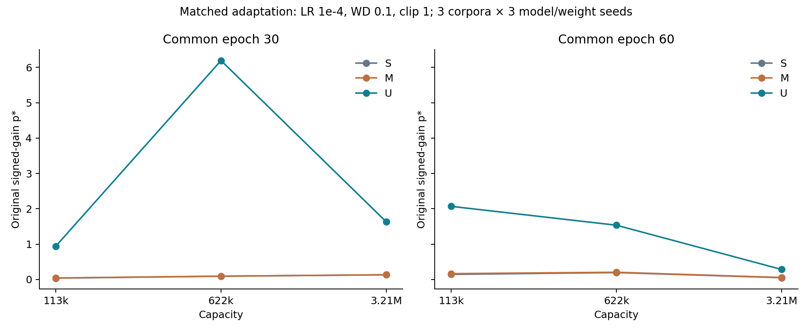
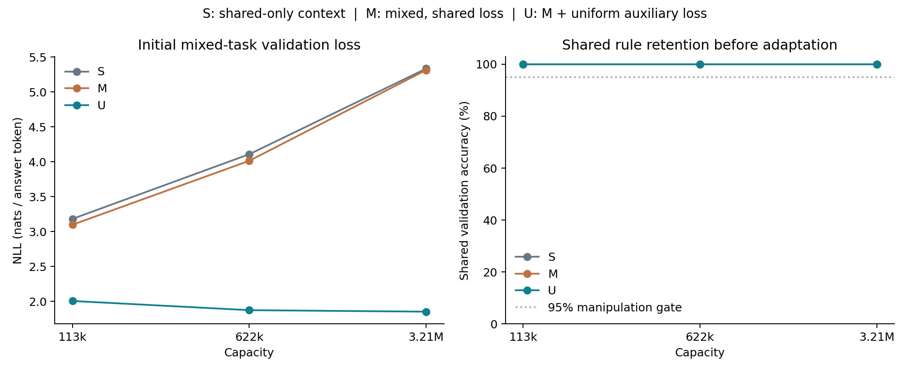
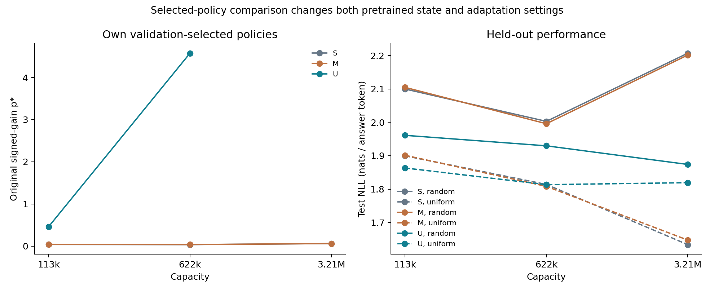
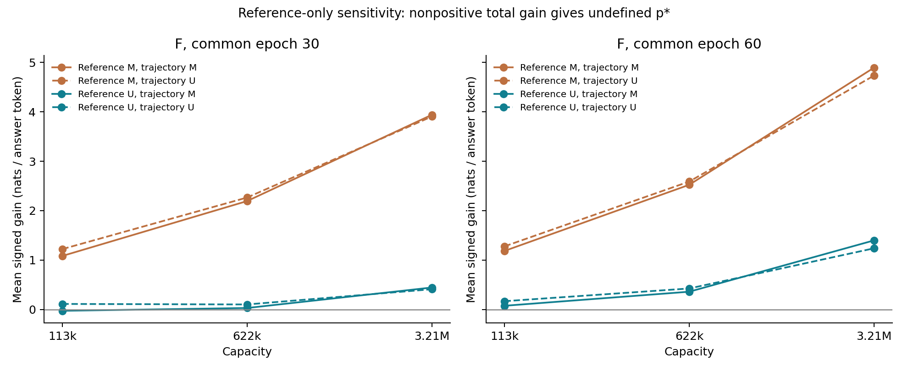

# Stage 4 v0.5: pretraining intervention and gain reference

**Analysis note:** the primary audit passed in the initial analysis, but one float64 Gram check exceeded the absolute tolerance of 1e-12. These results use the numerical-verification repair documented in NUMERICAL_REPAIR.md; the original failure is retained. No retraining or estimator/selection change occurred.

The study completed 144 fresh tuning runs and 270 confirmation runs, with 99 pretrained models.
Three confirmation corpora × three model/weight seeds, three capacities, and two arms.
The integrity audit returned **PASS**; no runs failed. Comparison formulas,
data seeds, the grid, and test evaluations were frozen before training. Selection used
only validation NLL from two separate tuning corpus/model pairs.

## 1. Main result: pretraining under matched adaptation

With optimizer F at epoch 30, the mean K change for U−M was
**4.600252**, with a
**positive** corpus-mean sign. The verdict for M was
**disappears**, and for U it was
**survives**.
K = middle-capacity p* − max(small-capacity p*, large-capacity p*). Undefined values are not discarded.

S uses the earlier shared-only pretraining. M and U use exactly the same mixed
tokens; M optimizes shared CE, while U adds uniform-target CE
over 16 answers at group/instance positions, with a fixed coefficient of 1. The cold
checkpoint and batch order are identical. F uses LR 1e-4, WD .1, and clipping 1.
U−M at F/C30 tests a pretraining-objective intervention under fixed adaptation.
The intervention can change both representations and baseline loss; it does not
identify the isolated effect of a single baseline value. S−M also changes context and
the amount of shared-token supervision, making it a contextual comparison.

| Cell | Mean K | SD corpus means | Positive / 9 | Undefined / 9 | Peak | Gen random | Gen uniform |
| --- | --- | --- | --- | --- | --- | --- | --- |
| S_F_C30 | -0.041060 | 0.003466 | 0 | 0 | disappears | False | False |
| S_F_C60 | 0.050503 | 0.007935 | 9 | 0 | survives | False | False |
| S_T_C30 | 0.066644 | 0.000210 | 9 | 0 | survives | False | False |
| S_F_ET | -0.017580 | 0.002940 | 0 | 0 | disappears | False | False |
| S_T_ET | -0.025444 | 0.002409 | 0 | 0 | disappears | False | True |
| M_F_C30 | -0.038544 | 0.002886 | 0 | 0 | disappears | False | False |
| M_F_C60 | 0.039704 | 0.005262 | 9 | 0 | survives | False | False |
| M_T_C30 | 0.071342 | 0.008147 | 9 | 0 | survives | False | False |
| M_F_ET | -0.021320 | 0.003040 | 0 | 0 | disappears | False | False |
| M_T_ET | -0.024380 | 0.001642 | 0 | 0 | disappears | False | True |
| U_F_C30 | 4.561708 | 1.501001 | 9 | 0 | survives | False | False |
| U_F_C60 | -0.533549 | 0.216302 | 2 | 0 | disappears | False | False |
| U_T_C30 | 3.862426 | 1.238621 | 9 | 0 | survives | False | False |
| U_F_ET | 2.034824 | 0.853716 | 7 | 0 | mixed/inconclusive | False | False |
| U_T_ET | undefined | undefined | 3 | 1 | inconclusive_undefined | False | False |

F/T denotes the fixed/selected optimizer for each condition. C30/C60 uses matched epochs
across capacities; ET uses the epoch vector selected for that condition.
Aliases for identical cells are recorded in policy-summary.json, rather than counted as additional replications.
Survives means 9/9 contrasts are defined and positive; disappears means all
are defined and all three corpus means are <=0; other outcomes are mixed or undefined.
SD refers to the three corpus means. These are descriptive results without a significance claim.

## 2. Did the intervention improve the targeted baseline?

Overall manipulation check: **True**. U reduced
both group/instance component NLLs relative to M in **9/9**
capacity/corpus cells; U shared accuracy was >=95% in **9/9** cells.
The two conditions are reported separately; failure did not trigger selection or retry.

| Condition | Width | Initial val NLL | Shared NLL | Group NLL | Instance NLL | Shared accuracy |
| --- | --- | --- | --- | --- | --- | --- |
| S | 64 | 3.182204 | 0.232534 | 4.624573 | 4.689504 | 100.00% |
| S | 128 | 4.108480 | 0.047723 | 6.105278 | 6.172439 | 100.00% |
| S | 256 | 5.333983 | 0.008079 | 7.944114 | 8.049758 | 100.00% |
| M | 64 | 3.098612 | 0.251842 | 4.494442 | 4.549553 | 100.00% |
| M | 128 | 4.014371 | 0.049274 | 5.962710 | 6.031128 | 100.00% |
| M | 256 | 5.313718 | 0.007875 | 7.916956 | 8.016324 | 100.00% |
| U | 64 | 2.006810 | 0.415802 | 2.799329 | 2.805299 | 100.00% |
| U | 128 | 1.875265 | 0.060029 | 2.781759 | 2.784008 | 100.00% |
| U | 256 | 1.853632 | 0.009380 | 2.775111 | 2.776404 | 100.00% |

Each component has four answers, so mixed NLL is the mean
of the three components. Ideal uniform-answer NLL for group/instance is log(16)=2.772589.
Lower NLL is not a complete assessment of probability calibration. S/M/U all
use four pretraining epochs; neither pretraining strength nor duration was tuned.

## 3. Fresh tuning, optimizer, and duration

| Condition | Width | LR | WD | Clip | Epoch | Tuning validation NLL |
| --- | --- | --- | --- | --- | --- | --- |
| S | 64 | 0.0001 | 0.1 | 1.0 | 30 | 1.992689 |
| S | 128 | 0.0003 | 0.1 | 1.0 | 10 | 1.893534 |
| S | 256 | 0.0003 | 1.0 | 1.0 | 10 | 1.901114 |
| M | 64 | 0.0001 | 0.1 | 1.0 | 30 | 1.982483 |
| M | 128 | 0.0003 | 0.1 | 1.0 | 10 | 1.896345 |
| M | 256 | 0.0003 | 1.0 | 1.0 | 10 | 1.908137 |
| U | 64 | 0.0003 | 0.1 | 1.0 | 10 | 1.896070 |
| U | 128 | 0.0001 | 0.1 | 1.0 | 10 | 1.838469 |
| U | 256 | 0.0003 | 0.1 | 1.0 | 3 | 1.850748 |

The grid is limited to LR {1e-4,3e-4}, WD {.1,1}, clipping 1, and epochs {1,3,10,30,60}.
The score is mean validation NLL across both arms and two tuning pairs. The tie rule is
full-precision score, earlier epoch, ascending LR, and ascending WD. Epoch 0 is only an
improvement check. The best result in this grid does not establish a global optimum.
The U−M comparison at T/ET is a total policy effect that also changes
optimizer/duration, and thus differs from the fixed-adaptation comparison above.

| Effect on K | Mean | SD corpus means | Corpus-mean sign |
| --- | --- | --- | --- |
| primary_U_minus_M_F_C30 | 4.600252 | 1.498199 | positive |
| secondary_U_minus_M_F_C60 | -0.573252 | 0.211076 | negative |
| context_M_minus_S_F_C30 | 0.002516 | 0.002771 | mixed |
| selected_policy_U_minus_M | undefined | undefined | undefined |
| S_optimizer_C30 | 0.107704 | 0.003256 | positive |
| S_duration_F | 0.023480 | 0.003001 | positive |
| S_duration_T | -0.092089 | 0.002216 | negative |
| S_interaction | -0.115569 | 0.004052 | negative |
| M_optimizer_C30 | 0.109886 | 0.005270 | positive |
| M_duration_F | 0.017224 | 0.004576 | positive |
| M_duration_T | -0.095723 | 0.009731 | negative |
| M_interaction | -0.112947 | 0.006482 | negative |
| U_optimizer_C30 | -0.699283 | 0.262452 | negative |
| U_duration_F | -2.526884 | 2.118819 | negative |
| U_duration_T | undefined | undefined | undefined |
| U_interaction | undefined | undefined | undefined |

Within each condition, interaction=(T_ET−T_C30)−(F_ET−F_C30). All nine
values and three corpus means are in policy-summary.json. Per-capacity effects for
p*, loss, memorization, fit, clipping, and signed gains are in per-capacity-effects.csv.

## 4. Loss-reference-only changes: arithmetic sensitivity

For the same F trajectory, gains are recomputed using the initial M or U baseline.
Diagonal cells use each model's own baseline and exactly match primary p*.
Off-diagonal cells change only the per-sequence loss reference, rather than running
a new model. Propagating undefined values can leave the K decomposition unidentified.

| Reference cell | Mean K | Undefined K / 9 | p* 64 | p* 128 | p* 256 |
| --- | --- | --- | --- | --- | --- |
| e30_referenceM_trajectoryM | -0.038544 | 0 | 0.041212 | 0.093380 | 0.131924 |
| e30_referenceM_trajectoryU | -0.000385 | 0 | 0.054201 | 0.134421 | 0.134806 |
| e30_referenceU_trajectoryM | undefined | 9 | undefined | 8.000000 | 1.493759 |
| e30_referenceU_trajectoryU | 4.561708 | 0 | 0.940211 | 6.193818 | 1.632110 |
| e60_referenceM_trajectoryM | 0.039704 | 0 | 0.163985 | 0.203689 | 0.054557 |
| e60_referenceM_trajectoryU | 0.059032 | 0 | 0.138943 | 0.197975 | 0.074805 |
| e60_referenceU_trajectoryM | -4.191565 | 0 | 6.063049 | 1.871484 | 0.190285 |
| e60_referenceU_trajectoryU | -0.533549 | 0 | 2.068494 | 1.534945 | 0.283015 |

| Reference diagnostic effect on K | Mean | Undefined / 9 |
| --- | --- | --- |
| e30_reference | undefined | 9 |
| e30_trajectory | 0.038159 | 0 |
| e30_interaction | undefined | 9 |
| e30_total | 4.600252 | 0 |
| e60_reference | -4.231268 | 0 |
| e60_trajectory | 0.019328 | 0 |
| e60_interaction | 3.638688 | 0 |
| e60_total | -0.573252 | 0 |

The reference effect holds the M trajectory fixed; the trajectory effect holds reference M fixed.
The interaction is the difference between the crossed effects. Detailed p* and signed mean gains
for each capacity/pair are available in reference-sensitivity.csv and
reference-capacity-effects.csv. Do not sum only the defined components
to infer a total when another component is undefined.

All confirmation checkpoints also retain component p*, group+instance-only p*,
the oracle reference [0, log16, log16], signed mass, centered cumulative RMS, and Gram
cross-terms. The primary estimator continues to use all signed gains against
the original pretrained baseline. The maximum component-gain identity error was
1.50012784e-06, below the frozen tolerance of 2e-6.
Undefined and boundary fits by condition/arm/metric are saved in diagnostics.csv
and diagnostics.json; uniform-weight p* is always undefined, including in diagnostics.

## 5. Generalization, memorization, and fit

For U/F/C30, **2/9** middle-capacity fits reached the search boundary p*=8. The mean fit objective across all nine U middle-capacity fits was 2.600139, compared with 0.000177 for M. Because U fits were much poorer and some values were search-boundary-limited, this descriptive peak must not be treated as evidence of a well-fitting power mechanism. For U/T/ET, 1/27 capacity/pair p* values were undefined and 5/27 reached the upper boundary. No values were removed and the search range was not expanded.

| Cell | Arm | Width | Epoch | p* | Fit objective | Train | Validation | Test | Instance acc | Clipping |
| --- | --- | --- | --- | --- | --- | --- | --- | --- | --- | --- |
| S_F_C30 | random | 64 | 30 | 0.037633 | 0.000049 | 2.029611 | 2.098864 | 2.099726 | 6.24% | 99.9% |
| S_F_C30 | random | 128 | 30 | 0.091671 | 0.000175 | 1.852486 | 2.231229 | 2.228942 | 17.36% | 99.9% |
| S_F_C30 | random | 256 | 30 | 0.132732 | 0.000055 | 1.414097 | 2.713858 | 2.729006 | 44.46% | 99.9% |
| S_F_C30 | uniform | 64 | 30 | undefined | undefined | 1.864771 | 1.899738 | 1.899610 | 5.98% | 100.0% |
| S_F_C30 | uniform | 128 | 30 | undefined | undefined | 1.464831 | 1.875404 | 1.869152 | 14.28% | 99.8% |
| S_F_C30 | uniform | 256 | 30 | undefined | undefined | 0.405957 | 2.011507 | 2.008177 | 68.03% | 99.3% |
| S_T_ET | random | 64 | 30 | 0.037633 | 0.000049 | 2.029611 | 2.098864 | 2.099726 | 6.24% | 99.9% |
| S_T_ET | random | 128 | 10 | 0.034900 | 0.000041 | 1.869373 | 2.009467 | 2.002905 | 9.64% | 99.7% |
| S_T_ET | random | 256 | 10 | 0.060344 | 0.000080 | 1.830574 | 2.217212 | 2.206835 | 16.78% | 99.7% |
| S_T_ET | uniform | 64 | 30 | undefined | undefined | 1.864771 | 1.899738 | 1.899610 | 5.98% | 100.0% |
| S_T_ET | uniform | 128 | 10 | undefined | undefined | 1.668786 | 1.820266 | 1.813977 | 9.70% | 96.5% |
| S_T_ET | uniform | 256 | 10 | undefined | undefined | 1.276689 | 1.644643 | 1.633762 | 12.97% | 97.2% |
| M_F_C30 | random | 64 | 30 | 0.041212 | 0.000054 | 2.035193 | 2.104465 | 2.104647 | 6.25% | 99.9% |
| M_F_C30 | random | 128 | 30 | 0.093380 | 0.000177 | 1.845299 | 2.221211 | 2.210982 | 17.38% | 99.9% |
| M_F_C30 | random | 256 | 30 | 0.131924 | 0.000048 | 1.408972 | 2.693477 | 2.713359 | 44.47% | 99.9% |
| M_F_C30 | uniform | 64 | 30 | undefined | undefined | 1.863920 | 1.901780 | 1.901230 | 5.99% | 100.0% |
| M_F_C30 | uniform | 128 | 30 | undefined | undefined | 1.462668 | 1.872875 | 1.865668 | 13.87% | 99.4% |
| M_F_C30 | uniform | 256 | 30 | undefined | undefined | 0.391361 | 2.036069 | 2.032204 | 69.42% | 99.4% |
| M_T_ET | random | 64 | 30 | 0.041212 | 0.000054 | 2.035193 | 2.104465 | 2.104647 | 6.25% | 99.9% |
| M_T_ET | random | 128 | 10 | 0.035998 | 0.000043 | 1.866695 | 2.003241 | 1.995848 | 9.73% | 99.8% |
| M_T_ET | random | 256 | 10 | 0.060378 | 0.000079 | 1.823531 | 2.212765 | 2.201349 | 16.81% | 99.7% |
| M_T_ET | uniform | 64 | 30 | undefined | undefined | 1.863920 | 1.901780 | 1.901230 | 5.99% | 100.0% |
| M_T_ET | uniform | 128 | 10 | undefined | undefined | 1.665838 | 1.815626 | 1.808197 | 9.67% | 94.6% |
| M_T_ET | uniform | 256 | 10 | undefined | undefined | 1.281091 | 1.657611 | 1.647451 | 14.27% | 96.0% |
| U_F_C30 | random | 64 | 30 | 0.940211 | 0.001938 | 1.896494 | 2.010863 | 2.010890 | 10.10% | 95.8% |
| U_F_C30 | random | 128 | 30 | 6.193818 | 2.600139 | 1.773489 | 2.335233 | 2.338855 | 24.28% | 92.8% |
| U_F_C30 | random | 256 | 30 | 1.632110 | 0.223840 | 1.443863 | 2.756179 | 2.769913 | 44.00% | 97.4% |
| U_F_C30 | uniform | 64 | 30 | undefined | undefined | 1.719533 | 1.879005 | 1.875303 | 10.09% | 73.2% |
| U_F_C30 | uniform | 128 | 30 | undefined | undefined | 1.187442 | 2.034122 | 2.030189 | 24.64% | 80.8% |
| U_F_C30 | uniform | 256 | 30 | undefined | undefined | 0.216177 | 2.395785 | 2.395172 | 86.27% | 87.9% |
| U_T_ET | random | 64 | 10 | 0.460426 | 0.000765 | 1.898929 | 1.961649 | 1.961026 | 7.92% | 94.9% |
| U_T_ET | random | 128 | 10 | 4.575795 | 0.568448 | 1.840168 | 1.937493 | 1.929643 | 8.77% | 78.3% |
| U_T_ET | random | 256 | 3 | undefined | undefined | 1.847607 | 1.874986 | 1.873920 | 7.80% | 88.0% |
| U_T_ET | uniform | 64 | 10 | undefined | undefined | 1.772316 | 1.867980 | 1.863250 | 8.68% | 68.0% |
| U_T_ET | uniform | 128 | 10 | undefined | undefined | 1.678010 | 1.822166 | 1.813333 | 9.72% | 42.3% |
| U_T_ET | uniform | 256 | 3 | undefined | undefined | 1.770996 | 1.822884 | 1.819284 | 8.11% | 50.5% |

The generalization criterion requires test NLL to decrease strictly with capacity and
validation NLL to be <=epoch 0 at every capacity, within **every** corpus. The cell table
above reports random and uniform arms separately; per-corpus results are
in policy-summary.json. No test evaluation occurred during tuning or at epoch 0.
The fit objective, negative-gain fraction, and boundary flags are not selection criteria.
Memorization and clipping must be read alongside p*, rather than as evidence of a causal
clipping mechanism. Complete final data are in all-checkpoints.csv.

## 6. Integrity, resources, and reproducibility

The audit checked 4826 historical files without
changes, 2070 adaptation checkpoints, and exactly
1350 prespecified test evaluations.
Cold-model tensors are identical across conditions; pretrained models/initial losses are identical across
arms/configurations within each condition. Full tokens/targets/type masks, weights, batch
orders, source hashes, selection, and scalar metrics/p* were reconstructed.

Training wall time was 84.1 minutes, including pretraining,
setup, evaluation, and serialization; excluding preparation, audit, and reporting.
Peak adaptation allocated memory was 150.49 MiB;
reserved memory was 184.00 MiB.
These are PyTorch measurements, not total driver/desktop usage. The three-hour
and 468-run limits were met. At the time of this study, all outputs were local; no upload/publication occurred.

Raw records: `work/runs/baseline-v05-20260929-01/`. The compact archive contains protocols, source, data,
per-sequence losses, assignments, tuning decisions, audit, reports, and figures.
Model binaries remain local, with hashes in raw-manifest.json. The environment is recorded
in environment-lock.txt. The notebook was not executed; scripts produced the results.

## 7. Scientific positioning and claim boundaries

The results test a pretraining-objective intervention and gain dependence on
its reference in a synthetic task. Three capacities cannot establish movement
between two interior peaks. Three confirmation corpora and two tuning pairs provide
limited evidence. The intervention can change representations, shared-rule capability, and
adaptation dynamics simultaneously. Reference swapping supports arithmetic diagnosis;
it does not establish causal mediation by baseline loss.

[Jane Street](https://blog.janestreet.com/a-study-of-sequence-weighting-at-scale/)
motivates the metric and scaling question, but these experiments do not replicate
its large-LM/private-text setting. Uniform-target regularization relates to
[Pereyra et al.](https://arxiv.org/abs/1701.06548); formal calibration assessment
differs from NLL, as discussed by [Guo et al.](https://proceedings.mlr.press/v70/guo17a.html).
LITERATURE_CHECK.md records the primary sources rechecked. No
novelty claim, venue-suitability claim, or publication guarantee is made.
