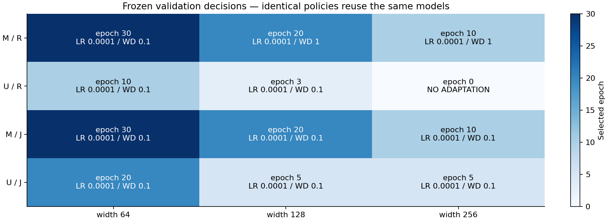
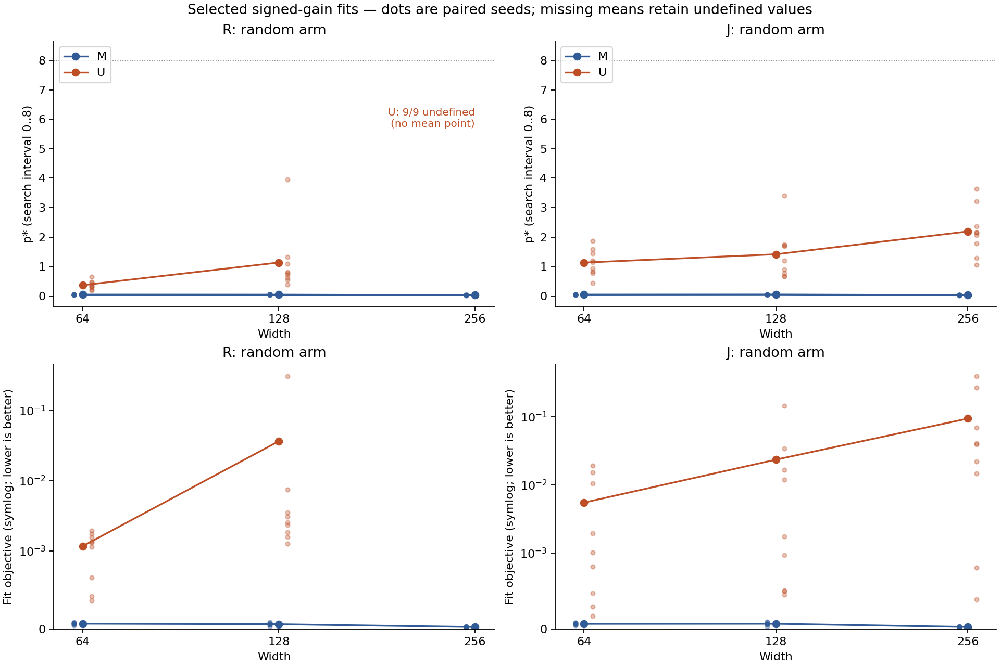

# Stage 5 v0.6 — adaptasi berguna dibanding tanpa adaptasi

**Revisi presentasi r1:** batas vertikal grafik objective diperluas agar semua titik terlihat penuh; label undefined dipindahkan dari garis nol. Catatan pasangan individual dan LR terpilih memperjelas pembacaan hasil. Semua data, estimasi dan audit identik dengan analisis awal yang tetap disimpan.

Run `utility-v06-20260929-01`. Training lokal selesai: **144 tuning + 144 konfirmasi**, **66 pretrained models**, dan **54 evaluasi awal test**. Protokol/seleksi dibekukan sebelum hasil konfirmasi.

## 1. Jawaban utama dan batas interpretasi

Kriteria global adaptasi berguna untuk **U / R / random**: **False**. Setiap kapasitas harus memakai update nonzero, memiliki penurunan test NLL positif pada ketiga rerata korpus, dan validation NLL tidak lebih buruk dari baseline pada setiap korpus. Delta = test NLL model awal − test NLL model terpilih; nilai positif berarti perbaikan.

Pada kebijakan utama, p* undefined pada **9/27** pasangan kapasitas/seed, dan **0/27** mencapai batas atas p*=8. Mean objective fit kecil/menengah/besar: 0.001166, 0.036312, undefined. Fit dibatasi pencarian atau tidak terdefinisi tidak membuktikan mekanisme pangkat; keputusan utility ditentukan oleh perbaikan held-out terhadap baseline sendiri.

| Lebar | Epoch | Δ test mean | SD antar korpus | Rentang korpus | Update >0 | 3 korpus Δ>0 | 3 korpus val≤awal | Berguna |
| --- | --- | --- | --- | --- | --- | --- | --- | --- |
| 64 | 10 | 0.030936 | 0.002429 | 0.028339 … 0.033153 | True | True | True | True |
| 128 | 3 | 0.001879 | 0.001237 | 0.000763 … 0.003208 | True | True | True | True |
| 256 | 0 | 0.000000 | 0.000000 | 0.000000 … 0.000000 | False | False | True | False |

Ketiga korpus adalah unit replikasi; tiga seed model/bobot per korpus adalah pasangan bersarang. Sembilan pasangan lengkap dan tiga rerata korpus disimpan di `policy-summary.json` dan `policy-cells.csv`. Pemilihan epoch 0 menghasilkan delta tepat nol dan p* undefined. Itu tidak memenuhi bukti belajar berguna.

Kriteria di atas memakai rerata per korpus. Pada kapasitas menengah, 1/9 pasangan memiliki test NLL yang memburuk dan 3/9 memiliki validation NLL yang memburuk, meskipun ketiga rerata korpus memenuhi kriteria. Manfaat menengah yang kecil ini belum membuktikan kestabilan seleksi pada panel tuning lain.

## 2. Keputusan validation yang dibekukan

R memilih mean validation random; J memilih mean gabungan random/uniform. Kandidat epoch 0 kanonik dibandingkan dengan enam optimizer × enam epoch. Tie: full precision score, epoch terdini, LR lalu WD terkecil. Tidak ada test, p*, peak, atau fit yang dipakai untuk memilih.

| Kondisi | Selektor | Lebar | Grid | LR | WD | Epoch | Validation tuning |
| --- | --- | --- | --- | --- | --- | --- | --- |
| M | R | 64 | 4 | 0.0001 | 0.1 | 30 | 2.129973 |
| M | R | 128 | 5 | 0.0001 | 1.0 | 20 | 2.049507 |
| M | R | 256 | 5 | 0.0001 | 1.0 | 10 | 2.030243 |
| U | R | 64 | 4 | 0.0001 | 0.1 | 10 | 1.954028 |
| U | R | 128 | 4 | 0.0001 | 0.1 | 3 | 1.872411 |
| U | R | 256 | None | None | None | 0 | 1.853737 |
| M | J | 64 | 4 | 0.0001 | 0.1 | 30 | 2.005190 |
| M | J | 128 | 4 | 0.0001 | 0.1 | 20 | 1.934212 |
| M | J | 256 | 4 | 0.0001 | 0.1 | 10 | 1.911310 |
| U | J | 64 | 4 | 0.0001 | 0.1 | 20 | 1.927368 |
| U | J | 128 | 4 | 0.0001 | 0.1 | 5 | 1.861215 |
| U | J | 256 | 4 | 0.0001 | 0.1 | 5 | 1.850489 |

Epoch 0 tidak memiliki optimizer. Kebijakan identik mengacu ke hasil yang sama, bukan replikasi tambahan. Confirmation melatih union konfigurasi nonzero yang terpilih sampai 30 epoch; checkpoint lainnya hanya deskriptif.

Seluruh pilihan nonzero memakai LR1e-4; kandidat LR1e-5 dan3e-5 tidak terpilih. Karena itu manfaat yang terukur tidak dapat diatribusikan khusus pada penggunaan learning rate yang lebih kecil.

## 3. Semua kebijakan: utility, scaling dan puncak terpisah

| Kebijakan | Arm | Alias | Global useful | Scaling gate | K mean | K undefined/9 | K positif/9 | Verdict |
| --- | --- | --- | --- | --- | --- | --- | --- | --- |
| M_R | random | — | True | True | -0.001204 | 0 | 3 | mixed/inconclusive |
| M_R | uniform | — | True | True | undefined | 9 | 0 | undefined_uniform |
| U_R | random | — | False | True | undefined | 9 | 0 | inconclusive_undefined |
| U_R | uniform | — | False | True | undefined | 9 | 0 | undefined_uniform |
| M_J | random | — | True | True | 0.002418 | 0 | 5 | mixed/inconclusive |
| M_J | uniform | — | True | True | undefined | 9 | 0 | undefined_uniform |
| U_J | random | — | False | False | -0.865673 | 0 | 1 | disappears |
| U_J | uniform | — | True | True | undefined | 9 | 0 | undefined_uniform |

Scaling mensyaratkan test NLL turun ketat pada tiga kapasitas dan validation≤awal pada setiap kapasitas di setiap korpus. Baseline tanpa update boleh memenuhi scaling; utility tetap memerlukan perbaikan terhadap model awalnya sendiri. K = p* tengah − max(p* kecil, p* besar). Undefined dipropagasikan ke rerata/kontras, tidak dibuang. Uniform selalu memiliki p* undefined.

## 4. Fit, cancellation dan memorisasi

Puncak adalah hasil deskriptif estimator signed-gain dengan rentang pencarian [0,8]. Nilai batas, gain total kecil, cancellation kuat dan objective buruk membatasi interpretasi mekanisme. Tidak ada threshold kualitas fit tambahan yang dipakai sebagai filter atau untuk memilih model. Semua nilai dipertahankan.

| Kebijakan | Lebar | p* mean | Undefined/9 | Batas bawah/9 | Batas atas/9 | Fit objective mean | Cancellation ratio mean | Gain mean |
| --- | --- | --- | --- | --- | --- | --- | --- | --- |
| M_R | 64 | 0.043666 | 0 | 0 | 0 | 0.000068 | 1.000000 | 1.085353 |
| M_R | 128 | 0.042462 | 0 | 0 | 0 | 0.000061 | 1.000000 | 2.134097 |
| M_R | 256 | 0.026017 | 0 | 0 | 0 | 0.000025 | 1.000000 | 3.447650 |
| U_R | 64 | 0.365058 | 0 | 0 | 0 | 0.001166 | 0.780051 | 0.057439 |
| U_R | 128 | 1.134881 | 0 | 0 | 0 | 0.036312 | 0.345061 | 0.010056 |
| U_R | 256 | undefined | 9 | 0 | 0 | undefined | undefined | 0.000000 |
| M_J | 64 | 0.043666 | 0 | 0 | 0 | 0.000068 | 1.000000 | 1.085353 |
| M_J | 128 | 0.046084 | 0 | 0 | 0 | 0.000069 | 1.000000 | 2.143638 |
| M_J | 256 | 0.026928 | 0 | 0 | 0 | 0.000026 | 1.000000 | 3.450739 |
| U_J | 64 | 1.133194 | 0 | 0 | 0 | 0.005480 | 0.562162 | 0.086451 |
| U_J | 128 | 1.414657 | 0 | 0 | 0 | 0.023306 | 0.373277 | 0.021449 |
| U_J | 256 | 2.190293 | 0 | 0 | 0 | 0.093103 | 0.313796 | 0.028469 |

Rasio cancellation = |Σ gain| / Σ |gain|, undefined bila semua gain nol. Gain memakai pengurangan loss float32 asli sebelum konversi estimator ke float64. Garis mean pada gambar tidak ditampilkan jika satu pasangan saja undefined; titik terdefinisi tetap ditampilkan sebagai diagnostik, bukan rerata yang mengecualikan kegagalan.

| Kebijakan | Arm | Lebar | Train NLL | Validation NLL | Test NLL | Train instance accuracy | Clipping fraction |
| --- | --- | --- | --- | --- | --- | --- | --- |
| M_R | random | 64 | 2.031464 | 2.112173 | 2.109539 | 0.065158 | 0.999769 |
| M_R | random | 128 | 1.896959 | 2.053587 | 2.053295 | 0.097385 | 0.999653 |
| M_R | random | 256 | 1.861728 | 2.012486 | 2.011852 | 0.092936 | 1.000000 |
| M_R | uniform | 64 | 1.839878 | 1.889074 | 1.887526 | 0.066515 | 0.999769 |
| M_R | uniform | 128 | 1.660188 | 1.829214 | 1.829846 | 0.100586 | 0.994097 |
| M_R | uniform | 256 | 1.638958 | 1.797405 | 1.796834 | 0.095974 | 0.981944 |
| U_R | random | 64 | 1.939215 | 1.965782 | 1.964697 | 0.071018 | 0.779861 |
| U_R | random | 128 | 1.865868 | 1.874471 | 1.873726 | 0.073242 | 0.562500 |
| U_R | random | 256 | 1.853931 | 1.853984 | 1.853765 | 0.062663 | undefined |
| U_R | uniform | 64 | 1.884136 | 1.924903 | 1.924766 | 0.073839 | 0.222222 |
| U_R | uniform | 128 | 1.851064 | 1.865032 | 1.864352 | 0.069282 | 0.002315 |
| U_R | uniform | 256 | 1.853931 | 1.853984 | 1.853765 | 0.062663 | undefined |
| M_J | random | 64 | 2.031464 | 2.112173 | 2.109539 | 0.065158 | 0.999769 |
| M_J | random | 128 | 1.887418 | 2.058583 | 2.058941 | 0.101617 | 0.999653 |
| M_J | random | 256 | 1.858639 | 2.014836 | 2.014789 | 0.093967 | 1.000000 |
| M_J | uniform | 64 | 1.839878 | 1.889074 | 1.887526 | 0.066515 | 0.999769 |
| M_J | uniform | 128 | 1.642517 | 1.824526 | 1.825586 | 0.101291 | 0.994444 |
| M_J | uniform | 256 | 1.631966 | 1.795313 | 1.794867 | 0.096191 | 0.984722 |
| U_J | random | 64 | 1.910202 | 2.006733 | 2.003109 | 0.094076 | 0.887847 |
| U_J | random | 128 | 1.854475 | 1.877212 | 1.876669 | 0.073025 | 0.629167 |
| U_J | random | 256 | 1.825462 | 1.870346 | 1.866641 | 0.082086 | 0.822222 |
| U_J | uniform | 64 | 1.755587 | 1.885318 | 1.885336 | 0.101671 | 0.609028 |
| U_J | uniform | 128 | 1.810724 | 1.849325 | 1.849117 | 0.077691 | 0.043056 |
| U_J | uniform | 256 | 1.734085 | 1.811832 | 1.813493 | 0.093316 | 0.302778 |

Clipping undefined pada epoch 0 karena tidak ada update. Semua checkpoint, loss/accuracy komponen, massa positif/negatif, komponen/group+instance/oracle-reference p*, signed allocation dan Gram tersimpan dalam CSV/JSON pendamping. Oracle-reference adalah diagnostik berlabel, bukan pengganti estimator utama.

## 5. Manipulasi baseline

Manipulation check semua kapasitas/korpus: **True**; 9/9 lulus. U harus menurunkan initial group dan instance validation NLL dibanding M, dengan shared accuracy≥95%.

| Lebar | Korpus | U group NLL | M group NLL | U instance NLL | M instance NLL | U shared accuracy | Lulus |
| --- | --- | --- | --- | --- | --- | --- | --- |
| 64 | 52919 | 2.802559 | 4.579614 | 2.802313 | 4.575660 | 1.000000 | True |
| 64 | 55049 | 2.798133 | 4.485175 | 2.804383 | 4.581701 | 1.000000 | True |
| 64 | 57163 | 2.798551 | 4.491839 | 2.803099 | 4.570746 | 1.000000 | True |
| 128 | 52919 | 2.785723 | 6.058007 | 2.784880 | 6.070377 | 1.000000 | True |
| 128 | 55049 | 2.782281 | 5.948622 | 2.785459 | 6.074530 | 1.000000 | True |
| 128 | 57163 | 2.780639 | 5.931616 | 2.784514 | 6.057557 | 1.000000 | True |
| 256 | 52919 | 2.776349 | 8.012090 | 2.777399 | 8.019510 | 1.000000 | True |
| 256 | 55049 | 2.775176 | 7.868528 | 2.777496 | 8.046738 | 1.000000 | True |
| 256 | 57163 | 2.774085 | 7.811291 | 2.776918 | 8.025512 | 1.000000 | True |

M/U memakai token, cold state, assignment dan batch order yang sama. U menambah auxiliary uniform-target CE; intervensi dapat mengubah representasi dan dinamika belajar. Karena itu U−M tidak mengisolasi efek satu angka baseline, dan check ini bukan penilaian kalibrasi probabilitas lengkap.

## 6. Audit, kegagalan dan runtime

Audit integritas independen: **PASS**. Audit utility/scaling/K: **PASS**. Source beku, corpus penuh, equality token/label/cold state, checkpoint, assignment/order, candidate/tie/schedule, epoch0 aliases dan test sesudah selection diaudit.

Original Gram absolute-check failures: **0**. Setiap kegagalan strict tetap dicatat; verifikasi 70 digit dan batas akumulasi float64 yang dipraspesifikasikan harus lulus. Toleransi lainnya tidak dilonggarkan. Nilai fit/p* dan seleksi tidak diubah oleh verifikasi numerik. Detail di `DIAGNOSTIC_AUDIT.json`.

Perbandingan cumulative component-vs-primary undefined akibat guard total gain primer: **0**. Nilai tersebut disimpan null beserta alasan; komponen dan fit aslinya dipertahankan. Klarifikasi serialisasi ini dibekukan sebelum training dalam `ANALYSIS_CLARIFICATIONS.md`.

Waktu training tercatat: **perf_counter 29.86 menit; UTC 32.38 menit**. Selisih UTC − perf_counter = 151.191739 detik; penyebab selisih tidak disimpulkan. Budget 180 menit diperiksa menggunakan timer yang lebih besar. CPU audit/report di luar budget training.

| Tahap | Model/evaluasi/run | Peak allocated MiB | Peak reserved MiB |
| --- | --- | --- | --- |
| Pretraining | 66 | 150.097656 | 184.000000 |
| Initial evaluation | 54 | 60.790527 | 184.000000 |
| Adaptation | 288 | 150.490234 | 184.000000 |

Tidak ada retry implisit, seed pengganti, cloud, upload, atau publikasi. Semua raw run ada di `work/runs/utility-v06-20260929-01`; model penuh tetap lokal. `raw-manifest.json` menyimpan SHA semua file raw; archive ringkas mempertahankan data, losses, weights/orders, source, checks dan report, dengan model biner besar dikecualikan dan hash tetap tersedia.

## 7. Batas ilmiah dan provenance

Hanya dua corpus/model tuning dan tiga korpus konfirmasi, tiga kapasitas, satu keluarga task sintetis, grid LR/WD terbatas, dan horizon 30 epoch. Tidak ada klaim optimum global, exact large-LM replication, pergeseran antara dua peak interior, novelty, atau jaminan venue/publikasi. Tidak ada notebook yang diklaim dieksekusi: script setara dijalankan. Arah eksperimen berikutnya harus ditetapkan sebagai protokol baru sebelum melihat hasil baru.

Protocol SHA256: `87dccda6cdbbf27895b77782519fff150da28853ba0a62e877702da8ccbd84f5`. Selection SHA256: `ce7f3e6f95d92ad5298e4aeccfe6866658077e0a5bbeae115f86c9c48ca29cdb`. Manifest source training dan analisis, environment lock, audit dan semua keputusan tersedia dalam raw archive. Stage4 memotivasi desain ini; hasil Stage4 tidak diperlakukan sebagai konfirmasi Stage5.

Penyelarasan metode diperiksa terhadap [studi Jane Street](https://blog.janestreet.com/a-study-of-sequence-weighting-at-scale/) dan [catatan estimatornya](https://blog.janestreet.com/a-study-of-sequence-weighting-at-scale/sequence-weighting-note.pdf): bobot log-uniform, pemilihan validation, dan gain bertanda terhadap baseline menjadi acuan. [Pereyra et al.](https://arxiv.org/abs/1701.06548) menyediakan konteks prior untuk regularisasi kepercayaan output; U tidak diklaim identik atau baru. Batas pemeriksaan sumber tercatat dalam `LITERATURE_CHECK.md`.
