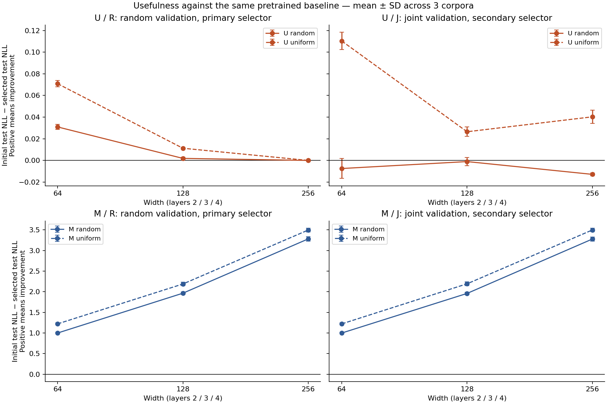
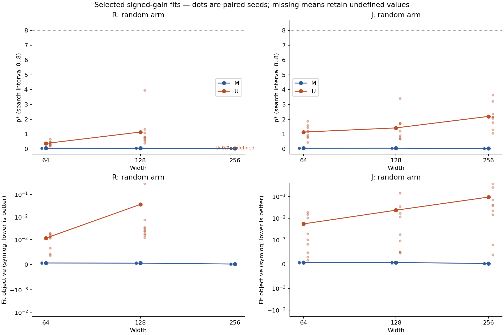
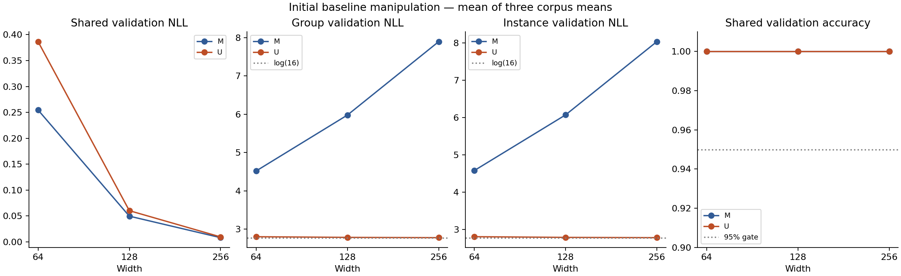

# Stage 5 v0.6 — useful adaptation compared with no adaptation

Run `utility-v06-20260929-01`. Local training completed: **144 tuning + 144 confirmation runs**, **66 pretrained models**, and **54 initial test evaluations**. The protocol/selection were frozen before confirmation outcomes.

## 1. Main result and interpretation limits

The global useful-adaptation criterion for **U / R / random** was **False**. Every capacity must use nonzero updates, show a positive reduction in test NLL for all three corpus means, and have validation NLL no worse than baseline in each corpus. Delta = initial-model test NLL − selected-model test NLL; positive values indicate improvement.

Under the primary policy, p* was undefined for **9/27** capacity/seed pairs, and **0/27** reached the upper boundary p*=8. Mean fit objectives for small/middle/large capacities were 0.001166, 0.036312, and undefined. Search-boundary-limited or undefined fits do not establish a power mechanism; utility is determined by held-out improvement over each model's own baseline.

| Width | Epoch | Mean Δ test | Between-corpus SD | Corpus range | Update >0 | 3 corpora Δ>0 | 3 corpora val≤initial | Useful |
| --- | --- | --- | --- | --- | --- | --- | --- | --- |
| 64 | 10 | 0.030936 | 0.002429 | 0.028339 … 0.033153 | True | True | True | True |
| 128 | 3 | 0.001879 | 0.001237 | 0.000763 … 0.003208 | True | True | True | True |
| 256 | 0 | 0.000000 | 0.000000 | 0.000000 … 0.000000 | False | False | True | False |

The three corpora are the replication units; three model/weight seeds per corpus are nested pairs. All nine pairs and three corpus means are saved in `policy-summary.json` and `policy-cells.csv`. Selecting epoch 0 gives exactly zero delta and undefined p*. It does not establish useful learning.

## 2. Frozen validation decisions

R selects mean random-weight validation NLL; J selects the joint random/uniform mean. The canonical epoch 0 candidate is compared with six optimizers × six epochs. Ties use the full-precision score, earliest epoch, then smallest LR and WD. Test results, p*, peaks, and fit quality do not enter selection.

| Condition | Selector | Width | Grid | LR | WD | Epoch | Tuning validation |
| --- | --- | --- | --- | --- | --- | --- | --- |
| M | R | 64 | 4 | 0.0001 | 0.1 | 30 | 2.129973 |
| M | R | 128 | 5 | 0.0001 | 1.0 | 20 | 2.049507 |
| M | R | 256 | 5 | 0.0001 | 1.0 | 10 | 2.030243 |
| U | R | 64 | 4 | 0.0001 | 0.1 | 10 | 1.954028 |
| U | R | 128 | 4 | 0.0001 | 0.1 | 3 | 1.872411 |
| U | R | 256 | None | None | None | 0 | 1.853737 |
| M | J | 64 | 4 | 0.0001 | 0.1 | 30 | 2.005190 |
| M | J | 128 | 4 | 0.0001 | 0.1 | 20 | 1.934212 |
| M | J | 256 | 4 | 0.0001 | 0.1 | 10 | 1.911310 |
| U | J | 64 | 4 | 0.0001 | 0.1 | 20 | 1.927368 |
| U | J | 128 | 4 | 0.0001 | 0.1 | 5 | 1.861215 |
| U | J | 256 | 4 | 0.0001 | 0.1 | 5 | 1.850489 |

Epoch 0 has no optimizer. Identical policies reference the same result rather than additional replications. Confirmation trained the union of selected nonzero configurations through 30 epochs; other checkpoints are descriptive only.

## 3. All policies: separate utility, scaling, and peak criteria

| Policy | Arm | Alias | Global useful | Scaling gate | K mean | K undefined/9 | K positive/9 | Verdict |
| --- | --- | --- | --- | --- | --- | --- | --- | --- |
| M_R | random | — | True | True | -0.001204 | 0 | 3 | mixed/inconclusive |
| M_R | uniform | — | True | True | undefined | 9 | 0 | undefined_uniform |
| U_R | random | — | False | True | undefined | 9 | 0 | inconclusive_undefined |
| U_R | uniform | — | False | True | undefined | 9 | 0 | undefined_uniform |
| M_J | random | — | True | True | 0.002418 | 0 | 5 | mixed/inconclusive |
| M_J | uniform | — | True | True | undefined | 9 | 0 | undefined_uniform |
| U_J | random | — | False | False | -0.865673 | 0 | 1 | disappears |
| U_J | uniform | — | True | True | undefined | 9 | 0 | undefined_uniform |

Scaling requires test NLL to decrease strictly across three capacities and validation NLL to be ≤initial at every capacity in every corpus. A no-update baseline can satisfy scaling; utility still requires improvement over each model's own initial state. K = middle-capacity p* − max(small-capacity p*, large-capacity p*). Undefined values propagate into means/contrasts rather than being discarded. Uniform-weight p* is always undefined.

## 4. Fit, cancellation, and memorization

The peak is a descriptive result from the signed-gain estimator with search range [0,8]. Boundary values, small total gains, strong cancellation, and poor objectives limit mechanistic interpretation. No additional fit-quality threshold was used to filter results or select models. All values were retained.

| Policy | Width | p* mean | Undefined/9 | Lower boundary/9 | Upper boundary/9 | Fit objective mean | Cancellation ratio mean | Gain mean |
| --- | --- | --- | --- | --- | --- | --- | --- | --- |
| M_R | 64 | 0.043666 | 0 | 0 | 0 | 0.000068 | 1.000000 | 1.085353 |
| M_R | 128 | 0.042462 | 0 | 0 | 0 | 0.000061 | 1.000000 | 2.134097 |
| M_R | 256 | 0.026017 | 0 | 0 | 0 | 0.000025 | 1.000000 | 3.447650 |
| U_R | 64 | 0.365058 | 0 | 0 | 0 | 0.001166 | 0.780051 | 0.057439 |
| U_R | 128 | 1.134881 | 0 | 0 | 0 | 0.036312 | 0.345061 | 0.010056 |
| U_R | 256 | undefined | 9 | 0 | 0 | undefined | undefined | 0.000000 |
| M_J | 64 | 0.043666 | 0 | 0 | 0 | 0.000068 | 1.000000 | 1.085353 |
| M_J | 128 | 0.046084 | 0 | 0 | 0 | 0.000069 | 1.000000 | 2.143638 |
| M_J | 256 | 0.026928 | 0 | 0 | 0 | 0.000026 | 1.000000 | 3.450739 |
| U_J | 64 | 1.133194 | 0 | 0 | 0 | 0.005480 | 0.562162 | 0.086451 |
| U_J | 128 | 1.414657 | 0 | 0 | 0 | 0.023306 | 0.373277 | 0.021449 |
| U_J | 256 | 2.190293 | 0 | 0 | 0 | 0.093103 | 0.313796 | 0.028469 |

Cancellation ratio = |Σ gain| / Σ |gain|, undefined when every gain is zero. Gains use the original float32 loss subtraction before conversion to float64 for the estimator. Mean lines are omitted from figures if even one pair is undefined; defined points remain as diagnostics, rather than a mean that excludes failures.

| Policy | Arm | Width | Train NLL | Validation NLL | Test NLL | Train instance accuracy | Clipping fraction |
| --- | --- | --- | --- | --- | --- | --- | --- |
| M_R | random | 64 | 2.031464 | 2.112173 | 2.109539 | 0.065158 | 0.999769 |
| M_R | random | 128 | 1.896959 | 2.053587 | 2.053295 | 0.097385 | 0.999653 |
| M_R | random | 256 | 1.861728 | 2.012486 | 2.011852 | 0.092936 | 1.000000 |
| M_R | uniform | 64 | 1.839878 | 1.889074 | 1.887526 | 0.066515 | 0.999769 |
| M_R | uniform | 128 | 1.660188 | 1.829214 | 1.829846 | 0.100586 | 0.994097 |
| M_R | uniform | 256 | 1.638958 | 1.797405 | 1.796834 | 0.095974 | 0.981944 |
| U_R | random | 64 | 1.939215 | 1.965782 | 1.964697 | 0.071018 | 0.779861 |
| U_R | random | 128 | 1.865868 | 1.874471 | 1.873726 | 0.073242 | 0.562500 |
| U_R | random | 256 | 1.853931 | 1.853984 | 1.853765 | 0.062663 | undefined |
| U_R | uniform | 64 | 1.884136 | 1.924903 | 1.924766 | 0.073839 | 0.222222 |
| U_R | uniform | 128 | 1.851064 | 1.865032 | 1.864352 | 0.069282 | 0.002315 |
| U_R | uniform | 256 | 1.853931 | 1.853984 | 1.853765 | 0.062663 | undefined |
| M_J | random | 64 | 2.031464 | 2.112173 | 2.109539 | 0.065158 | 0.999769 |
| M_J | random | 128 | 1.887418 | 2.058583 | 2.058941 | 0.101617 | 0.999653 |
| M_J | random | 256 | 1.858639 | 2.014836 | 2.014789 | 0.093967 | 1.000000 |
| M_J | uniform | 64 | 1.839878 | 1.889074 | 1.887526 | 0.066515 | 0.999769 |
| M_J | uniform | 128 | 1.642517 | 1.824526 | 1.825586 | 0.101291 | 0.994444 |
| M_J | uniform | 256 | 1.631966 | 1.795313 | 1.794867 | 0.096191 | 0.984722 |
| U_J | random | 64 | 1.910202 | 2.006733 | 2.003109 | 0.094076 | 0.887847 |
| U_J | random | 128 | 1.854475 | 1.877212 | 1.876669 | 0.073025 | 0.629167 |
| U_J | random | 256 | 1.825462 | 1.870346 | 1.866641 | 0.082086 | 0.822222 |
| U_J | uniform | 64 | 1.755587 | 1.885318 | 1.885336 | 0.101671 | 0.609028 |
| U_J | uniform | 128 | 1.810724 | 1.849325 | 1.849117 | 0.077691 | 0.043056 |
| U_J | uniform | 256 | 1.734085 | 1.811832 | 1.813493 | 0.093316 | 0.302778 |

Clipping is undefined at epoch 0 because no updates occur. All checkpoints, component losses/accuracies, positive/negative mass, component/group+instance/oracle-reference p*, signed allocation, and Gram quantities are saved in the accompanying CSV/JSON. The oracle reference is a labeled diagnostic, not a replacement for the primary estimator.

## 5. Baseline intervention

Manipulation check across all capacities/corpora: **True**; 9/9 passed. U must reduce initial group and instance validation NLL relative to M, with shared accuracy≥95%.

| Width | Corpus | U group NLL | M group NLL | U instance NLL | M instance NLL | U shared accuracy | Passed |
| --- | --- | --- | --- | --- | --- | --- | --- |
| 64 | 52919 | 2.802559 | 4.579614 | 2.802313 | 4.575660 | 1.000000 | True |
| 64 | 55049 | 2.798133 | 4.485175 | 2.804383 | 4.581701 | 1.000000 | True |
| 64 | 57163 | 2.798551 | 4.491839 | 2.803099 | 4.570746 | 1.000000 | True |
| 128 | 52919 | 2.785723 | 6.058007 | 2.784880 | 6.070377 | 1.000000 | True |
| 128 | 55049 | 2.782281 | 5.948622 | 2.785459 | 6.074530 | 1.000000 | True |
| 128 | 57163 | 2.780639 | 5.931616 | 2.784514 | 6.057557 | 1.000000 | True |
| 256 | 52919 | 2.776349 | 8.012090 | 2.777399 | 8.019510 | 1.000000 | True |
| 256 | 55049 | 2.775176 | 7.868528 | 2.777496 | 8.046738 | 1.000000 | True |
| 256 | 57163 | 2.774085 | 7.811291 | 2.776918 | 8.025512 | 1.000000 | True |

M/U use the same tokens, cold state, assignments, and batch order. U adds auxiliary uniform-target CE; the intervention can change representations and learning dynamics. U−M therefore does not isolate the effect of a single baseline value, and this check is not a complete assessment of probability calibration.

## 6. Audit, failures, and runtime

Independent integrity audit: **PASS**. Utility/scaling/K audit: **PASS**. The audits covered frozen source, complete corpora, token/label/cold-state equality, checkpoints, assignments/order, candidates/ties/schedules, epoch 0 aliases, and test evaluation after selection.

Original Gram absolute-check failures: **0**. Every strict-check failure remains recorded; prespecified 70-digit verification and float64 accumulation bounds must pass. No other tolerance was relaxed. Numerical verification did not change fit/p* values or selection. Details are in `DIAGNOSTIC_AUDIT.json`.

Cumulative component-vs-primary comparisons undefined because of the primary total-gain guard: **0**. Such values are saved as null with reasons; original components and fits are retained. This serialization clarification was frozen before training in `ANALYSIS_CLARIFICATIONS.md`.

Recorded training time: **perf_counter 29.86 minutes; UTC 32.38 minutes**. UTC − perf_counter = 151.191739 seconds; no cause is inferred for the discrepancy. The 180-minute budget used the larger timer. CPU audit/reporting was outside the training budget.

| Tahap | Model/evaluasi/run | Peak allocated MiB | Peak reserved MiB |
| --- | --- | --- | --- |
| Pretraining | 66 | 150.097656 | 184.000000 |
| Initial evaluation | 54 | 60.790527 | 184.000000 |
| Adaptation | 288 | 150.490234 | 184.000000 |

This stage involved no implicit retry, replacement seed, cloud execution, upload, or publication. All raw runs are in `work/runs/utility-v06-20260929-01`; full models remain local. `raw-manifest.json` records SHA hashes of all raw files; the compact archive retains data, losses, weights/orders, source, checks, and reports, while excluding large model binaries and retaining their hashes.

## 7. Scientific limitations and provenance

The study has only two tuning corpus/model pairs and three confirmation corpora, three capacities, one synthetic-task family, a bounded LR/WD grid, and a 30-epoch horizon. It makes no claim of global optimality, exact large-LM replication, movement between two interior peaks, novelty, or guaranteed venue acceptance/publication. The notebook is not claimed to have executed: equivalent scripts ran. Any subsequent experiment must be specified in a new protocol before inspecting new outcomes.

Protocol SHA256: `87dccda6cdbbf27895b77782519fff150da28853ba0a62e877702da8ccbd84f5`. Selection SHA256: `ce7f3e6f95d92ad5298e4aeccfe6866658077e0a5bbeae115f86c9c48ca29cdb`. Training/analysis source manifests, the environment lock, audits, and all decisions are available in the raw archive. Stage 4 motivated this design; Stage 4 results are not treated as Stage 5 confirmation.

Methodological alignment was checked against the [Jane Street study](https://blog.janestreet.com/a-study-of-sequence-weighting-at-scale/) and its [estimator note](https://blog.janestreet.com/a-study-of-sequence-weighting-at-scale/sequence-weighting-note.pdf): log-uniform weights, validation-based selection, and signed gains relative to baseline are the reference framework. [Pereyra et al.](https://arxiv.org/abs/1701.06548) provides prior context for output-confidence regularization; U is not claimed to be identical or novel. Source-check limitations are recorded in `LITERATURE_CHECK.md`.
