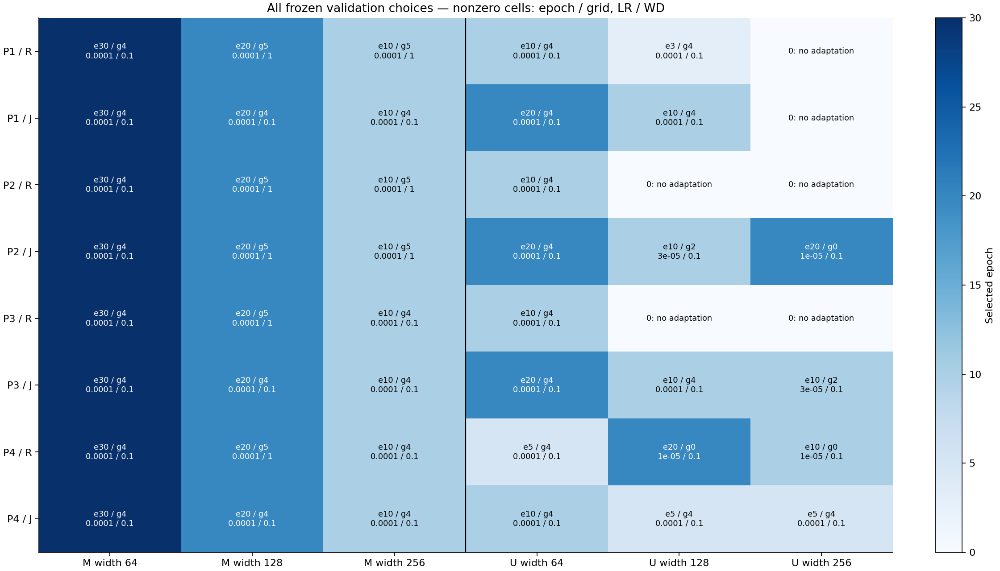
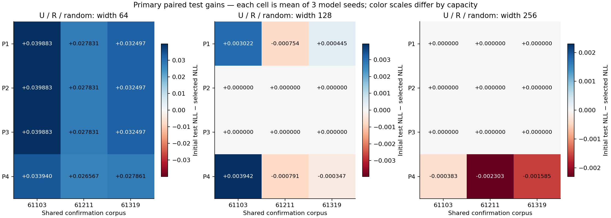
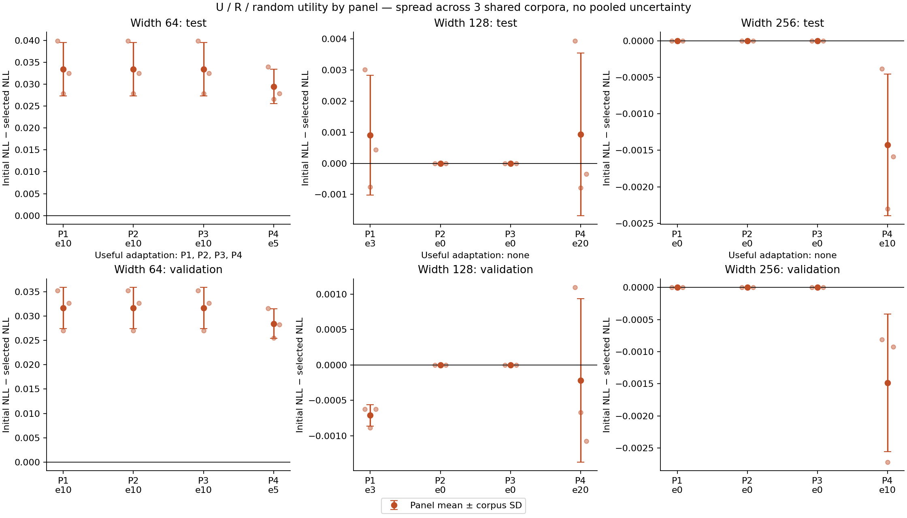
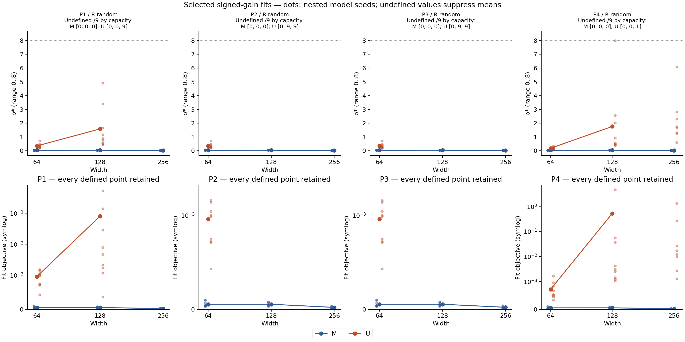

# Stage 6 v0.7 — replikasi panel tuning untuk kebijakan tanpa adaptasi

Run `stability-v07-20260929-01`: **576 tuning + 216 confirmation trajectories**, **102 pretrained models**, dan **54 evaluasi awal test**. Empat panel tuning baru memakai korpus konfirmasi yang sama.

## 1. Hasil utama

Pada **U / R / random**, kapasitas terbesar memilih tanpa adaptasi pada **3/4 panel**. Kriteria adaptasi berguna kapasitas menengah terpenuhi pada **0/4 panel**. Ini adalah frekuensi deskriptif pada empat panel; tidak diberi label biner “stabil” berdasarkan threshold baru dan tidak diuji dengan uji signifikansi.

| Panel | Terbesar epoch0 | Menengah update>0 | 3 korpus Δtest>0 | 3 korpus val≤awal | Menengah berguna | Global berguna | Scaling | K verdict |
| --- | --- | --- | --- | --- | --- | --- | --- | --- |
| P1 | True | True | False | False | False | False | False | inconclusive_undefined |
| P2 | True | False | False | True | False | False | True | inconclusive_undefined |
| P3 | True | False | False | True | False | False | True | inconclusive_undefined |
| P4 | False | True | False | False | False | False | False | inconclusive_undefined |

Δtest = initial test NLL − selected test NLL. Utility pada satu kapasitas memerlukan update nonzero, Δtest mean positif di setiap korpus, dan validation mean tidak lebih buruk dari model awal pada setiap korpus. Epoch0 memberi delta tepat nol dan p* undefined. Scaling adalah gerbang terpisah: test NLL turun ketat sepanjang kapasitas dan validation≤awal di seluruh kapasitas/korpus.

**Desain replikasi:** 4 panel tuning × **3 korpus konfirmasi yang sama**, masing-masing dengan 3 seed model/bobot bersarang. Ke-12 sel panel×korpus bukan 12 korpus independen, dan 36 pasangan per kapasitas bukan 36 replikasi data independen. Konfigurasi terpilih yang sama memakai checkpoint konfirmasi yang sama. Tidak ada panel dipilih berdasarkan test, p*, atau peak.

## 2. Seluruh keputusan validation dan frekuensinya

R memilih validation random; J memilih gabungan random/uniform. Setiap panel memakai dua pasangan corpus/model tuning tersendiri. Variasi panel mencakup data tuning, seed model/bobot, dan data pretraining; tidak mengisolasi efek korpus tuning saja. Kandidat epoch0 kanonik dibandingkan dengan enam optimizer×enam epoch; tie full precision, epoch terdini, LR lalu WD terkecil.

| Selektor | Kondisi | Lebar | Epoch0 /4 | Frekuensi setting (grid/epoch: panel) |
| --- | --- | --- | --- | --- |
| R | M | 64 | 0 | g4/e30: 4/4 (P1,P2,P3,P4) |
| R | M | 128 | 0 | g5/e20: 4/4 (P1,P2,P3,P4) |
| R | M | 256 | 0 | g4/e10: 2/4 (P3,P4); g5/e10: 2/4 (P1,P2) |
| R | U | 64 | 0 | g4/e5: 1/4 (P4); g4/e10: 3/4 (P1,P2,P3) |
| R | U | 128 | 2 | gNone/e0: 2/4 (P2,P3); g4/e3: 1/4 (P1); g0/e20: 1/4 (P4) |
| R | U | 256 | 3 | gNone/e0: 3/4 (P1,P2,P3); g0/e10: 1/4 (P4) |
| J | M | 64 | 0 | g4/e30: 4/4 (P1,P2,P3,P4) |
| J | M | 128 | 0 | g4/e20: 3/4 (P1,P3,P4); g5/e20: 1/4 (P2) |
| J | M | 256 | 0 | g4/e10: 3/4 (P1,P3,P4); g5/e10: 1/4 (P2) |
| J | U | 64 | 0 | g4/e10: 1/4 (P4); g4/e20: 3/4 (P1,P2,P3) |
| J | U | 128 | 0 | g4/e5: 1/4 (P4); g2/e10: 1/4 (P2); g4/e10: 2/4 (P1,P3) |
| J | U | 256 | 1 | gNone/e0: 1/4 (P1); g4/e5: 1/4 (P4); g2/e10: 1/4 (P3); g0/e20: 1/4 (P2) |

Semua candidate scores, LR/WD, pilihan, dan union konfirmasi dibekukan di `selection.json`. Detail setting identik/alias dipertahankan di `panel-summary.json`. Union optimizer dijalankan dalam kedua arm sampai epoch30; semua enam checkpoint terdeklarasi dievaluasi, tanpa pemilihan ulang memakai konfirmasi.

## 3. Matriks gain silang dan dua marginal terpisah

Setiap sel adalah rerata tiga seed pada pasangan panel/korpus. “SD panel” adalah SD empat marginal panel setelah merata-ratakan tiga korpus; “SD korpus” adalah SD tiga marginal korpus setelah merata-ratakan empat panel. Keduanya mengukur sumber variasi berbeda, bukan standard error/CI dan bukan estimasi dengan asumsi seluruh sel independen. Tidak ada SD gabungan 12 sel/36 pasangan yang dipakai untuk inferensi.

| Lebar | Δtest grand mean | SD marginal panel (n=4) | SD marginal korpus (n=3) | Sumber checkpoint unik /36 |
| --- | --- | --- | --- | --- |
| 64 | 0.032417 | 0.001974 | 0.005521 | 18 |
| 128 | 0.000460 | 0.000531 | 0.001128 | 27 |
| 256 | -0.000356 | 0.000712 | 0.000243 | 18 |

`crossed-summary.json` menyimpan matriks, setiap marginal, seluruh 36 nilai pasangan dan referensi checkpoint. `policy-cells.csv` mempertahankan loss/accuracy semua komponen, clipping, gain, p*, dan alasan undefined untuk setiap kebijakan.

## 4. Semua kebijakan dan kualitas fit

| Panel | Kebijakan | Arm | Useful global | Scaling | K mean | Undefined K /9 | K positif /9 | Verdict |
| --- | --- | --- | --- | --- | --- | --- | --- | --- |
| P1 | M_R | random | True | True | 0.001486 | 0 | 5 | mixed/inconclusive |
| P1 | M_R | uniform | True | True | undefined | 9 | 0 | undefined_uniform |
| P1 | U_R | random | False | False | undefined | 9 | 0 | inconclusive_undefined |
| P1 | U_R | uniform | False | True | undefined | 9 | 0 | undefined_uniform |
| P1 | M_J | random | True | True | 0.004848 | 0 | 7 | mixed/inconclusive |
| P1 | M_J | uniform | True | True | undefined | 9 | 0 | undefined_uniform |
| P1 | U_J | random | False | False | undefined | 9 | 0 | inconclusive_undefined |
| P1 | U_J | uniform | False | False | undefined | 9 | 0 | undefined_uniform |
| P2 | M_R | random | True | True | 0.001486 | 0 | 5 | mixed/inconclusive |
| P2 | M_R | uniform | True | True | undefined | 9 | 0 | undefined_uniform |
| P2 | U_R | random | False | True | undefined | 9 | 0 | inconclusive_undefined |
| P2 | U_R | uniform | False | True | undefined | 9 | 0 | undefined_uniform |
| P2 | M_J | random | True | True | 0.001486 | 0 | 5 | mixed/inconclusive |
| P2 | M_J | uniform | True | True | undefined | 9 | 0 | undefined_uniform |
| P2 | U_J | random | False | False | undefined | 1 | 2 | inconclusive_undefined |
| P2 | U_J | uniform | True | True | undefined | 9 | 0 | undefined_uniform |
| P3 | M_R | random | True | True | 0.001486 | 0 | 5 | mixed/inconclusive |
| P3 | M_R | uniform | True | True | undefined | 9 | 0 | undefined_uniform |
| P3 | U_R | random | False | True | undefined | 9 | 0 | inconclusive_undefined |
| P3 | U_R | uniform | False | True | undefined | 9 | 0 | undefined_uniform |
| P3 | M_J | random | True | True | 0.004848 | 0 | 7 | mixed/inconclusive |
| P3 | M_J | uniform | True | True | undefined | 9 | 0 | undefined_uniform |
| P3 | U_J | random | False | False | -0.978110 | 0 | 3 | mixed/inconclusive |
| P3 | U_J | uniform | True | False | undefined | 9 | 0 | undefined_uniform |
| P4 | M_R | random | True | True | 0.001486 | 0 | 5 | mixed/inconclusive |
| P4 | M_R | uniform | True | True | undefined | 9 | 0 | undefined_uniform |
| P4 | U_R | random | False | False | undefined | 1 | 0 | inconclusive_undefined |
| P4 | U_R | uniform | True | True | undefined | 9 | 0 | undefined_uniform |
| P4 | M_J | random | True | True | 0.004848 | 0 | 7 | mixed/inconclusive |
| P4 | M_J | uniform | True | True | undefined | 9 | 0 | undefined_uniform |
| P4 | U_J | random | False | False | -1.270858 | 0 | 1 | disappears |
| P4 | U_J | uniform | True | True | undefined | 9 | 0 | undefined_uniform |

K = p* tengah − max(p* kecil,p* besar). Setiap undefined dipropagasikan ke rerata dan kontras. Uniform selalu undefined. Tiga kapasitas tidak dapat membuktikan perpindahan antara dua peak interior.

| Panel | Kondisi / R random | Lebar | Epoch | p* mean | Undefined /9 | Batas atas /9 | Objective mean | Cancellation mean | Δtest negatif /9 | Δvalidation negatif /9 |
| --- | --- | --- | --- | --- | --- | --- | --- | --- | --- | --- |
| P1 | M | 64 | 30 | 0.041994 | 0 | 0 | 0.000054 | 1.000000 | 0 | 0 |
| P1 | M | 128 | 20 | 0.043480 | 0 | 0 | 0.000054 | 1.000000 | 0 | 0 |
| P1 | M | 256 | 10 | 0.025852 | 0 | 0 | 0.000021 | 1.000000 | 0 | 0 |
| P1 | U | 64 | 10 | 0.354999 | 0 | 0 | 0.000957 | 0.775695 | 0 | 0 |
| P1 | U | 128 | 3 | 1.590241 | 0 | 0 | 0.079808 | 0.303125 | 4 | 4 |
| P1 | U | 256 | 0 | undefined | 9 | 0 | undefined | undefined | 0 | 0 |
| P2 | M | 64 | 30 | 0.041994 | 0 | 0 | 0.000054 | 1.000000 | 0 | 0 |
| P2 | M | 128 | 20 | 0.043480 | 0 | 0 | 0.000054 | 1.000000 | 0 | 0 |
| P2 | M | 256 | 10 | 0.025852 | 0 | 0 | 0.000021 | 1.000000 | 0 | 0 |
| P2 | U | 64 | 10 | 0.354999 | 0 | 0 | 0.000957 | 0.775695 | 0 | 0 |
| P2 | U | 128 | 0 | undefined | 9 | 0 | undefined | undefined | 0 | 0 |
| P2 | U | 256 | 0 | undefined | 9 | 0 | undefined | undefined | 0 | 0 |
| P3 | M | 64 | 30 | 0.041994 | 0 | 0 | 0.000054 | 1.000000 | 0 | 0 |
| P3 | M | 128 | 20 | 0.043480 | 0 | 0 | 0.000054 | 1.000000 | 0 | 0 |
| P3 | M | 256 | 10 | 0.026718 | 0 | 0 | 0.000022 | 1.000000 | 0 | 0 |
| P3 | U | 64 | 10 | 0.354999 | 0 | 0 | 0.000957 | 0.775695 | 0 | 0 |
| P3 | U | 128 | 0 | undefined | 9 | 0 | undefined | undefined | 0 | 0 |
| P3 | U | 256 | 0 | undefined | 9 | 0 | undefined | undefined | 0 | 0 |
| P4 | M | 64 | 30 | 0.041994 | 0 | 0 | 0.000054 | 1.000000 | 0 | 0 |
| P4 | M | 128 | 20 | 0.043480 | 0 | 0 | 0.000054 | 1.000000 | 0 | 0 |
| P4 | M | 256 | 10 | 0.026718 | 0 | 0 | 0.000022 | 1.000000 | 0 | 0 |
| P4 | U | 64 | 5 | 0.187629 | 0 | 0 | 0.000717 | 0.873643 | 0 | 0 |
| P4 | U | 128 | 20 | 1.767128 | 0 | 1 | 0.522528 | 0.346585 | 3 | 4 |
| P4 | U | 256 | 10 | undefined | 1 | 0 | undefined | 0.178036 | 7 | 7 |

P* memakai signed gain asli dan rentang pencarian [0,8]. Gain nonpositive/di bawah guard, no adaptation dan bobot uniform tetap undefined. Cancellation ratio = |Σgain|/Σ|gain|, undefined bila semua gain nol. Nilai batas dan objective buruk membatasi interpretasi, tanpa filtering atau perubahan rentang estimator. Gambar objective mempertahankan semua titik; mean dihilangkan bila satu saja nilai undefined.

| Panel | Kebijakan | Arm | Lebar | Train NLL | Validation NLL | Test NLL | Instance train accuracy | Clipping |
| --- | --- | --- | --- | --- | --- | --- | --- | --- |
| P1 | M_R | random | 64 | 2.011199 | 2.083453 | 2.083173 | 0.061903 | 0.999537 |
| P1 | M_R | random | 128 | 1.895633 | 2.052223 | 2.055430 | 0.097439 | 1.000000 |
| P1 | M_R | random | 256 | 1.872513 | 2.021971 | 2.023664 | 0.097005 | 0.999306 |
| P1 | M_R | uniform | 64 | 1.852419 | 1.889731 | 1.889937 | 0.060167 | 1.000000 |
| P1 | M_R | uniform | 128 | 1.657434 | 1.820907 | 1.828682 | 0.108127 | 0.988542 |
| P1 | M_R | uniform | 256 | 1.644342 | 1.797141 | 1.799880 | 0.101780 | 0.979167 |
| P1 | U_R | random | 64 | 1.942249 | 1.970811 | 1.968145 | 0.063802 | 0.837500 |
| P1 | U_R | random | 128 | 1.864235 | 1.875611 | 1.873763 | 0.067708 | 0.553241 |
| P1 | U_R | random | 256 | 1.853060 | 1.853307 | 1.853035 | 0.059570 | undefined |
| P1 | U_R | uniform | 64 | 1.883992 | 1.920835 | 1.919574 | 0.065538 | 0.305556 |
| P1 | U_R | uniform | 128 | 1.843923 | 1.860525 | 1.859850 | 0.063965 | 0.004630 |
| P1 | U_R | uniform | 256 | 1.853060 | 1.853307 | 1.853035 | 0.059570 | undefined |
| P1 | M_J | random | 64 | 2.011199 | 2.083453 | 2.083173 | 0.061903 | 0.999537 |
| P1 | M_J | random | 128 | 1.883436 | 2.053874 | 2.056882 | 0.102756 | 1.000000 |
| P1 | M_J | random | 256 | 1.868023 | 2.023083 | 2.024719 | 0.098470 | 0.999306 |
| P1 | M_J | uniform | 64 | 1.852419 | 1.889731 | 1.889937 | 0.060167 | 1.000000 |
| P1 | M_J | uniform | 128 | 1.639574 | 1.816004 | 1.824511 | 0.110623 | 0.988889 |
| P1 | M_J | uniform | 256 | 1.636828 | 1.795166 | 1.797960 | 0.102322 | 0.979861 |
| P1 | U_J | random | 64 | 1.906937 | 1.977880 | 1.977050 | 0.077908 | 0.917014 |
| P1 | U_J | random | 128 | 1.817535 | 1.924021 | 1.920742 | 0.091797 | 0.829861 |
| P1 | U_J | random | 256 | 1.853060 | 1.853307 | 1.853035 | 0.059570 | undefined |
| P1 | U_J | uniform | 64 | 1.769847 | 1.871438 | 1.874475 | 0.090712 | 0.652083 |
| P1 | U_J | uniform | 128 | 1.660197 | 1.801971 | 1.802937 | 0.097059 | 0.543056 |
| P1 | U_J | uniform | 256 | 1.853060 | 1.853307 | 1.853035 | 0.059570 | undefined |
| P2 | M_R | random | 64 | 2.011199 | 2.083453 | 2.083173 | 0.061903 | 0.999537 |
| P2 | M_R | random | 128 | 1.895633 | 2.052223 | 2.055430 | 0.097439 | 1.000000 |
| P2 | M_R | random | 256 | 1.872513 | 2.021971 | 2.023664 | 0.097005 | 0.999306 |
| P2 | M_R | uniform | 64 | 1.852419 | 1.889731 | 1.889937 | 0.060167 | 1.000000 |
| P2 | M_R | uniform | 128 | 1.657434 | 1.820907 | 1.828682 | 0.108127 | 0.988542 |
| P2 | M_R | uniform | 256 | 1.644342 | 1.797141 | 1.799880 | 0.101780 | 0.979167 |
| P2 | U_R | random | 64 | 1.942249 | 1.970811 | 1.968145 | 0.063802 | 0.837500 |
| P2 | U_R | random | 128 | 1.874796 | 1.874900 | 1.874668 | 0.059570 | undefined |
| P2 | U_R | random | 256 | 1.853060 | 1.853307 | 1.853035 | 0.059570 | undefined |
| P2 | U_R | uniform | 64 | 1.883992 | 1.920835 | 1.919574 | 0.065538 | 0.305556 |
| P2 | U_R | uniform | 128 | 1.874796 | 1.874900 | 1.874668 | 0.059570 | undefined |
| P2 | U_R | uniform | 256 | 1.853060 | 1.853307 | 1.853035 | 0.059570 | undefined |
| P2 | M_J | random | 64 | 2.011199 | 2.083453 | 2.083173 | 0.061903 | 0.999537 |
| P2 | M_J | random | 128 | 1.895633 | 2.052223 | 2.055430 | 0.097439 | 1.000000 |
| P2 | M_J | random | 256 | 1.872513 | 2.021971 | 2.023664 | 0.097005 | 0.999306 |
| P2 | M_J | uniform | 64 | 1.852419 | 1.889731 | 1.889937 | 0.060167 | 1.000000 |
| P2 | M_J | uniform | 128 | 1.657434 | 1.820907 | 1.828682 | 0.108127 | 0.988542 |
| P2 | M_J | uniform | 256 | 1.644342 | 1.797141 | 1.799880 | 0.101780 | 0.979167 |
| P2 | U_J | random | 64 | 1.906937 | 1.977880 | 1.977050 | 0.077908 | 0.917014 |
| P2 | U_J | random | 128 | 1.859120 | 1.879952 | 1.877507 | 0.065484 | 0.602083 |
| P2 | U_J | random | 256 | 1.837861 | 1.864012 | 1.863650 | 0.070909 | 0.770139 |
| P2 | U_J | uniform | 64 | 1.769847 | 1.871438 | 1.874475 | 0.090712 | 0.652083 |
| P2 | U_J | uniform | 128 | 1.821501 | 1.852289 | 1.851388 | 0.067112 | 0.030556 |
| P2 | U_J | uniform | 256 | 1.776507 | 1.827405 | 1.827861 | 0.072049 | 0.140972 |
| P3 | M_R | random | 64 | 2.011199 | 2.083453 | 2.083173 | 0.061903 | 0.999537 |
| P3 | M_R | random | 128 | 1.895633 | 2.052223 | 2.055430 | 0.097439 | 1.000000 |
| P3 | M_R | random | 256 | 1.868023 | 2.023083 | 2.024719 | 0.098470 | 0.999306 |
| P3 | M_R | uniform | 64 | 1.852419 | 1.889731 | 1.889937 | 0.060167 | 1.000000 |
| P3 | M_R | uniform | 128 | 1.657434 | 1.820907 | 1.828682 | 0.108127 | 0.988542 |
| P3 | M_R | uniform | 256 | 1.636828 | 1.795166 | 1.797960 | 0.102322 | 0.979861 |
| P3 | U_R | random | 64 | 1.942249 | 1.970811 | 1.968145 | 0.063802 | 0.837500 |
| P3 | U_R | random | 128 | 1.874796 | 1.874900 | 1.874668 | 0.059570 | undefined |
| P3 | U_R | random | 256 | 1.853060 | 1.853307 | 1.853035 | 0.059570 | undefined |
| P3 | U_R | uniform | 64 | 1.883992 | 1.920835 | 1.919574 | 0.065538 | 0.305556 |
| P3 | U_R | uniform | 128 | 1.874796 | 1.874900 | 1.874668 | 0.059570 | undefined |
| P3 | U_R | uniform | 256 | 1.853060 | 1.853307 | 1.853035 | 0.059570 | undefined |
| P3 | M_J | random | 64 | 2.011199 | 2.083453 | 2.083173 | 0.061903 | 0.999537 |
| P3 | M_J | random | 128 | 1.883436 | 2.053874 | 2.056882 | 0.102756 | 1.000000 |
| P3 | M_J | random | 256 | 1.868023 | 2.023083 | 2.024719 | 0.098470 | 0.999306 |
| P3 | M_J | uniform | 64 | 1.852419 | 1.889731 | 1.889937 | 0.060167 | 1.000000 |
| P3 | M_J | uniform | 128 | 1.639574 | 1.816004 | 1.824511 | 0.110623 | 0.988889 |
| P3 | M_J | uniform | 256 | 1.636828 | 1.795166 | 1.797960 | 0.102322 | 0.979861 |
| P3 | U_J | random | 64 | 1.906937 | 1.977880 | 1.977050 | 0.077908 | 0.917014 |
| P3 | U_J | random | 128 | 1.817535 | 1.924021 | 1.920742 | 0.091797 | 0.829861 |
| P3 | U_J | random | 256 | 1.826847 | 1.875293 | 1.874707 | 0.075358 | 0.811111 |
| P3 | U_J | uniform | 64 | 1.769847 | 1.871438 | 1.874475 | 0.090712 | 0.652083 |
| P3 | U_J | uniform | 128 | 1.660197 | 1.801971 | 1.802937 | 0.097059 | 0.543056 |
| P3 | U_J | uniform | 256 | 1.733825 | 1.809617 | 1.811172 | 0.086426 | 0.279167 |
| P4 | M_R | random | 64 | 2.011199 | 2.083453 | 2.083173 | 0.061903 | 0.999537 |
| P4 | M_R | random | 128 | 1.895633 | 2.052223 | 2.055430 | 0.097439 | 1.000000 |
| P4 | M_R | random | 256 | 1.868023 | 2.023083 | 2.024719 | 0.098470 | 0.999306 |
| P4 | M_R | uniform | 64 | 1.852419 | 1.889731 | 1.889937 | 0.060167 | 1.000000 |
| P4 | M_R | uniform | 128 | 1.657434 | 1.820907 | 1.828682 | 0.108127 | 0.988542 |
| P4 | M_R | uniform | 256 | 1.636828 | 1.795166 | 1.797960 | 0.102322 | 0.979861 |
| P4 | U_R | random | 64 | 1.963446 | 1.974020 | 1.972093 | 0.061035 | 0.718056 |
| P4 | U_R | random | 128 | 1.864933 | 1.875116 | 1.873733 | 0.064562 | 0.524306 |
| P4 | U_R | random | 256 | 1.849602 | 1.854793 | 1.854459 | 0.069770 | 0.720833 |
| P4 | U_R | uniform | 64 | 1.942332 | 1.955209 | 1.953842 | 0.059625 | 0.013889 |
| P4 | U_R | uniform | 128 | 1.845505 | 1.862475 | 1.861632 | 0.061632 | 0.001389 |
| P4 | U_R | uniform | 256 | 1.840776 | 1.848888 | 1.849231 | 0.066840 | 0.011111 |
| P4 | M_J | random | 64 | 2.011199 | 2.083453 | 2.083173 | 0.061903 | 0.999537 |
| P4 | M_J | random | 128 | 1.883436 | 2.053874 | 2.056882 | 0.102756 | 1.000000 |
| P4 | M_J | random | 256 | 1.868023 | 2.023083 | 2.024719 | 0.098470 | 0.999306 |
| P4 | M_J | uniform | 64 | 1.852419 | 1.889731 | 1.889937 | 0.060167 | 1.000000 |
| P4 | M_J | uniform | 128 | 1.639574 | 1.816004 | 1.824511 | 0.110623 | 0.988889 |
| P4 | M_J | uniform | 256 | 1.636828 | 1.795166 | 1.797960 | 0.102322 | 0.979861 |
| P4 | U_J | random | 64 | 1.942249 | 1.970811 | 1.968145 | 0.063802 | 0.837500 |
| P4 | U_J | random | 128 | 1.851012 | 1.880780 | 1.879886 | 0.071723 | 0.669444 |
| P4 | U_J | random | 256 | 1.820536 | 1.878553 | 1.878564 | 0.081434 | 0.879167 |
| P4 | U_J | uniform | 64 | 1.883992 | 1.920835 | 1.919574 | 0.065538 | 0.305556 |
| P4 | U_J | uniform | 128 | 1.796063 | 1.839831 | 1.839794 | 0.080349 | 0.131944 |
| P4 | U_J | uniform | 256 | 1.717560 | 1.804598 | 1.807092 | 0.090820 | 0.359722 |

Clipping epoch0 undefined karena tidak ada update. Diagnosis component, group+instance, oracle-reference, signed allocation/Gram, massa gain positif/negatif dan seluruh checkpoint tetap disimpan. Diagnosis ini tidak mengganti estimator utama dan tidak menjadi kriteria seleksi.

## 5. Manipulasi baseline dan audit

Manipulation check: **9/9** kapasitas/korpus lulus. U harus menurunkan initial group/instance validation NLL terhadap M dengan shared accuracy≥95%.

| Lebar | Korpus | U group | M group | U instance | M instance | U shared accuracy | Lulus |
| --- | --- | --- | --- | --- | --- | --- | --- |
| 64 | 61103 | 2.792166 | 4.424853 | 2.807484 | 4.628993 | 1.000000 | True |
| 64 | 61211 | 2.796420 | 4.499488 | 2.799079 | 4.527988 | 1.000000 | True |
| 64 | 61319 | 2.792117 | 4.415681 | 2.800576 | 4.541801 | 1.000000 | True |
| 128 | 61103 | 2.778645 | 5.847270 | 2.786970 | 6.152012 | 1.000000 | True |
| 128 | 61211 | 2.782178 | 6.001019 | 2.783206 | 6.017591 | 1.000000 | True |
| 128 | 61319 | 2.778833 | 5.896590 | 2.783314 | 6.055578 | 1.000000 | True |
| 256 | 61103 | 2.773079 | 7.771592 | 2.778419 | 8.171053 | 1.000000 | True |
| 256 | 61211 | 2.774681 | 7.937776 | 2.775908 | 8.005195 | 1.000000 | True |
| 256 | 61319 | 2.772776 | 7.826018 | 2.776531 | 8.028852 | 1.000000 | True |

M/U pasangan memakai full token/label, cold state, assignment/order yang sama. U mengubah objective pretraining dan mungkin representasi/dinamika; U−M tidak mengisolasi pengaruh satu angka baseline. Check bukan asesmen kalibrasi probabilitas lengkap.

Audit integritas independen: **PASS**; utility/scaling/K setiap panel diperiksa ulang. Audit meliputi frozen source, histori Stage0–5, regenerasi data lengkap, seed split, cold/pretrained equality, weights/orders, candidate/tie/schedule seluruh panel, alias epoch0, serta test setelah selection freeze.

Gram original strict absolute-check failures: **0**; semuanya dicatat dan harus melewati verifikasi 70 digit/batas akumulasi float64 yang telah dipraspesifikasikan. Normalisasi cumulative-primary undefined: **0**, disimpan null+alasan. Tidak ada toleransi lain yang dilonggarkan; fit/gain/seleksi tetap. Detail `DIAGNOSTIC_AUDIT.json`.

## 6. Runtime dan keterbatasan penyimpanan

Timer training: perf_counter **80.43 menit**, UTC **83.02 menit**; selisih UTC−perf_counter **155.702609 detik**, tanpa mengasumsikan penyebab. Budget180 menit memakai timer yang lebih besar; CPU analisis tidak termasuk.

| Tahap | Jumlah | Peak allocated MiB | Peak reserved MiB |
| --- | --- | --- | --- |
| Pretraining | 102 | 150.097656 | 184.000000 |
| Initial evaluation | 54 | 60.790527 | 184.000000 |
| Adaptation | 792 | 150.490234 | 184.000000 |

**Penyimpanan model:** cold/pretrained dan model epoch30 disimpan penuh. Model adaptasi epoch1/3/5/10/20 tidak disimpan sebagai biner; map SHA tensor model dicatat saat runtime, beserta seluruh per-sequence losses/metrics setiap checkpoint. Audit dapat memeriksa loss/fit/seleksi dari rekaman tersebut, tetapi tidak dapat menghitung ulang hash bobot intermediate dari biner yang tidak disimpan. Model intermediate harus diregenerasi dengan rerun jika dibutuhkan; ketersediaan hash bukan bukti ekuivalen dengan audit ulang binary checkpoint.

Model penuh yang tersedia tetap lokal dan dikecualikan dari archive ringkas; semua raw files dicatat SHA, dataset/losses/assignment/orders/source disertakan, archive diuji CRC dan SHA. Tidak ada retry implisit, seed pengganti, cloud, upload atau publikasi.

## 7. Batas ilmiah dan provenance

Empat panel memperluas replikasi proses seleksi; hanya tiga korpus konfirmasi dibagi bersama. Grid optimizer/horizon terbatas, task sintetis dan tiga kapasitas tidak membuktikan optimum global, scaling umum, exact large-LM replication, novelty atau kesiapan venue. Tidak ada notebook yang diklaim telah dieksekusi; script eksperimen digunakan. Interpretasi Stage5 memotivasi desain, bukan data konfirmasi tambahan.

Protocol SHA256: `9859d5644b8468506f47bd8c28ee594e2eb93f1371989f0fdb2c7e7c3be37164`. Selection SHA256: `678a1430ca845ab99ede2a4c683c40120a8641df4b76487fe0685f6aa3eb3de7`. Manifest source/environment/checks lengkap tersedia dalam raw archive. Arahan literatur dan batas klaim mengikuti `LITERATURE_CHECK.md`; tidak ada klaim kebaruan baru dalam tahap ini.
