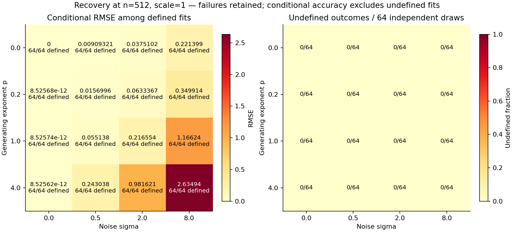
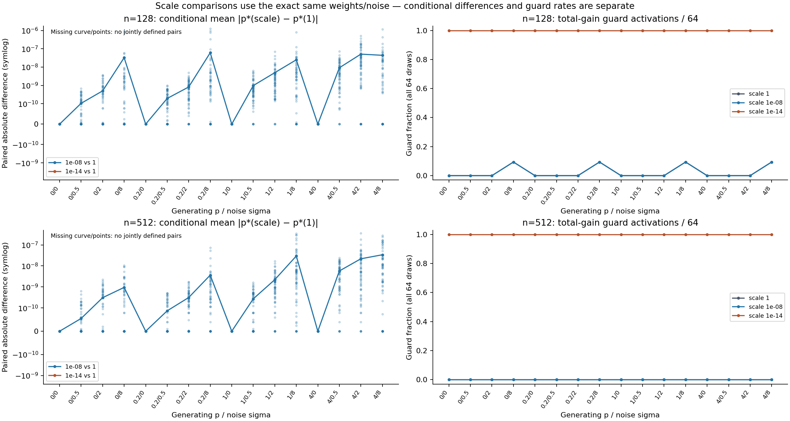
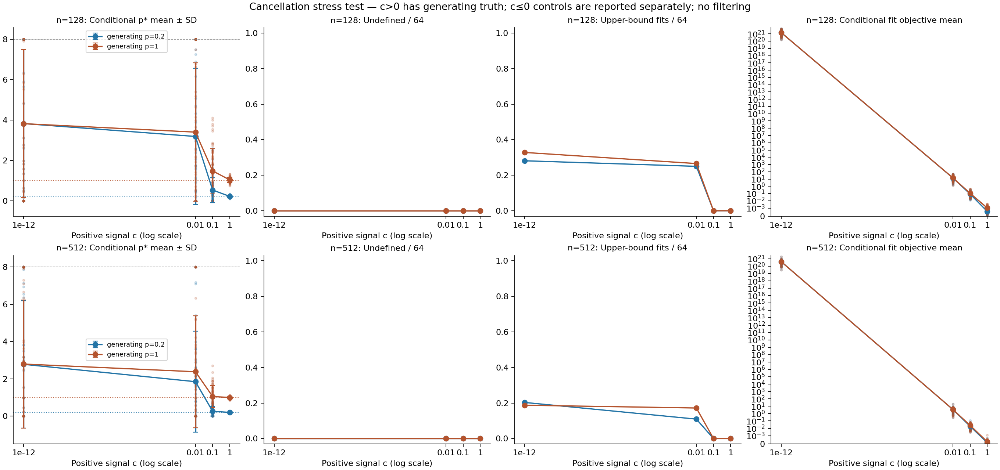

# Stage 7 v0.8 — finite-estimator validity under signed gains

Run `estimator-v08-20260930-01` completed **8,320 CPU fits**, with **130 conditions × 64 independent draws per condition**. There are **128 independent weight/noise blocks**: 64 at n=128 and 64 at n=512. The 65 conditions within each block reuse weights/noise and are paired observations.

## Findings and accounting

**5,328/8,320 estimates are defined**; **2,992 are undefined**. Undefined outcomes are retained by reason, with no fit threshold, favorable subset selection, or replacement draws.

| Undefined reason | Condition evaluations |
| --- | --- |
| constant_weights | 128 |
| nonpositive_total_gain | 2864 |

Counts pooled over conditions are descriptive evaluation counts, not independent trials. Conditional means/errors/objectives use only defined fits and give their denominator. Unconditional recovery mean and RMSE are null if any fit is undefined or no identifiable truth is assigned. Boundary frequency is reported against all 64 draws and against defined draws in the accompanying summary.

Of the guarded outcomes, **2,166** have a positive total no larger than 1e-10; **698** have a nonpositive total. Both the original sum and math.fsum totals are preserved.

## Design and recovery

The unchanged Stage 6 estimator fits its original cumulative discrepancy on [0,8]. Gains remain signed. Uniform weights are undefined; the inherited total-gain guard is `sum(gain) <= 1e-10`, including small positive totals. Its historical reason label `nonpositive_total_gain` therefore also covers these small positive cases.

Recovery: normalized q = w^p / mean(w^p), with p∈{0,.2,1,4}, iid normal noise z, sigma∈{0,.5,2,8}, and gain = scale·(q+sigma·z), scale∈{1,1e-8,1e-14}. No p*/objective-based model or sample selection is performed.



| n=512 noiseless p | Scale | Defined /64 | Conditional bias | Conditional RMSE | Unconditional RMSE |
| --- | --- | --- | --- | --- | --- |
| 0.0 | 1.0 | 64 | 0 | 0 | 0 |
| 0.2 | 1.0 | 64 | -8.52568e-12 | 8.52568e-12 | 8.52568e-12 |
| 1.0 | 1.0 | 64 | -8.52574e-12 | 8.52574e-12 | 8.52574e-12 |
| 4.0 | 1.0 | 64 | -8.52562e-12 | 8.52562e-12 | 8.52562e-12 |
| 0.0 | 1e-08 | 64 | 0 | 0 | 0 |
| 0.2 | 1e-08 | 64 | -8.52568e-12 | 8.52568e-12 | 8.52568e-12 |
| 1.0 | 1e-08 | 64 | -8.52574e-12 | 8.52574e-12 | 8.52574e-12 |
| 4.0 | 1e-08 | 64 | -8.52562e-12 | 8.52562e-12 | 8.52562e-12 |
| 0.0 | 1e-14 | 0 | undefined | undefined | undefined |
| 0.2 | 1e-14 | 0 | undefined | undefined | undefined |
| 1.0 | 1e-14 | 0 | undefined | undefined | undefined |
| 4.0 | 1e-14 | 0 | undefined | undefined | undefined |

All 130 conditions, signed gain/cancellation statistics, bias/RMSE/MAE, 5/25/50/75/95% quantiles and lower/upper-bound counts are available in `summaries.json` and `summaries.csv`. Quantiles use linear interpolation between ordered samples. A lower-bound estimate when true p=0, or upper-bound estimate when true p=8, is not automatically a failure.

## Matched scale comparisons

Scaling gains by a positive constant leaves their normalized cumulative profile mathematically unchanged when normalization is defined. The fixed absolute guard can change estimator availability. Paired comparisons match n, replicate/block, p and sigma, with identical weight/noise seeds and weight hashes. Absolute p* differences are computed only when both fits exist; a missing paired fit remains undefined in unconditional comparison summaries.

| n | Scale vs 1 | Both defined | Matched condition pairs | Max conditional |Δp*| | Guard at scale 1 | Guard at target |
| --- | --- | --- | --- | --- | --- | --- |
| 128 | 1e-08 | 1000 | 1024 | 1.23079e-06 | 24 | 24 |
| 128 | 1e-14 | 0 | 1024 | undefined | 24 | 1024 |
| 512 | 1e-08 | 1024 | 1024 | 3.62382e-07 | 0 | 0 |
| 512 | 1e-14 | 0 | 1024 | undefined | 0 | 1024 |

These aggregate pair counts span 16 paired p/sigma conditions per draw; they are not extra independent replications. `scale-comparisons.json` and `scale-pairs.csv` retain every match, denominator and undefined reason.



## Cancellation and controls

Cancellation uses gain = c·q + centered unit-RMS noise, with generating p∈{.2,1}, c∈{1,.1,.01,1e-12,0,-.01}. Only c>0 is assigned recovery truth. Centering occurs on each finite noise draw; floating-point residuals and the guard remain part of the measured implementation. The cancellation ratio |sum(gain)|/sum(|gain|) is undefined only when its denominator is zero.

Changing c changes signal-to-noise ratio and cancellation together; it does not isolate a causal effect of cancellation alone. The two generator_p conditions remain separate even when c≤0 and their recovery truth is null.



| Control | n | Truth p | Defined /64 | Upper /64 | Lower /64 | Conditional mean p* | Eligible recovery RMSE | Out-of-range error RMSE |
| --- | --- | --- | --- | --- | --- | --- | --- | --- |
| negative_gain | 128 | None | 0 | 0 | 0 | undefined | undefined | undefined |
| negative_gain | 512 | None | 0 | 0 | 0 | undefined | undefined | undefined |
| outside_range | 128 | 10.0 | 64 | 64 | 0 | 8 | undefined | 2 |
| outside_range | 512 | 10.0 | 64 | 64 | 0 | 8 | undefined | 2 |
| uniform_weights | 128 | None | 0 | 0 | 0 | undefined | undefined | undefined |
| uniform_weights | 512 | None | 0 | 0 | 0 | undefined | undefined | undefined |
| upper_boundary | 128 | 8.0 | 64 | 64 | 0 | 8 | 0 | undefined |
| upper_boundary | 512 | 8.0 | 64 | 64 | 0 | 8 | 0 | undefined |
| zero_gain | 128 | None | 0 | 0 | 0 | undefined | undefined | undefined |
| zero_gain | 512 | None | 0 | 0 | 0 | undefined | undefined | undefined |

The p=10 control deliberately lies outside the estimator’s [0,8] search range: its error is **constrained model misspecification**, not evidence that the estimator can recover an out-of-range exponent. Uniform-weight, zero-gain, negative-gain and c≤0 conditions have no assigned recovery truth. Defined estimates, if any, in no-truth conditions remain reported descriptively without recovery bias/RMSE.

| n | c | Generator p | Defined /64 | Undefined /64 | Conditional mean p* | Conditional objective max |
| --- | --- | --- | --- | --- | --- | --- |
| 128 | -0.01 | 0.2 | 0 | 64 | undefined | undefined |
| 512 | -0.01 | 0.2 | 0 | 64 | undefined | undefined |
| 128 | -0.01 | 1.0 | 0 | 64 | undefined | undefined |
| 512 | -0.01 | 1.0 | 0 | 64 | undefined | undefined |
| 128 | 0.0 | 0.2 | 0 | 64 | undefined | undefined |
| 512 | 0.0 | 0.2 | 0 | 64 | undefined | undefined |
| 128 | 0.0 | 1.0 | 0 | 64 | undefined | undefined |
| 512 | 0.0 | 1.0 | 0 | 64 | undefined | undefined |

## Audit, provenance and limits

Independent audit: **PASS**. Frozen source hashes, exact gain arrays/weights, draw pairing, saved fits and undefined cases are retained in the raw record. Outcome-independent analysis fixtures check undefined propagation, no-truth errors, deterministic grouping and paired scale matching. CPU fit timing is recorded per evaluation; no GPU training or new language-model replication was performed.

The historical integrity check covers prior versioned output artifacts and raw top-level records/source snapshots. Historical model/sequence arrays were preserved but not all rehashed; this is not a full repeat of the earlier training audits.

Completion metadata (recorded without renaming timer fields):

```json
{
  "status": "COMPLETE",
  "utc": "2026-09-30T03:33:24.877601+00:00",
  "fits": 8320,
  "draw_blocks": 128,
  "elapsed_seconds": 58.454539755,
  "utc_elapsed_seconds": 58.921792,
  "peak_rss_mib": 35.84765625,
  "results_sha256": "6dac404186aaa59c8449cc15b695456d9e1507d6d86028441fb84d67eb795162",
  "failed_runs": [],
  "training": false
}
```

This experiment diagnoses an unchanged finite estimator under specified gain-generating families. Generating exponents under noisy gains describe the signal construction; they do not guarantee finite-sample identification. The grid has 64 independent draws per condition, two sequence counts and one weight/noise design. For one cell frequency, the worst-case binomial Monte Carlo standard error is .0625; paired conditions do not increase its independent replicate count. Conditional accuracy can look favorable when difficult draws become undefined. No significance test, quality cutoff, novelty claim or publication guarantee is made.

See [the Stage 4–6 synthesis](SYNTHESIS_STAGE4_6.md) for the preceding adaptation evidence. Estimator validity and adaptation utility answer different questions; these synthetic estimator results do not establish a large-LM scaling claim.

Protocol SHA256: `32b40e9321cbf6dae142b35a171b62b7b7f89830ec8d1667c6d6ed4e0a69ef66`. All sources and raw evidence are preserved in the SHA/CRC-checked compact archive. Scientific figures require a separate visual review after generation; this script does not assert that review.
