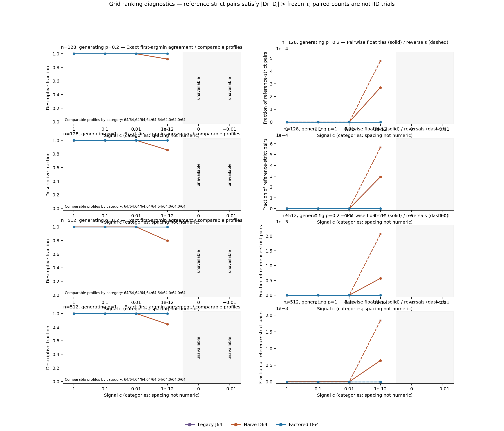
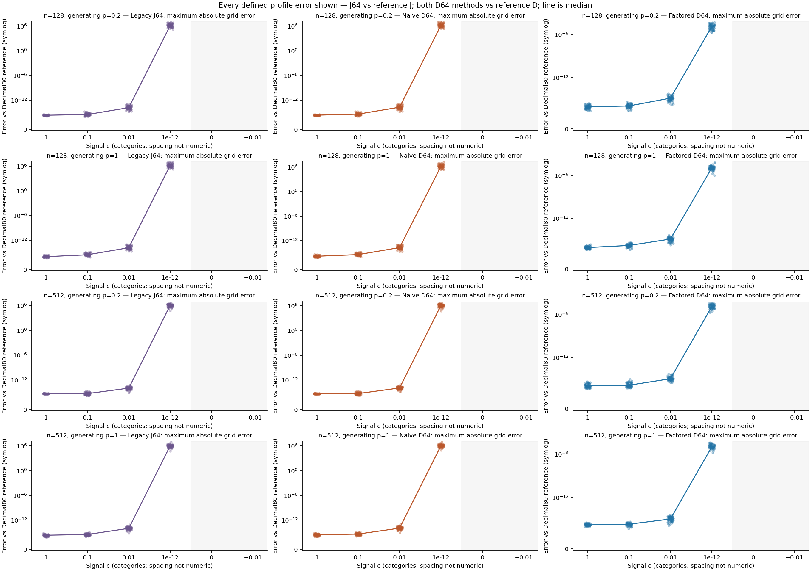
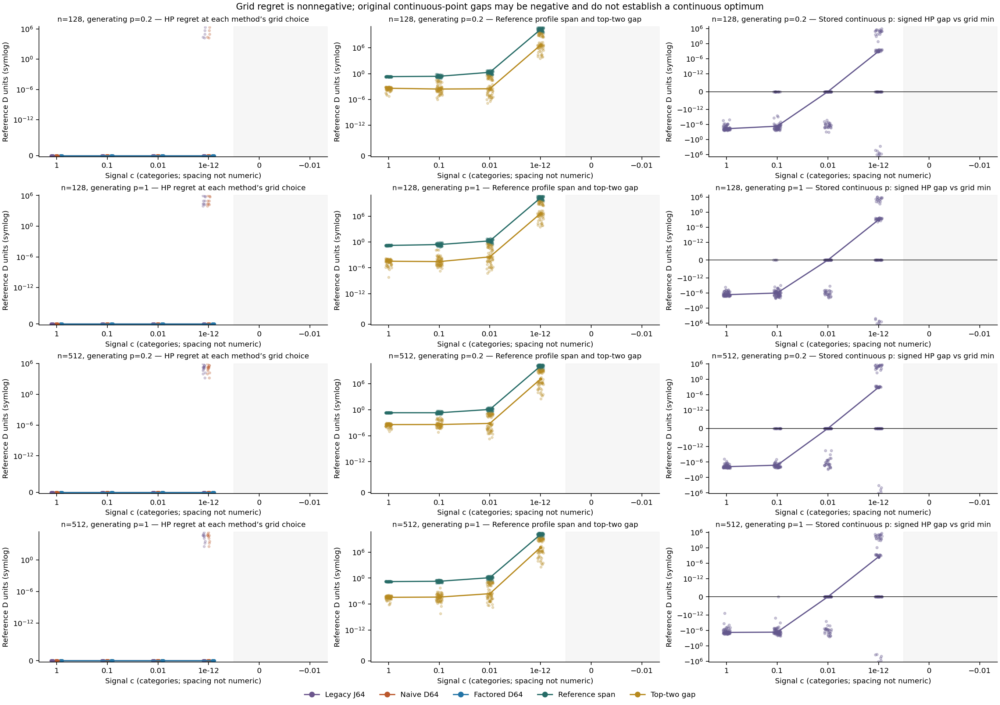

# Presentation r1

This revision makes small pairwise error rates visible and removes overlapping symlog tick labels near zero. Legacy J64 and naive D64 have identical ranking counts, so their lines overlap. All profile metrics, summaries, audited raw records and scientific conclusions are byte-identical to the original release. The original report and archive remain preserved. No experiment, reference profile or fit was rerun.

# Stage 8 v0.9 — objective ranking precision on preserved signed gains

Run `precision-v09-20260930-01` evaluates **1,536 preserved Stage 7 cancellation profiles** from 128 shared blocks, in **24 cells × 64 replicates**. **1,024 profiles** have both legacy and high-precision objectives; all other profiles and guard outcomes remain recorded. No gains, training runs, fits or p* replacements were generated for this study.

## Measured results

All 164,864 eligible grid points and 1,024 stored-p points passed the frozen 80/110-digit convergence bounds. Legacy and high-precision guards disagree in 0 of 1536 cases. The following counts compare grid choices on the same profiles; the final column counts profiles with at least one reference-strict pair reversed.

| Profiles | Method | Comparable | Exact argmin matches | Reference-band matches | Tied method minima | Any reversed pair |
| --- | --- | --- | --- | --- | --- | --- |
| All comparable | Legacy J64 | 1024 | 987 | 987 | 17 | 102 |
| All comparable | Naive D64 | 1024 | 987 | 987 | 17 | 102 |
| All comparable | Factored D64 | 1024 | 1024 | 1024 | 0 | 0 |
| c=1e-12 comparable | Legacy J64 | 256 | 219 | 219 | 17 | 102 |
| c=1e-12 comparable | Naive D64 | 256 | 219 | 219 | 17 | 102 |
| c=1e-12 comparable | Factored D64 | 256 | 256 | 256 | 0 | 0 |

These are numerical fidelity results for reused inputs. Grid agreement does not measure recovery of the generating exponent, validate continuous optimization, or identify the cause of Stage 7 recovery error.

## Question and fixed comparisons

Does binary64 arithmetic preserve grid rankings and objective contrasts of the unchanged signed-gain objective? The diagnostic grid has 161 exact saved binary64 values i/20, i=0..160, and anchor p=0. Legacy J64 follows the original operation order. Naive D64 subtracts J64(0); factored D64 evaluates the algebraic contrast using sequential prefixes and math.fsum of products, with the original Python sum gain denominator. Decimal80 reference arrays use the exact binary64 inputs and a high-precision sum/log/exp evaluation.

The factored route changes algebra and accumulation, so its differences cannot be assigned solely to removal of a common offset. The high-precision route changes precision throughout the pipeline and is a checked numerical reference to saved rounded inputs, not unknown unrounded data.

The independent auditor reconstructs Decimal110 objectives and direct contrasts. Preregistered convergence bounds are 1e-50·max(1, abs(J110)) for J and 1e-50·max(1, max(abs(D110))) for D. Ranking reference remains D80, with τ = 2e-50·max(1, max(abs(D80))). Reference minimum-set membership is D80≤min(D80)+τ; a reference pair is strict only if its absolute difference exceeds τ.

**0 profiles** have an 80-vs-110 classification difference or lie near a classification boundary relative to the observed precision drift. Such cases are retained and labelled unresolved; tolerance-aware counts use the declared D80 reference and do not assert a fully resolved ordering beyond the checked precision.

## Availability and all-cell ranking counts

Each row below has 64 independently drawn blocks at its n. Conditions on the same block share weights/noise; neither cells nor the 12,880 grid pairs within a profile are independent trials. “Exact” means the same first-index strict argmin as D80. “Band” accepts any index within the frozen reference minimum set. Counts are conditional on both objectives being available; the available count is explicit.

| n | Generator p | c | Legacy /64 | HP /64 | Both /64 | Domain mismatch | Unresolved | Legacy exact/band | Naive exact/band | Factored exact/band |
| --- | --- | --- | --- | --- | --- | --- | --- | --- | --- | --- |
| 128 | 0.2 | -0.01 | 0 | 0 | 0 | 0 | 0 | 0/0 | 0/0 | 0/0 |
| 128 | 0.2 | 0.0 | 0 | 0 | 0 | 0 | 0 | 0/0 | 0/0 | 0/0 |
| 128 | 0.2 | 1e-12 | 64 | 64 | 64 | 0 | 0 | 59/59 | 59/59 | 64/64 |
| 128 | 0.2 | 0.01 | 64 | 64 | 64 | 0 | 0 | 64/64 | 64/64 | 64/64 |
| 128 | 0.2 | 0.1 | 64 | 64 | 64 | 0 | 0 | 64/64 | 64/64 | 64/64 |
| 128 | 0.2 | 1.0 | 64 | 64 | 64 | 0 | 0 | 64/64 | 64/64 | 64/64 |
| 128 | 1.0 | -0.01 | 0 | 0 | 0 | 0 | 0 | 0/0 | 0/0 | 0/0 |
| 128 | 1.0 | 0.0 | 0 | 0 | 0 | 0 | 0 | 0/0 | 0/0 | 0/0 |
| 128 | 1.0 | 1e-12 | 64 | 64 | 64 | 0 | 0 | 55/55 | 55/55 | 64/64 |
| 128 | 1.0 | 0.01 | 64 | 64 | 64 | 0 | 0 | 64/64 | 64/64 | 64/64 |
| 128 | 1.0 | 0.1 | 64 | 64 | 64 | 0 | 0 | 64/64 | 64/64 | 64/64 |
| 128 | 1.0 | 1.0 | 64 | 64 | 64 | 0 | 0 | 64/64 | 64/64 | 64/64 |
| 512 | 0.2 | -0.01 | 0 | 0 | 0 | 0 | 0 | 0/0 | 0/0 | 0/0 |
| 512 | 0.2 | 0.0 | 0 | 0 | 0 | 0 | 0 | 0/0 | 0/0 | 0/0 |
| 512 | 0.2 | 1e-12 | 64 | 64 | 64 | 0 | 0 | 51/51 | 51/51 | 64/64 |
| 512 | 0.2 | 0.01 | 64 | 64 | 64 | 0 | 0 | 64/64 | 64/64 | 64/64 |
| 512 | 0.2 | 0.1 | 64 | 64 | 64 | 0 | 0 | 64/64 | 64/64 | 64/64 |
| 512 | 0.2 | 1.0 | 64 | 64 | 64 | 0 | 0 | 64/64 | 64/64 | 64/64 |
| 512 | 1.0 | -0.01 | 0 | 0 | 0 | 0 | 0 | 0/0 | 0/0 | 0/0 |
| 512 | 1.0 | 0.0 | 0 | 0 | 0 | 0 | 0 | 0/0 | 0/0 | 0/0 |
| 512 | 1.0 | 1e-12 | 64 | 64 | 64 | 0 | 0 | 54/54 | 54/54 | 64/64 |
| 512 | 1.0 | 0.01 | 64 | 64 | 64 | 0 | 0 | 64/64 | 64/64 | 64/64 |
| 512 | 1.0 | 0.1 | 64 | 64 | 64 | 0 | 0 | 64/64 | 64/64 | 64/64 |
| 512 | 1.0 | 1.0 | 64 | 64 | 64 | 0 | 0 | 64/64 | 64/64 | 64/64 |

The first index resolves raw exact method ties deterministically. Exact ties, near-ties under τ, float ties against reference-strict pairs and strict reversals are counted separately. Unavailable cells have null comparisons rather than zero error. All per-profile tie index sets and metrics are preserved in `profile-metrics.jsonl`.



## Errors, reference variation and regret

Binary64 values are promoted with Decimal.from_float. Error subtraction, normalization and summaries are computed with Decimal precision 110 and stored as strings; conversion to binary64 is used only for plotting. Each profile records maximum absolute J error, naive/factored D error, and both error/max(1, max|D80|) and error/reference-span. Span normalization is null when span is zero. Decimal strings preserve small differences before any display conversion.

| n | Generator p | c | Both /64 | Max J error | Max naive D error | Max factored D error | Max naive regret | Max factored regret | Median ref span | Median top-two gap |
| --- | --- | --- | --- | --- | --- | --- | --- | --- | --- | --- |
| 128 | 0.2 | -0.01 | 0 | undefined | undefined | undefined | undefined | undefined | undefined | undefined |
| 128 | 0.2 | 0.0 | 0 | undefined | undefined | undefined | undefined | undefined | undefined | undefined |
| 128 | 0.2 | 1e-12 | 64 | 1.00754e+7 | 9.40799e+6 | 0.0000446796 | 2.12635e+6 | 0e-77 | 1.89905e+10 | 4.26736e+6 |
| 128 | 0.2 | 0.01 | 64 | 1.12622e-13 | 1.15329e-13 | 6.10250e-15 | 0e-87 | 0e-87 | 2.04369 | 0.000303236 |
| 128 | 0.2 | 0.1 | 64 | 1.79374e-15 | 1.86375e-15 | 4.34715e-16 | 0e-88 | 0e-88 | 0.243228 | 0.000261516 |
| 128 | 0.2 | 1.0 | 64 | 3.89086e-16 | 3.84685e-16 | 2.83003e-16 | 0e-82 | 0e-82 | 0.202840 | 0.000400177 |
| 128 | 1.0 | -0.01 | 0 | undefined | undefined | undefined | undefined | undefined | undefined | undefined |
| 128 | 1.0 | 0.0 | 0 | undefined | undefined | undefined | undefined | undefined | undefined | undefined |
| 128 | 1.0 | 1e-12 | 64 | 9.93556e+6 | 1.73668e+7 | 0.0000690686 | 951424 | 0e-77 | 1.89906e+10 | 4.26735e+6 |
| 128 | 1.0 | 0.01 | 64 | 1.03947e-13 | 1.08333e-13 | 4.96387e-15 | 0e-87 | 0e-87 | 1.83707 | 0.000352178 |
| 128 | 1.0 | 0.1 | 64 | 1.58652e-15 | 1.47562e-15 | 3.99390e-16 | 0e-88 | 0e-88 | 0.258622 | 0.0000278339 |
| 128 | 1.0 | 1.0 | 64 | 2.80347e-16 | 4.09899e-16 | 2.08185e-16 | 0e-80 | 0e-80 | 0.162148 | 0.0000344852 |
| 512 | 0.2 | -0.01 | 0 | undefined | undefined | undefined | undefined | undefined | undefined | undefined |
| 512 | 0.2 | 0.0 | 0 | undefined | undefined | undefined | undefined | undefined | undefined | undefined |
| 512 | 0.2 | 1e-12 | 64 | 6.47261e+6 | 7.57023e+6 | 0.0000428934 | 762658 | 0e-69 | 1.20370e+10 | 1.19146e+7 |
| 512 | 0.2 | 0.01 | 64 | 7.57305e-14 | 8.02463e-14 | 5.65105e-15 | 0e-79 | 0e-79 | 1.16067 | 0.000692414 |
| 512 | 0.2 | 0.1 | 64 | 2.42594e-15 | 2.45727e-15 | 1.02713e-15 | 0e-80 | 0e-80 | 0.202000 | 0.000387026 |
| 512 | 0.2 | 1.0 | 64 | 7.56310e-16 | 7.50262e-16 | 4.69993e-16 | 0e-81 | 0e-81 | 0.204487 | 0.000369398 |
| 512 | 1.0 | -0.01 | 0 | undefined | undefined | undefined | undefined | undefined | undefined | undefined |
| 512 | 1.0 | 0.0 | 0 | undefined | undefined | undefined | undefined | undefined | undefined | undefined |
| 512 | 1.0 | 1e-12 | 64 | 8.95119e+6 | 9.02788e+6 | 0.0000407231 | 154336 | 0e-69 | 1.20370e+10 | 1.19146e+7 |
| 512 | 1.0 | 0.01 | 64 | 8.16261e-14 | 1.03615e-13 | 3.92254e-15 | 0e-79 | 0e-79 | 1.25311 | 0.000255092 |
| 512 | 1.0 | 0.1 | 64 | 1.11796e-15 | 1.53733e-15 | 4.37805e-16 | 0e-80 | 0e-80 | 0.187045 | 0.0000419595 |
| 512 | 1.0 | 1.0 | 64 | 6.65597e-16 | 7.75297e-16 | 3.21669e-16 | 0e-80 | 0e-80 | 0.158479 | 0.0000372915 |

“Max” is over available profiles in that cell, without excluding poor objectives or ranks. Conditional mean/SD/min/max/median and unconditional means (null if any required profile is unavailable) are in `summaries.json` and `summaries.csv`; pairwise counts also retain their resolved-reference denominator.



Grid regret is D80 at a method’s selected grid index minus the grid minimum, so it is nonnegative. The tolerance-aware excess is max(0, regret−τ), while exact agreement and raw regret are also retained. A small absolute objective error does not itself certify a ranking if the relevant gap is smaller. Conversely, a large common objective offset need not change the ranking.

The original stored continuous p* is evaluated separately and is never added to the grid candidate set. Its signed reference contrast minus the grid minimum can be negative. That comparison neither locates a continuous global optimum nor replaces the historical p*.



## Guard controls and precision limits

| n | Generator p | c | Legacy undefined reasons | HP undefined reasons | Original-point defined | Original-point below grid | Max relative total error: legacy vs HP |
| --- | --- | --- | --- | --- | --- | --- | --- |
| 128 | 0.2 | -0.01 | {"nonpositive_total_gain": 64} | {"nonpositive_total_gain": 64} | 0 | 0 | 8.67362e-17 |
| 128 | 0.2 | 0.0 | {"nonpositive_total_gain": 64} | {"nonpositive_total_gain": 64} | 0 | 0 | 0 |
| 128 | 0.2 | 1e-12 | {} | {} | 64 | 9 | 0 |
| 128 | 0.2 | 0.01 | {} | {} | 64 | 26 | 8.53809e-17 |
| 128 | 0.2 | 0.1 | {} | {} | 64 | 50 | 6.88468e-17 |
| 128 | 0.2 | 1.0 | {} | {} | 64 | 64 | 7.89299e-17 |
| 128 | 1.0 | -0.01 | {"nonpositive_total_gain": 64} | {"nonpositive_total_gain": 64} | 0 | 0 | 8.67362e-17 |
| 128 | 1.0 | 0.0 | {"nonpositive_total_gain": 64} | {"nonpositive_total_gain": 64} | 0 | 0 | 0 |
| 128 | 1.0 | 1e-12 | {} | {} | 64 | 8 | 0 |
| 128 | 1.0 | 0.01 | {} | {} | 64 | 25 | 8.47033e-17 |
| 128 | 1.0 | 0.1 | {} | {} | 64 | 60 | 6.92534e-17 |
| 128 | 1.0 | 1.0 | {} | {} | 64 | 64 | 1.09532e-16 |
| 512 | 0.2 | -0.01 | {"nonpositive_total_gain": 64} | {"nonpositive_total_gain": 64} | 0 | 0 | 8.40257e-17 |
| 512 | 0.2 | 0.0 | {"nonpositive_total_gain": 64} | {"nonpositive_total_gain": 64} | 0 | 0 | 0 |
| 512 | 0.2 | 1e-12 | {} | {} | 64 | 5 | 0 |
| 512 | 0.2 | 0.01 | {} | {} | 64 | 27 | 8.53809e-17 |
| 512 | 0.2 | 0.1 | {} | {} | 64 | 48 | 6.66784e-17 |
| 512 | 0.2 | 1.0 | {} | {} | 64 | 64 | 1.00397e-16 |
| 512 | 1.0 | -0.01 | {"nonpositive_total_gain": 64} | {"nonpositive_total_gain": 64} | 0 | 0 | 8.55503e-17 |
| 512 | 1.0 | 0.0 | {"nonpositive_total_gain": 64} | {"nonpositive_total_gain": 64} | 0 | 0 | 0 |
| 512 | 1.0 | 1e-12 | {} | {} | 64 | 6 | 0 |
| 512 | 1.0 | 0.01 | {} | {} | 64 | 26 | 8.62280e-17 |
| 512 | 1.0 | 0.1 | {} | {} | 64 | 63 | 6.81353e-17 |
| 512 | 1.0 | 1.0 | {} | {} | 64 | 64 | 1.06425e-16 |

Domain eligibility uses each route’s declared denominator/guard, without retrospective filtering. Exact input preservation does not mean arithmetic routes share the same denominator rounding; the legacy sum, math.fsum and high-precision total are retained. Classification differences between the two precision references are reported rather than removed.

Stage 7 already showed that all c=1e-12 cases could be defined while recovery error remained large. This study diagnoses numerical objective/ranking fidelity on those same draws; agreement with a high-precision profile is not accuracy, identifiability, useful adaptation, or a validated sequence-weighting mechanism. Changes in c also change signal-to-noise ratio. No fit-quality threshold, exclusion rule, new target exponent, novelty claim or publication guarantee is introduced.

## Audit and provenance

Independent audit status: **PASS**. Reference-classification evidence and original profiles are included in the raw archive. Three scientific figures use categorical c spacing and include every defined plotted profile within explicit axes. Visual review is recorded separately.

Recorded completion metadata:

```json
{
  "status": "COMPLETE",
  "utc": "2026-09-30T04:48:02.263973+00:00",
  "cases": 1536,
  "blocks": 128,
  "elapsed_seconds": 541.986909297,
  "utc_elapsed_seconds": 552.019859,
  "peak_rss_mib": 77.609375,
  "profiles_sha256": "8592377d4de2f39f4f9ca6b5699297023cd8b0e938d7a5258c2f7eeb72014fcb",
  "failed_cases": [],
  "training": false,
  "original_estimates_modified": false
}
```

Protocol SHA256: `ae3a8b4542e44ec32aebe6c122bcca365fb52b0b9e874c2307fb11bf5fcbda34`. Profile SHA256: `8592377d4de2f39f4f9ca6b5699297023cd8b0e938d7a5258c2f7eeb72014fcb`. All frozen sources, raw arrays/profiles, checks, numerical summaries and figure files are preserved in a CRC/SHA-checked archive. No model training, cloud execution, upload or publication was performed.
