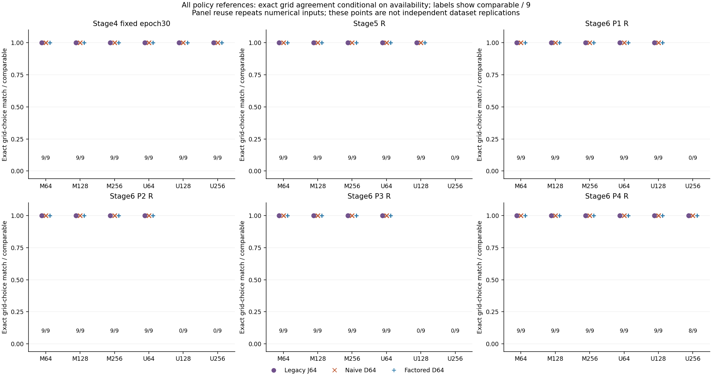
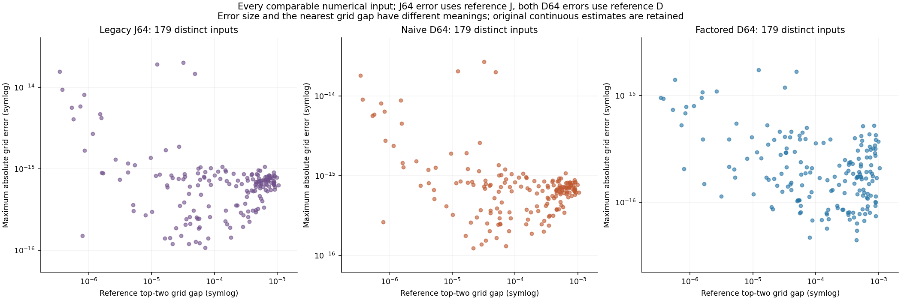
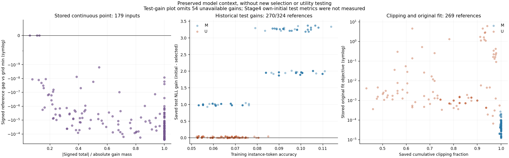

# Stage 9 v0.10 — objective precision on preserved model gains

Presentation r2 fixes axis-limit expansion in the error and stored-point plots. Every numerical table, model-context value and raw record is byte-identical to r1. The preserved r1 report documents the separate null-handling repair.

Run `model-precision-v010-20260930-01` audits **324 policy references**, **207 saved native checkpoints**, and **186 distinct weight/gain input pairs**. Stage4 contributes its fixed epoch30 random-weight cohort; Stage5 and all four Stage6 panels contribute the previously selected capacity-specific R policies. All M/U variants, capacities, data seeds, model/weight seeds, selected zero-adaptation cases and mathematical guards are retained.

## Measured numerical results

Independent audit: **PASS**. 179 of 186 distinct inputs have both objectives available; 0 have differing legacy/reference eligibility and 0 have unresolved reference classification. The table counts distinct numerical inputs and preserves the comparable denominator.

| Method | Comparable | Exact argmin matches | Reference-band matches | Tied method minima | Any strict reversal |
| --- | --- | --- | --- | --- | --- |
| Legacy J64 | 179 | 179 | 179 | 0 | 0 |
| Naive D64 | 179 | 179 | 179 | 0 | 0 |
| Factored D64 | 179 | 179 | 179 | 0 | 0 |

Grid agreement measures fidelity of these objective evaluations to checked high-precision arithmetic. It does not validate the continuous search, identify a true exponent, establish a capacity peak, or improve adaptation utility. The original p*, K summaries, model selections and Stage6 failed utility gate remain unchanged.

## Frozen inputs and arithmetic

The cohort is fixed from the original designs and validation decisions before these profiles were evaluated. Selection does not use p*, fit quality, test scores or visible peaks. Gains reproduce the historical operation order: subtract saved float32 initial/current per-sequence losses, then promote that float32 result to float64. Weights are the saved float32 assignments promoted exactly to binary64. Deduplication uses both exact weight and gain bytes; all policy aliases and their full losses remain separately recorded.

The fixed diagnostic grid contains 161 binary64 values i/20 from 0 to 8 with anchor 0. Legacy J64 follows the original objective arithmetic; naive D64 subtracts the anchor objective; factored D64 uses the declared algebraic contrast and accumulation. These methods share the historical Python-sum denominator. Decimal80 evaluates exact promoted inputs using high-precision sums, logs and exponentials; an independent Decimal110 implementation checks every eligible grid and stored-p point. Factoring changes both algebra and accumulation.

Frozen convergence bounds are 1e-50·max(1,|J110|) for J and 1e-50·max(1,max|D110|) for D. Ranking uses D80 with τ=2e-50·max(1,max|D80|). The first strict minimum index resolves method ties; reference-band membership permits D80≤min(D80)+τ. Reference-strict pairs have separation greater than τ. All exact ties, near ties, float ties, reversals and unresolved precision-boundary classifications are retained.

## Cohort coverage and policy-reference counts

Each row has nine policy references from three data seeds × three model/weight seeds. Seeds on one corpus are paired runs, not independent dataset replications. Stage6 panels reuse selected checkpoints. These 36 cells are descriptive views with repeated inputs; the global numerical summary above deduplicates them.

| Cohort | Variant | Width | Distinct inputs /9 | Both /9 | Original p defined /9 | Zero adaptation | Legacy exact/band | Naive exact/band | Factored exact/band |
| --- | --- | --- | --- | --- | --- | --- | --- | --- | --- |
| S4_fixed30 | M | 64 | 9 | 9 | 9 | 0 | 9/9 | 9/9 | 9/9 |
| S4_fixed30 | M | 128 | 9 | 9 | 9 | 0 | 9/9 | 9/9 | 9/9 |
| S4_fixed30 | M | 256 | 9 | 9 | 9 | 0 | 9/9 | 9/9 | 9/9 |
| S4_fixed30 | U | 64 | 9 | 9 | 9 | 0 | 9/9 | 9/9 | 9/9 |
| S4_fixed30 | U | 128 | 9 | 9 | 9 | 0 | 9/9 | 9/9 | 9/9 |
| S4_fixed30 | U | 256 | 9 | 9 | 9 | 0 | 9/9 | 9/9 | 9/9 |
| S5_R | M | 64 | 9 | 9 | 9 | 0 | 9/9 | 9/9 | 9/9 |
| S5_R | M | 128 | 9 | 9 | 9 | 0 | 9/9 | 9/9 | 9/9 |
| S5_R | M | 256 | 9 | 9 | 9 | 0 | 9/9 | 9/9 | 9/9 |
| S5_R | U | 64 | 9 | 9 | 9 | 0 | 9/9 | 9/9 | 9/9 |
| S5_R | U | 128 | 9 | 9 | 9 | 0 | 9/9 | 9/9 | 9/9 |
| S5_R | U | 256 | 3 | 0 | 0 | 9 | 0/0 | 0/0 | 0/0 |
| S6_P1_R | M | 64 | 9 | 9 | 9 | 0 | 9/9 | 9/9 | 9/9 |
| S6_P1_R | M | 128 | 9 | 9 | 9 | 0 | 9/9 | 9/9 | 9/9 |
| S6_P1_R | M | 256 | 9 | 9 | 9 | 0 | 9/9 | 9/9 | 9/9 |
| S6_P1_R | U | 64 | 9 | 9 | 9 | 0 | 9/9 | 9/9 | 9/9 |
| S6_P1_R | U | 128 | 9 | 9 | 9 | 0 | 9/9 | 9/9 | 9/9 |
| S6_P1_R | U | 256 | 3 | 0 | 0 | 9 | 0/0 | 0/0 | 0/0 |
| S6_P2_R | M | 64 | 9 | 9 | 9 | 0 | 9/9 | 9/9 | 9/9 |
| S6_P2_R | M | 128 | 9 | 9 | 9 | 0 | 9/9 | 9/9 | 9/9 |
| S6_P2_R | M | 256 | 9 | 9 | 9 | 0 | 9/9 | 9/9 | 9/9 |
| S6_P2_R | U | 64 | 9 | 9 | 9 | 0 | 9/9 | 9/9 | 9/9 |
| S6_P2_R | U | 128 | 3 | 0 | 0 | 9 | 0/0 | 0/0 | 0/0 |
| S6_P2_R | U | 256 | 3 | 0 | 0 | 9 | 0/0 | 0/0 | 0/0 |
| S6_P3_R | M | 64 | 9 | 9 | 9 | 0 | 9/9 | 9/9 | 9/9 |
| S6_P3_R | M | 128 | 9 | 9 | 9 | 0 | 9/9 | 9/9 | 9/9 |
| S6_P3_R | M | 256 | 9 | 9 | 9 | 0 | 9/9 | 9/9 | 9/9 |
| S6_P3_R | U | 64 | 9 | 9 | 9 | 0 | 9/9 | 9/9 | 9/9 |
| S6_P3_R | U | 128 | 3 | 0 | 0 | 9 | 0/0 | 0/0 | 0/0 |
| S6_P3_R | U | 256 | 3 | 0 | 0 | 9 | 0/0 | 0/0 | 0/0 |
| S6_P4_R | M | 64 | 9 | 9 | 9 | 0 | 9/9 | 9/9 | 9/9 |
| S6_P4_R | M | 128 | 9 | 9 | 9 | 0 | 9/9 | 9/9 | 9/9 |
| S6_P4_R | M | 256 | 9 | 9 | 9 | 0 | 9/9 | 9/9 | 9/9 |
| S6_P4_R | U | 64 | 9 | 9 | 9 | 0 | 9/9 | 9/9 | 9/9 |
| S6_P4_R | U | 128 | 9 | 9 | 9 | 0 | 9/9 | 9/9 | 9/9 |
| S6_P4_R | U | 256 | 9 | 8 | 8 | 0 | 8/8 | 8/8 | 8/8 |



Original policy reasons and mathematical guards remain separate. An epoch0 selection has historical reason `no_adaptation`; its exactly zero gain vector has mathematical reason `nonpositive_total_gain`. Neither becomes a measured p*=0. The historical guard includes constant weights (range below 1e-12) and total gain ≤1e-10, including tiny positive totals; these inputs remain undefined.

| Counting unit | Total | Comparable | Legacy undefined reasons | Reference undefined reasons |
| --- | --- | --- | --- | --- |
| Distinct weight/gain pairs | 186 | 179 | {"nonpositive_total_gain": 7} | {"nonpositive_total_gain": 7} |
| Policy references (reused inputs) | 324 | 269 | {"nonpositive_total_gain": 55} | {"nonpositive_total_gain": 55} |

## Errors, regret and continuous-point diagnostics

| Method | Max absolute grid error | Max grid regret | Max regret beyond τ | Max error / reference span |
| --- | --- | --- | --- | --- |
| Legacy J64 | 2.03790e-14 | 0e-80 | 0 | 8.67062e-15 |
| Naive D64 | 2.70107e-14 | 0e-80 | 0 | 1.01152e-14 |
| Factored D64 | 1.73883e-15 | 0e-80 | 0 | 2.35426e-15 |

Binary64 errors are computed after exact Decimal.from_float promotion; all differences and summaries use precision110 and retain Decimal strings. Error is also normalized by max(1,max|D80|) and the reference contrast span. Span-normalized values are undefined for zero span. Conditional summaries display available inputs; unconditional means are null whenever any required value is undefined. No imputation or fit-quality exclusion is applied.



The stored continuous point is available for 179 distinct inputs, of which 176 lie below the finite grid minimum in reference contrast. Its signed gap can be negative and it is never inserted into the grid candidate set. This diagnostic cannot certify a continuous optimum or establish recovery. Raw grid regret is nonnegative; regret beyond τ is max(0,regret−τ). A small objective error alone cannot certify ranking when the relevant separation is smaller.

## Preserved model context

The table reports historical saved metrics, with positive NLL gain meaning lower selected loss. Training instance-token accuracy describes memorization; it is distinct from held-out utility. Clipping is undefined when no training updates were selected. Original upper/lower-bound flags and objective values remain unchanged.

Analysis repair R1 retains the 54 Stage4 references whose own-initial test metrics were not measured. Their selected test loss and accuracy remain available; initial test loss/accuracy and corresponding gains remain null. Test NLL gains are available for 270/324 references. No premixed baseline, proxy or imputation is used. The original failed analysis and frozen sources remain preserved; `ANALYSIS_REPAIR.json` records the source and fixture hashes.

| Cohort | Variant | Width | Mean train NLL gain | Mean validation NLL gain | Mean selected test NLL | Mean test NLL gain (available) | Test-gain available /9 | Mean train instance accuracy | Mean clipping (available) | Original lower/upper bounds |
| --- | --- | --- | --- | --- | --- | --- | --- | --- | --- | --- |
| S4_fixed30 | M | 64 | 1.08381 | 0.994147 | 2.10465 | undefined | 0/9 | 0.0625000 | 0.999306 | 0/0 |
| S4_fixed30 | M | 128 | 2.19427 | 1.79316 | 2.21098 | undefined | 0/9 | 0.173774 | 0.999074 | 0/0 |
| S4_fixed30 | M | 256 | 3.94012 | 2.62024 | 2.71336 | undefined | 0/9 | 0.444716 | 0.999074 | 0/0 |
| S4_fixed30 | U | 64 | 0.112695 | -0.00405264 | 2.01089 | undefined | 0/9 | 0.100966 | 0.958333 | 0/0 |
| S4_fixed30 | U | 128 | 0.102486 | -0.459968 | 2.33886 | undefined | 0/9 | 0.242839 | 0.927546 | 0/2 |
| S4_fixed30 | U | 256 | 0.410354 | -0.902548 | 2.76991 | undefined | 0/9 | 0.439996 | 0.973843 | 0/0 |
| S5_R | M | 64 | 1.08535 | 1.00431 | 2.10954 | 0.999752 | 9/9 | 0.0651584 | 0.999769 | 0/0 |
| S5_R | M | 128 | 2.13410 | 1.97857 | 2.05329 | 1.96543 | 9/9 | 0.0973850 | 0.999653 | 0/0 |
| S5_R | M | 256 | 3.44765 | 3.29948 | 2.01185 | 3.28136 | 9/9 | 0.0929362 | 1 | 0/0 |
| S5_R | U | 64 | 0.0574386 | 0.0307414 | 1.96470 | 0.0309361 | 9/9 | 0.0710178 | 0.779861 | 0/0 |
| S5_R | U | 128 | 0.0100565 | 0.00153155 | 1.87373 | 0.00187900 | 9/9 | 0.0732422 | 0.562500 | 0/0 |
| S5_R | U | 256 | 0 | 0 | 1.85376 | 0 | 9/9 | 0.0626628 | undefined | 0/0 |
| S6_P1_R | M | 64 | 1.07116 | 1.00562 | 2.08317 | 0.995642 | 9/9 | 0.0619032 | 0.999537 | 0/0 |
| S6_P1_R | M | 128 | 2.10861 | 1.96083 | 2.05543 | 1.94183 | 9/9 | 0.0974392 | 1 | 0/0 |
| S6_P1_R | M | 256 | 3.42516 | 3.28514 | 2.02366 | 3.26669 | 9/9 | 0.0970052 | 0.999306 | 0/0 |
| S6_P1_R | U | 64 | 0.0594726 | 0.0316441 | 1.96815 | 0.0334038 | 9/9 | 0.0638021 | 0.837500 | 0/0 |
| S6_P1_R | U | 128 | 0.0105606 | -0.000710924 | 1.87376 | 0.000904467 | 9/9 | 0.0677083 | 0.553241 | 0/0 |
| S6_P1_R | U | 256 | 0 | 0 | 1.85303 | 0 | 9/9 | 0.0595703 | undefined | 0/0 |
| S6_P2_R | M | 64 | 1.07116 | 1.00562 | 2.08317 | 0.995642 | 9/9 | 0.0619032 | 0.999537 | 0/0 |
| S6_P2_R | M | 128 | 2.10861 | 1.96083 | 2.05543 | 1.94183 | 9/9 | 0.0974392 | 1 | 0/0 |
| S6_P2_R | M | 256 | 3.42516 | 3.28514 | 2.02366 | 3.26669 | 9/9 | 0.0970052 | 0.999306 | 0/0 |
| S6_P2_R | U | 64 | 0.0594726 | 0.0316441 | 1.96815 | 0.0334038 | 9/9 | 0.0638021 | 0.837500 | 0/0 |
| S6_P2_R | U | 128 | 0 | 0 | 1.87467 | 0 | 9/9 | 0.0595703 | undefined | 0/0 |
| S6_P2_R | U | 256 | 0 | 0 | 1.85303 | 0 | 9/9 | 0.0595703 | undefined | 0/0 |
| S6_P3_R | M | 64 | 1.07116 | 1.00562 | 2.08317 | 0.995642 | 9/9 | 0.0619032 | 0.999537 | 0/0 |
| S6_P3_R | M | 128 | 2.10861 | 1.96083 | 2.05543 | 1.94183 | 9/9 | 0.0974392 | 1 | 0/0 |
| S6_P3_R | M | 256 | 3.42965 | 3.28403 | 2.02472 | 3.26563 | 9/9 | 0.0984701 | 0.999306 | 0/0 |
| S6_P3_R | U | 64 | 0.0594726 | 0.0316441 | 1.96815 | 0.0334038 | 9/9 | 0.0638021 | 0.837500 | 0/0 |
| S6_P3_R | U | 128 | 0 | 0 | 1.87467 | 0 | 9/9 | 0.0595703 | undefined | 0/0 |
| S6_P3_R | U | 256 | 0 | 0 | 1.85303 | 0 | 9/9 | 0.0595703 | undefined | 0/0 |
| S6_P4_R | M | 64 | 1.07116 | 1.00562 | 2.08317 | 0.995642 | 9/9 | 0.0619032 | 0.999537 | 0/0 |
| S6_P4_R | M | 128 | 2.10861 | 1.96083 | 2.05543 | 1.94183 | 9/9 | 0.0974392 | 1 | 0/0 |
| S6_P4_R | M | 256 | 3.42965 | 3.28403 | 2.02472 | 3.26563 | 9/9 | 0.0984701 | 0.999306 | 0/0 |
| S6_P4_R | U | 64 | 0.0382748 | 0.0284356 | 1.97209 | 0.0294563 | 9/9 | 0.0610352 | 0.718056 | 0/0 |
| S6_P4_R | U | 128 | 0.00986330 | -0.000216365 | 1.87373 | 0.000934680 | 9/9 | 0.0645616 | 0.524306 | 0/1 |
| S6_P4_R | U | 256 | 0.00345826 | -0.00148597 | 1.85446 | -0.00142372 | 9/9 | 0.0697700 | 0.720833 | 0/0 |



Every policy-reference record preserves the complete selected and initial loss/accuracy histories, original fit metadata, selection decision and source paths. Signed total, positive/negative mass, absolute mass, cancellation ratio, negative/zero-gain fractions and legacy/fsum totals are stored alongside the numerical diagnostics. Historical Torch reductions need not equal Python sequential sums; their distinct values are preserved.

## Interpretation limits and provenance

This bounded CPU audit uses previously saved arrays; it performs no model training, inference, new continuous optimization, validation retuning, p* replacement, K recomputation or utility-gate revision. Agreement on these arrays cannot show that a peak is causal, rule out sampling or optimization effects, rescue the failed Stage6 usefulness result, or imply exact large-LM replication. Three capacities cannot establish movement between two interior peaks. One Pythia size/seed does not establish a scaling curve. No novelty or publication claim is made.

The saved loss arrays, full token/label data, pairing records, selected decisions and original files are hashed and audited. Missing historical intermediate model binaries are not regenerated; this is an audit of retained arrays. Original sources and records remain immutable. Each precision phase records runtime/memory and has its preregistered CPU budget.

Protocol SHA256: `c0422aa5734ea4a9fe8a7c14d6bbd32e3aa4e449430a42c5de4a6400708104a2`. Raw profiles SHA256: `95fe428ebc59501a3fe76404130b279c8874b2912cd748dcb328984a42963c1c`. The archive includes frozen source, copied input provenance, full 80/110-digit profiles, guard failures, classification evidence, fixtures, all analysis tables and figures. Archive CRC and SHA256 are verified. Visual inspection is recorded separately.

Completion record:

```json
{
  "status": "COMPLETE",
  "utc": "2026-09-30T06:19:42.134729+00:00",
  "cases": 186,
  "blocks": 9,
  "policy_references": 324,
  "native_checkpoints": 207,
  "weight_groups": 9,
  "elapsed_seconds": 83.85302580500002,
  "utc_elapsed_seconds": 85.170161,
  "peak_rss_mib": 433.91796875,
  "profiles_sha256": "95fe428ebc59501a3fe76404130b279c8874b2912cd748dcb328984a42963c1c",
  "failed_cases": [],
  "training": false,
  "original_estimates_modified": false
}
```
